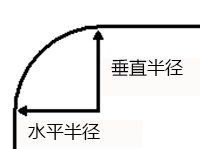
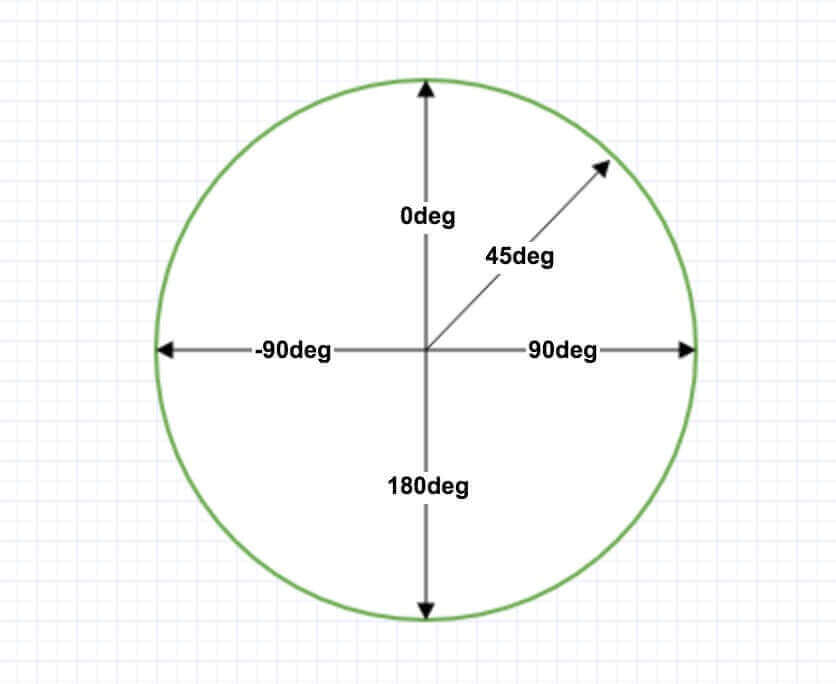

# CSS3

CSS3 是最新的 CSS 标准。  
CSS3 是 CSS 规范的最新版本，在 CSS2.1 的基础上增加了很多强大的新功能，以帮助开发人员解决一些实际面临的问题，并且不再需要非语义标签、复杂的 JavaScript 脚本以及图片。例如，CSS3 支持圆角、多背景、透明度、阴影、动画、图表等功能。

## CSS3 简介

### CSS3 规范是分模块的

CSS1 和 CSS2.1 都是单一的规范，其中 CSS1 主要定义了网页对象的基本样式，如字体、颜色、背景、边框等，CSS2 添加了高级概念，如浮动、定位、高级选择器（如子选择器、相邻选择器和通用选择器等）。

CSS3 被划分成了多个模块，每个模块都有自己的规范，这样做的好处是：
* 整个 CSS3 的规范发布不会因为部分存在争论而影响其他模块的推进。
* 对于浏览器来说，可以根据需要，决定哪些 CSS 功能被支持。
* 对于 W3C 制定者而言，可以根据需要进行针对性的更新，从而使一个整体的规范更加灵活，并能够及时修订，这样更容易扩展新的技术特定。

### CSS3 新特性

CSS3 规范并不是完全另起炉灶，它集成了 CSS2.1 的部分内容，但在其基础上进行了很多的增补与修订。  
与 CSS1、CSS2 相比，CSS3 进行了革命性的升级，而不仅限于局部功能的修订和完善，尽管浏览器对 CSS3 诸多新特性的支持还不是很完善，但是它依然让用户看到了未来网页样式的发展方向和使命。  
CSS3 的新特性非常多，这里简单列举被浏览器广泛支持的实用特性。
* 完善选择器
* 完善视觉效果
* 完善背景效果
* 完善盒模型
* 增强背景功能
* 增加阴影效果
* 增加多列布局与弹性盒模型布局
* 完善 Web 字体和 Web Font 图标
* 新增圆角与边框功能
* 增加变形操作
* 增加动画和交互效果
* 完善媒体特性与 Responsive 布局

### CSS3浏览器兼容性一览表

CSS3 属性支持情况：完全支持 CSS3 属性的浏览器有 Chrome 和 Safari，而且不管是 Mac 平台还是 Windows 平台全支持。  
CSS3 选择器支持情况：除了 IE 家族和 Firefox3，其他几乎全部支持，Chrome、Safari、Firefox 3.6、Opera 10.5 最好。

各主流浏览器都定义了私有属性，以便让用户体验 CSS3 的新特性。例如，
* Webkit 类型浏览器（如 Safari、Chrome）的私有属性是以-webkit-前缀开始，
* Gecko 类型的浏览器（如 Firefox）的私有属性是以-moz-前缀开始，
* Konqueror 类型的浏览器的私有属性是以-khtml-前缀开始，
* Opera 浏览器的私有属性是以-o-前缀开始，
* 而 Internet Explorer 浏览器的私有属性是以-ms-前缀开始（目前只有 IE 8+ 支持-ms-前缀）。

> @[附录：主流浏览器对CSS属性支持的详细列表]{`http://c.biancheng.net/view/1281.html`}
> `../../images/home/css3.png`

## CSS3 圆角`border-radius` {#border_radius}

CSS3圆角只需设置一个属性：`border-radius`（含义是"边框半径"）。你为这个属性提供一个值，就能同时设置四个圆角的半径。所有合法的CSS度量值都可以使用：em、px、百分比等等。  
`border-radius:50px;`这条语句同时将每个圆角的"水平半径"和"垂直半径"都设置为50px。



### CSS3 border-radius - 指定每个圆角

`border-radius`可以同时设置1到4个值指定每个圆角。（类似`margin`与`padding`属性）
* **1个值**，四个圆角值相同
* **2个值**，第一个值为左上角与右下角，第二个值为右上角与左下角
* **3个值**，第一个值为左上角, 第二个值为右上角和左下角，第三个值为右下角
* **4个值**，则依次对应左上角、右上角、右下角、左下角(顺时针顺序)。

`border-radius: 10px 20px 30px 40px / 5px 10px 15px 20px;`  
也可以分别设置**每个角的垂直半径和水平半径**,`用斜杠隔开`，第一个参数表示左上角开始顺时针的水平半径，第二个参数表示左上角开始顺时针的垂直半径

**CSS3提供四个单独的属性 对应四个角**  
`border-top-left-radius`    `border-bottom-right-radius`  
`border-top-right-radius`   `border-bottom-left-radius`  
这四个属性都可以同时设置1到2个值。如果设置1个值，表示水平半径与垂直半径相等。如果设置2个值，第一个值表示水平半径，第二个值表示垂直半径。

### 常用圆角图形

#### 圆

```css
.circle {width:100px; height:100px; border-radius: 50%;background: gold;}
```

<div style="width:100px; height:100px; border-radius: 50%;background: gold;"></div>

#### 半圆

```css
.semi_circle {
    width:200px;
    height:100px; /* 高度是宽度的一半 */
    background-color:#000;
    border-radius:100px 100px 0 0; /* 左上和右上至少为height值 */
}
```

<div style="width:200px;height:100px;background-color:#000;border-radius:100px 100px 0 0;"></div>

#### 扇形

```css
.sector {width:0; height:0; border:50px solid gray; border-radius:50px; border-right-color:red;}
```

<div style="width:0; height:0; border:50px solid gray; border-radius:50px; border-right-color:red;"></div>

#### 椭圆

```css
.ellipse {width:200px; height:100px; background: blue; border-radius:100px/50px;}
```

<div style="width:200px; height:100px; background: blue; border-radius:100px/50px;"></div>

> @[常用圆角图形]{`../../demo/demo.html?demoname=border-radius`}
> `../../images/css/border-radius.png` "rect"

## CSS3 背景`background` {#background}

CSS3 中包含几个新的背景属性([`background-image`](./README.md#background), [`background-size`](./README.md#background), 
[`background-origin`](./README.md#background), `background-clip`)，提供更大背景元素控制，更是可以`使用多重背景图像`。

### CSS3 `background-clip`属性

CSS3中background-clip背景剪裁属性是从指定位置开始绘制。

**语法：**`background-clip: border-box|padding-box|content-box;`

值 | 说明
:- | :-
border-box | 默认值。背景绘制在边框方框内（剪切成边框方框）。
padding-box | 背景绘制在衬距方框内（剪切成衬距方框）。
content-box | 背景绘制在内容方框内（剪切成内容方框）。

> @[`background-clip`属性]{`../../demo/demo.html?demoname=background-clip`}
> `../../images/home/css3.png`

### CSS3 多重背景(multiple backgrounds)

多重背景，也就是CSS2里background的属性外加origin、clip和size组成的新background的多次叠加，缩写时为用逗号隔开的每组值；用分解写法时，如果有多个背景图片，而其他属性只有一个（例如background-repeat只有一个），表明所有背景图片应用该属性值。

**语法缩写如下：**
```css
{
    background: [background-color] | [background-image] | [background-position][/background-size] | [background-repeat] | [background-attachment] | [background-clip] | [background-origin],...
}
```
可以把上面的缩写拆解成以下形式：
```css
{
    background-image:url1,url2,...,urlN;
    background-repeat : repeat1,repeat2,...,repeatN;
    backround-position : position1,position2,...,positionN;
    background-size : size1,size2,...,sizeN;
    background-attachment : attachment1,attachment2,...,attachmentN;
    background-clip : clip1,clip2,...,clipN;
    background-origin : origin1,origin2,...,originN;
    background-color : color;
}
```

> [!danger]
> * 用逗号隔开每组 background 的缩写值；
> * 如果有 size 值，需要紧跟 position 并且用 "/" 隔开；
> * 如果有多个背景图片，而其他属性只有一个（例如 background-repeat 只有一个），表明所有背景图片应用该属性值。
> * background-color 只能设置一个。

**代码示例：**
```html
<!DOCTYPE html>
<html>
<head>
<style>
#example1 {
    background-image: url(../../images/css/img_flwr.png), url(../../images/css/paper.png);
    background-position: right bottom, left top;
    background-repeat: no-repeat, repeat;
    padding: 15px;
}
</style>
</head>
<body>
    <div id="example1">
        <h1>Lorem Ipsum Dolor</h1>
        <p>Lorem ipsum dolor sit amet, consectetuer adipiscing elit, sed diam nonummy nibh euismod tincidunt ut laoreet dolore magna aliquam erat volutpat.</p>
    </div>
</body>
</html>
```

**显示效果如下：**
<div style="width:70%;margin:0 auto;background-image: url(../../images/css/img_flwr.png), url(../../images/css/paper.png);background-position: right bottom, left top;background-repeat: no-repeat, repeat;padding: 15px;">
        <h1>Lorem Ipsum Dolor</h1>
        <p>Lorem ipsum dolor sit amet, consectetuer adipiscing elit, sed diam nonummy nibh euismod tincidunt ut laoreet dolore magna aliquam erat volutpat.</p>
</div>

## CSS3 渐变`gradients` {#gradients}

CSS3 渐变（gradients）可以让你在两个或多个指定的颜色之间显示平稳的过渡。  
以前，你必须使用图像来实现这些效果。但是，通过使用 CSS3 渐变（gradients），你可以减少下载的时间和宽带的使用。此外，渐变效果的元素在放大时看起来效果更好，因为渐变（gradient）是由浏览器生成的。

**渐变的含义与组成**
* **含义：**两种或多种颜色之间平滑过渡的效果
* **组成：**由色标来组成（色标：1.颜色 2.颜色出现的位置）

### CSS3 线性渐变（Linear Gradients）

为了创建一个线性渐变，你必须至少定义两种颜色节点。颜色节点即你想要呈现平稳过渡的颜色。同时，你也可以设置一个起点和一个方向（或一个角度）。

#### 语法

```css
{ background-image: linear-gradient(direction, color-stop1, color-stop2, ...); }
```

> `direction`: 指定渐变的方向或角度，属性值为 方向的关键词或角度值

角度是指水平线和渐变线之间的角度，逆时针方向计算。换句话说，0deg 将创建一个从下到上的渐变，90deg 将创建一个从左到右的渐变。



> [!warning]
> 但是，请注意很多浏览器(Chrome,Safari,fiefox等)的使用了旧的标准，即 0deg 将创建一个从下到上的渐变，90deg 将创建一个从左到右的渐变。换算公式 `90 - x = y` 其中 x 为标准角度，y为非标准角度。

角度 | `direction` | 作用
:- | :- | :-
0deg/360deg | to top | 从下向上填充渐变
90deg | to right | 从左向右填充渐变
180deg | to bottom | (默认值)从上向下填充渐变
270deg | to left | 从右向左填充渐变
45deg | to top right | 左下角到右上角填充渐变
135deg | to bottom right | 左上角到右下角填充渐变
225deg | to bottom left | 右上角到左下角填充渐变
315deg | to top left | 右下角到左上角填充渐变

> @[CSS3 线性渐变（Linear Gradients）实例]{`../../demo/demo.html?demoname=linear-gradient`}
> `../../images/home/css3.png`

> `color-stop`: 色标，标识一种颜色，以及出现的位置

第一个参数省略时，默认为“180deg”，等同于“to bottom”。  
第二个和第三个参数，表示颜色的起始点和结束点，可以有多个颜色值。  
颜色值后面可以追加百分比，表示这个颜色要占总背景颜色面积的百分比。不加百分比即为平均分布。

**举例说明：**
```css
div { background-image: linear-gradient(to right, red, orange, yellow, green, blue, indigo, violet); }
```
该div元素线性渐变，方向是to right，即从左向右填充渐变，7 个颜色结点（均匀分布），效果类似彩虹
```css
div { background-image:linear-gradient(to right, red 10%,blue 80%,green 90%); }
```
该div元素线性渐变，方向是to right，即从左向右填充渐变，10%的时候是红色，80%的时候是蓝色，90%的时候是绿色，加百分比不均匀分布

**显示效果如下：**
<p>7 个颜色结点（均匀分布）</p>
<div style="height: 50px;background-image:linear-gradient(to right, red, orange, yellow, green, blue, indigo, violet);"></div>
<p>3 个颜色结点（不均匀分布）</p>
<div style="height: 50px;background-image:linear-gradient(to right,red 0%,blue 50%,green 100%);"></div>

### CSS3 径向渐变（Radial Gradients）

径向渐变由它的中心定义。  
为了创建一个径向渐变，你也必须至少定义两种颜色结点。颜色结点即你想要呈现平稳过渡的颜色。同时，你也可以指定渐变的中心、形状（圆形或椭圆形）、大小。默认情况下，渐变的中心是 center（表示在中心点），渐变的形状是 ellipse（表示椭圆形），渐变的大小是 farthest-corner（表示到最远的角落）。

#### 语法

```css
{ background-image: radial-gradient(shape size at position, start-color, ..., last-color); }
```

> `shape`：设置形状

shape 参数定义了形状。它可以是值 circle 或 ellipse。其中，circle 表示圆形，ellipse 表示椭圆形。默认值是 ellipse。

> `size`：设置半径

size 参数定义了渐变的大小。它可以是具体值 px，也可以是以下四个关键字：
* `closest-side`: 半径为从圆心到最近边
* `closest-corner`: 半径为从圆心到最近角
* `farthest-side`: 半径为从圆心到最远边
* `farthest-corner`: 半径为从圆心到最远角(默认)

> @[深入理解CSS径向渐变radial-gradient]{`https://www.cnblogs.com/xiaohuochai/p/5383285.html`}
> `../../images/home/css3.png`

> `position`：圆心的位置

可用数值、百分比、或者 关键字(`left/center/right/top/center/bottom`)表示

> [!tip]
> 该参数可以省略，如果省略的话，那么圆心默认就在元素的中间位置处

**举例说明：**
```css
div { background-image:radial-gradient(100px at 0px 0px,red 0%,blue 50%,green 100%); }
```
该div元素径向渐变，圆的半径是100px，圆心在元素的左上角，0%的时候是红色，50%的时候是蓝色，100%的时候是绿色

**显示效果如下：**
<p>径向渐变，圆的半径是100px，圆心在元素的左上角，0%的时候是红色，50%的时候是蓝色，100%的时候是绿色</p>
<div style="width:150px;height:150px;background-image:radial-gradient(100px at 0px 0px,red 0%,blue 50%,green 100%);"></div>

### CSS3 重复渐变（Repeating Gradients）

#### 语法

```css
/* 重复线性渐变 */
{ background-image: repeating-linear-gradient(direction, color-stop1, color-stop2, ...); }
/* 重复径向渐变 */
{ background-image: repeating-radial-gradient(shape size at position, start-color, ..., last-color); }
```
重复渐变除了在线性渐变或者径向渐变前加`repeating-`之外，其他用法和属性均与普通线性渐变和径向渐变相同

### 渐变效果图对比

```css
/* 线性渐变 */
{ background-image: linear-gradient(to top,red 0%,blue 50%,green 100%); }
/* 径向渐变 */
{ background-image:radial-gradient(100px at center center,red 0%,blue 50%,green 100%); }
/* 重复线性渐变 */
{ background-image:repeating-linear-gradient(red, yellow 10%, green 20%); }
/* 重复径向渐变 */
{ background-image: repeating-radial-gradient(5px at 0px 0px,red 0%,blue 50%,green 100%); }
{ background-image:repeating-radial-gradient(40px at center center,red 0%,blue 50%,green 100%); }
```

**显示效果如下：**
<div style="display:inline-block;">
    <p>线性渐变</p>
    <p style="width: 150px;height: 150px;background-image: linear-gradient(to top,red 0%,blue 50%,green 100%);"></p>
</div>
<div style="display:inline-block;">
    <p>径向渐变</p>
    <p style="width: 150px;height: 150px;background-image:radial-gradient(100px at center center,red 0%,blue 50%,green 100%);"></p>
</div>
<div style="display:inline-block;">
    <p>重复线性渐变</p>
    <p style="width: 150px;height: 150px;background-image:repeating-linear-gradient(red, yellow 10%, green 20%);"></p>
</div>
<div style="display:inline-block;">
    <p>重复径向渐变</p>
    <p style="width: 150px;height: 150px;background-image: repeating-radial-gradient(5px at 0px 0px,red 0%,blue 50%,green 100%);"></p>
</div>
<div style="display:inline-block;">
    <p>重复径向渐变</p>
    <p style="width: 150px;height: 150px;background-image:repeating-radial-gradient(40px at center center,red 0%,blue 50%,green 100%);"></p>
</div>

> @[css3 渐变效果图对比]{`../../demo/demo.html?demoname=css3-gradient`}
> `../../images/home/css3.png`
