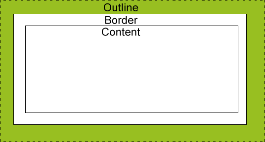

# CSS层叠样式表

CSS 指层叠样式表 (Cascading Style Sheets)

## DIV+CSS详解

在CSS布局方式中,DIV是这种布局方式的核心对象,我们的页面排版不再依赖于表格. 仅从DIV的使用上说,做一个简单的布局只需要两样东西:DIV与CSS.因此我们称这种布局方式为 DIV + CSS 布局。
* DIV：布局容器标签
div 是XHTML中指定的,专门用于布局设计的容器标签。用于存放html 元素，文字，图片，视频的元素。内容样式由CSS指定。
* CSS：层叠样式表
CSS（Cascading Style Sheet，层叠样式表）是一种格式化网页的标准方式，是用于控制网页样式并允许样式信息与网页内容分离的一种技术。


**DIV+CSS的优势**  
1. 符合 W3C标准，微软等公司均为 W3C支持者。
2. 能够对网页的布局、字体、颜色、背景等图文效果实现更加精确的控制,调整更加方便,现在很多网站均使用DIV+CSS框架模式,更加印证DIV+CSS是大势所趋
3. 将格式和结构分离，有利于格式的重用及网页的修改维护，在团队开发中更容易分工合作而减少相互关联性
4. CSS的极大优势表现在简介的代码，制作体积更小，下载更快，节省大量带宽，而且众所周知，搜索引擎喜欢简洁的代码。
5. 利用CSS样式表，可以将站点上的所有网页都只指向同一个CSS文件，可以实现许多网页同时更新。

**什么是W3C标准？**  
`W3C标准`不是一个标准，而是一系列标准的集合，包含三部分的标准：`结构标准`、`表现标准`和`动作标准`。  
与结构标准对应的代表语言是`xHTML`，与表现标准对应的代表语言是`CSS`，与动作标准对应的代表语言是`JavaScript`。

## CSS语法 {#grammar}

CSS 规则由两个主要的部分构成：选择器，以及一条或多条声明:  
CSS声明总是以分号(;)结束，声明总以大括号({})括起来:


选择器通常是您需要改变样式的 HTML 元素。每条声明由一个属性和一个值组成。  
属性（property）是您希望设置的样式属性（style attribute）。每个属性有一个值。属性和值被冒号分开。  

**CSS注释：** CSS注释以 `/*` 开始, 以 `*/` 结束。  
为了让CSS可读性更强，你可以每行只描述一个属性:
```css
/*这是个注释*/
p {
    text-align:center;
    color:black;
    /*这是另一个注释*/
    /*font-family:arial;*/
}
```

### CSS的应用和引入方式

* 【内嵌式】：在HTML文档内部，将CSS代码卸载`<head>`标记之间，并需要采用`<style>`标记进行声明
```html
<head>
    <style>
        p{color:red;}
    </style>
</head>
```
* 【内联式】：选择你想控制的`HTML标签`，给它添加`style属性`，注意这种方式的引入CSS，是不需要写选择器的
```html
<h1 style="color:red;"></h1>
```
* 【链接式】：在实际网站建设中，链接式CSS用法是最常用效果最好的。
  1. 新建一个以css为后缀的文件。在里面写入css。
  2. 在需要用到该css的HTML内部的`<head>`标记中加入link标签，href属性指明外部CSS文件的路径。
```html
<head>
    <link rel="stylesheet" type="text/css" href="css/index.css" />
</head>
```
* 【导入式】：与链接式的用法基本相同，区别在于语法和使用方法上略有不用。
```html
<style>
    @import url(css/index.css);
</style>
```

## CSS选择符 {#selector}

### 通配选择符

`*` 星号选择器将匹配页面里的每一个元素，但我建议你永远不要再生产代码中使用它。它给浏览器带来大量不必要的负担。
```css
*{margin:0; padding:0;}
```

### 标签选择符

标签选择符（也叫类型选择符）：也就是把html标签名作为选择符。
```css
ul { list-style:none; }
img{ width: 100%;}
```

### id选择符

给所需样式标签自定义id名.然后在css文件内写上`#自定义id名{CSS样式}`
```css
#IDname {width: 960px; margin: auto; }
```

> [!danger]
> 每个id名都必须不同，应该慎重使用ID选择器。

### 类选择符（class）

自定义class名,使用方法:在css文件内写上`.class名{css样式}`
```css
.className {border-color: blue; font-size:16px;}
```

> [!danger]
> 一个标签可以用多个class名,一个class名可以供多个标签使用。

### 群组选择符

同时控制多个标签。标签名用`,`隔开
```css
a,p,span{}
```

### 组合选择符

我们还可以通过`标签名,id名,class名`混搭的方式来选择，添加样式
```css
div .p {} /*表示div标签下的所有class为p的标签。*/
div,#a {} /*表示id为a的标签和所有的div标签。*/
```

### 关系选择符

选择符 | 名称 | 描述 | 版本 | 英文名
:-- | :-- | :--
E F | 包含选择符 |  选择所有被E元素包含的F元素。 | CSS1 |  (Descendant combinator)这个也有叫后代选择器的
E>F | 子选择符 |    选择所有作为E元素的子元素F。 | CSS2 |  (Child combinator)
E+F | 相邻选择符 |  选择紧贴在E元素之后F元素。 |   CSS2 |  (Adjacent sibling combinator)
E~F | 兄弟选择符 |  选择E元素所有兄弟元素F。 |     CSS3 |  (General sibling combinator)

### 伪类选择符

不是所有的标签都能使用伪类选择符,在此处我们只讲a标签的伪类选择符
* `a:link {color: #FF0000; text-decoration: none}`         未访问的链接
* `a:visited {color: #00FF00; text-decoration: none}`      已访问的链接
* `a:hover {color: #FF00FF; text-decoration: underline}`   鼠标在链接上
* `a:active {color: #0000FF; text-decoration: underline}`  激活链接

> [!danger]
> 以上的a标签伪类你可以写1个或者写多个。但是一定要按照顺序写，否则会出问题！

选择符 | 版本 | 描述
:-- | :-- | :--
E:link                | CSS1    | 设置超链接a在未被访问前的样式。
E:visited             | CSS1    | 设置超链接a在其链接地址已被访问过时的样式。
E:hover               | CSS1/2  | 设置元素在其鼠标悬停时的样式。
E:active              | CSS1/2  | 设置元素在被用户激活(在鼠标点击与释放之间发生的事件)时的样式。
E:focus               | CSS1/2  | 设置元素在成为输入焦点(该元素的onfocus事件发生)时的样式。
E:lang(fr)            | CSS2    | 匹配使用特殊语言的E元素。很少用
E:not(s)              | CSS3    | 匹配不含有s选择符的元素E。
E:root                | CSS3    | 匹配E元素在文档的根元素。常指html元素
E:first-child         | CSS2    | 匹配父元素的第一个子元素E。
E:last-child          | CSS3    | 匹配父元素的最后一个子元素E。
E:only-child          | CSS3    | 匹配父元素仅有的一个子元素E。
E:nth-child(n)        | CSS3    | 匹配父元素的第n个子元素E。
E:nth-last-child(n)   | CSS3    | 匹配父元素的倒数第n个子元素E。
E:first-of-type       | CSS3    | 匹配同类型中的第一个同级兄弟元素E。
E:last-of-type        | CSS3    | 匹配同类型中的最后一个同级兄弟元素E。
E:only-of-type        | CSS3    | 匹配同类型中的唯一的一个同级兄弟元素E。
E:nth-of-type(n)      | CSS3    | 匹配同类型中的第n个同级兄弟元素E。
E:nth-last-of-type(n) | CSS3    | 匹配同类型中的倒数第n个同级兄弟元素E。
E:empty               | CSS3    | 匹配没有任何子元素（包括text节点）的元素E。
E:checked             | CSS3    | 匹配用户界面上处于选中状态的元素E。(用于input type为radio与checkbox时)
E:enabled             | CSS3    | 匹配用户界面上处于可用状态的元素E。
E:disabled            | CSS3    | 匹配用户界面上处于禁用状态的元素E。
E:target              | CSS3    | 匹配相关URL指向的E元素。

> `first-child`与`first-of-type`的区别：举例来说

```html
<div class="test">
    <p>第一个子元素</p>
    <h1>第二个子元素</h1>
    <span>第三个子元素</span>
    <span>第四个子元素</span>
</div>
```
* `p:first-child`  匹配到的是p元素,因为p元素是div的第一个子元素；
* `h1:first-child`  匹配不到任何元素，因为在这里h1是div的第二个子元素，而不是第一个；
* `span:first-child`  匹配不到任何元素，因为在这里两个span元素都不是div的第一个子元素；

* `p:first-of-type`  匹配到的是p元素,因为p是div的所有为p的子元素中的第一个，事实上这里也只有一个为p的子元素；
* `h1:first-of-type`  匹配到的是h1元素，因为h1是div的所有为h1的子元素中的第一个，事实上这里也只有一个为h1的子元素；
* `span:first-of-type`  匹配到的是第三个子元素span。这里div有两个为span的子元素，匹配到的是第一个。

所以，通过以上两个例子可以得出结论：  
* `:first-child` 匹配的是某父元素的第一个子元素，可以说是结构上的第一个子元素。
* `:first-of-type` 匹配的是某父元素下相同类型子元素中的第一个，比如 `p:first-of-type`，就是指所有类型为p的子元素中的第一个。这里不再限制是第一个子元素了，只要是该类型元素的第一个就行了。

> [!danger]
> 当然这些元素的范围都是属于同一级的，也就是同辈的。  
> 同样类型的选择器`:last-child`和`:last-of-type`、`:nth-child(n)`和`:nth-of-type(n)`也可以这样去理解。

### 属性选择符

选择符 | 版本 | 描述
:-- | :-- | :--
E[att]        | CSS2 | 选择具有att属性的E元素。
E[att="val"]  | CSS2 | 选择具有att属性且属性值等于val的E元素。
E[att~="val"] | CSS2 | 选择具有att属性且属性值为一用空格分隔的字词列表，其中一个等于val的E元素。
E[att^="val"] | CSS3 | 选择具有att属性且属性值为以val开头的字符串的E元素。
E[att$="val"] | CSS3 | 选择具有att属性且属性值为以val结尾的字符串的E元素。
E[att*="val"] | CSS3 | 选择具有att属性且属性值为包含val的字符串的E元素。
E[att&#124;="val"] | CSS2 | 选择具有att属性且属性值为以val开头并用连接符"-"分隔的字符串的E元素。

### 伪对象选择符

选择符 | 版本 | 描述
:-- | :-- | :--
E:first-letter/E::first-letter | CSS1/3 | 设置对象内的第一个字符的样式。
E:first-line/E::first-line     | CSS1/3 | 设置对象内的第一行的样式。
E:before/E::before             | CSS2/3 | 设置在对象前（依据对象树的逻辑结构）发生的内容。用来和content属性一起使用
E:after/E::after               | CSS2/3 | 设置在对象后（依据对象树的逻辑结构）发生的内容。用来和content属性一起使用
E::placeholder                 | CSS3   | 设置对象文字占位符的样式。
E::selection                   | CSS3   | 设置对象被选择时的颜色。

> [!danger]
> CSS3的语法改成:: ,原本CSS1是: ,故一般直接用两个冒号为妥。如果为了兼容IE浏览器的话，就用一个冒号。
> 举例：`input::-webkit-input-placeholder {color: green;}`

**[30个你必须记住的CSS选择符](http://www.open-open.com/lib/view/open1429583085104.html)**

## CSS的冲突(即优先级)

CSS本身的设置可以同时应用多个样式在同一个元素，此时样式之间可能出现冲突而达不到用户所想要的效果。

**解决CSS冲突的优先级规则：**
* CSS层叠样式表引入方法的优先级：`内联式>内嵌式>链接式>导入式`
* 在多个外部样式中，后出现的样式的优先级高于先出现的样式，也就是俗称的覆盖
* 在样式中，选择器的优先级：`ID样式>class样式>标记样式`（以权重比喻：id的权重为100，class的权重为10,标签名的权重为1）
* 在样式后面加一个`!important`，例如这样：`.abc {background:#fff !improtant;}` 这个样式的优先级就会默认提升到顶级，全局样式就无法影响到它了。

> [!danger]
> `!important`要写在分号的前面

**优先级：**
1. 就近原则（离代码越近，优先级越高）
2. 选择范围越小，优先级越高。细化CSS，通过多加父元素的选择符一层层包住，缩小选择范围

### 样式继承

继承是指我们设置上级(父级)的CSS样式，上级（父级）及以下的子级（下级）都具有此属性。一般只有文字文本具有继承特性，如文字大小、文字加粗、文字颜色、字体等。但注意有一些css样式是不具有继承性的。如`border:1px solid red;`

举例：
```html
<p style="color:red;">如果你不知道自己<span>想做什么该做什么</span>，那你什么都做不好。</p>
```
说明：
1. 我设置`上级(父级：p)`的文字颜色为红色，而`子级(span)`未设置文字颜色，但是文字具有继承特性，所以子级文字内容依然是红色。
2. 假如设置父级文字颜色样式后，其多个子级因继承而与父级相同，若有些子级颜色不想与父级相同，这个时候只需对对应子级设置需要颜色即可。

> [!danger]
> 还有一个权值比较特殊--继承也有权值但很低，有的文献提出它只有0.1，所以可以理解为继承的权值最低。

**继承好处：**可以只设置上级的CSS样式表属性，子级（下级）不用设置，都有此CSS属性，可以减少CSS代码，便于维护。

**[CSS中可以和不可以继承的属性](http://www.cnblogs.com/thislbq/p/5882105.html)**

## CSS选择器命名及常用命名

规范的命名也是Web标准中的重要一项，标准的命名可以使代码更加易读，而且利于搜索引擎搜索，比如定义了两个div，一个 id 命名为“div1”，另外一个命名为“News”，肯定第二个比较易读，而且搜索引擎抓取率要高，在团队合作中还可以大大提高工作效率。为了达到这种效果我们就要规范化命名（语义化命名）！

关于CSS命名法，和其他的程序命名差不多，主要有三种：`骆驼命名法`，`帕斯卡命名法`，`匈牙利命名法`。看他们的名字挺不好理解的，不要被吓到了，其实很容易，不信的话继续往下看~

### 骆驼命名法

说到骆驼大家肯定会想到它那明显的特征，背部的隆起，一高一低的，我们的命名也要这样一高一低，怎么才能这样，就用大小写字母呗~，大写的英文就相当于骆驼背部的凸起，小写的就是凹下去的地方了，但是这个也是有规则的，就是第一个字母要小写，后面的词的第一个字母就要用大写，如下：  
`#headerBlock` 如果第二个单词后面还有单词呢？那就是下面这种情况，  
`.navMenuRedButton` 也就是说，无论几个单词凑一块，后面所有单词癿首字母都要大写。

### 帕斯卡命名法

这种命名法同样也是大小写字母混编而成，和骆驼命名法很像，但和骆驼命名法有一点区别，就是所有单词的首字母都要大写，当然也包括第一个单词，如下：  
`#HeaderBlock`  
`.NavMenuRedButton`  
题外话，如果说“骆驼命名法”是单峰驼的话，那么“帕斯卡命名法”就是双峰驼了~

### 匈牙利命名法

匈牙利命名法，是需要在名称前面加上一个或多个小写字母作为前缀，来让名称更加好认，更容易理解，比如：  
`#head_navigation`  
`.red_navMenuButton`  

以上三种，前两种（骆驼命名法、帕斯卡命名法）在命名CSS选择器的时候比较常用，当然这三种命名法可以混合使用，另需要遵守一个原则“容易理解，方便协同工作”就OK了，或者说”即使不懂代码的人看了代码也知道这块起什么作用”，没有必要强调是那种命名法，根据个人喜好使用就行。

<div style="background: whitesmoke;border-radius: 6px;text-indent: 50px;">
    <table align="center" width="1000px" height="180px" cellspacing="0" border="1">
        <caption style="font-weight: bold;font-size: 18px">页面模块的常用命名</caption>
        <tr> <td>头：header</td> <td>导航：nav</td> <td>菜单：menu</td> <td>友情链接：friendlink</td> </tr>
        <tr> <td>页面外围包裹：wrapper</td> <td>子导航：subnav</td> <td>子菜单：submenu</td> <td>下载：download</td> </tr>
        <tr> <td>页面主体：main</td> <td>广告：banner</td> <td>侧栏：sidebar</td> <td>小技巧：tips</td> </tr>
        <tr> <td>内容：content</td> <td>标志：logo</td> <td>栏目：column</td> <td>滚动：scroll</td> </tr>
        <tr> <td>页脚：footer</td> <td>搜索：search</td> <td>热点：hot</td> <td>上一个：prev</td> </tr>
        <tr> <td>版权：copyright</td> <td>登录条：loginbar</td> <td>新闻：news</td> <td>下一个：next</td> </tr>
    </table>
</div>

## CSS常用属性 {#property}

> [!Tip|label: 温馨提醒]
> 关于CSS属性个人建议查看手册更加详细方便，我这里就几种常用属性进行分类并简单取几个常用属性值做下笔记

### css样式的书写顺序

1. 定位属性：position  display  float  left  top  right  bottom   overflow  clear   z-index
2. 自身属性：width  height  padding  border  margin   background
3. 字体样式：font-style font-variant font-weight font-size/line-height font-family color
4. 文本属性：text-align vertical-align text-wrap text-transform text-indent text-decoration letter-spacing word-spacing white-space text-overflow
5. css3中新增属性：content   box-shadow   border-radius  transform……

### 字体样式

字体的缩写,写法是`font:font-style font-variant font-weight font-size/line-height font-family`，一定要按照顺序来写

font属性 | 描述 | 属性值(说明)
:-- | :-- | :--
font-style | 字体样式 | `normal`(正常);`italic`(斜体);`oblique`(倾斜的字体样式)
font-variant | 字母(字体偏小)全大写或正常 | `normal`(正常);`small-caps`(小型的大写字母);
font-weight | 字体粗细 | `normal`(正常);`bold`(粗体);`bolder`(特粗);`lighter`(细体);直接用数字表示（数值100-900）
font-size | 字体大小 | px、em、rem
line-height | 字体行高 | 可以用长度px; 百分比（基于字体的高度尺寸）; 用数值(乘积因子)指定行高
font-family | 字体系列 | 指定文本使用某个字体或字体序列，值用单引号包起来,默认是宋体.下面举例说明下

`font-family`举例说明：
```css
body{font-family:helvetica,verdana,sans-serif;}
```
按优先顺序排列。以逗号隔开。如上字体定义，假设你电脑上没有helvetica字体，但有verdana，这时将会以verdana显示你的文字。

#### @font-face嵌入字体

@font-face能够加载服务器端的字体文件，让浏览器端可以显示用户电脑里没有安装的字体。

**基本语法：**
```css
@font-face {
    font-family : 自定义字体名称;
    src : url(字体文件在服务器上的相对或绝对路径)  format(字体类型);
}
```
**举例：**
```css
@font-face {/*该写法是兼容所有的浏览器*/
  font-family : bgg;
  src: url('fonts/fontawesome-webfont.eot'), /* IE9+ */
  url('fonts/fontawesome-webfont.eot?#iefix') format('embedded-opentype'), /* IE6-IE8 */
  url('fonts/fontawesome-webfont.woff') format('woff'), /* chrome、firefox */
  url('fonts/fontawesome-webfont.ttf') format('truetype'), /* chrome、firefox、opera、Safari,Android, iOS 4.2+*/
   url('fonts/fontawesome-webfont.svg') format('svg'); /* iOS 4.1+ */
}
p{ font-family: bgg }
```

### 文本样式

text属性 | 描述 | 属性值(说明)
:-- | :-- | :--
text-indent | 文本缩进 | 值是以em为单位的数值,1em等于一个字的宽度.
text-align | 文本水平对齐 | `left`(左对齐);`center`(居中对齐);`right`(右对齐);`justify`(两端对齐)
vertical-align | 文本垂直对齐 | `middle`(父元素的中部);`top`(与行中最高元素的顶端对齐);`text-top`(与父元素字体的顶端对齐);还有其他见手册
letter-spacing | 文字间距 | `normal`(正常);以px为单位的数值
word-wrap | 文本换行 | `normal`(允许内容顶开或溢出);break-word(内容将在边界内换行。如果需要，单词内部允许断行)
text-decoration | 下划线控制 | `none`(没有下划线,默认);`underline`(下划线);`blink`;`overline`(上划线);`line`-through(删除线)
text-transform | 文本的大小写 | `capitalize`(首字母大写);`uppercase`(转换成大写);`lowercase`(转换成小写);
color | 文本颜色 | 下面单独说明

**文本颜色 `color`**
* `颜色名称` `16种基本色`为aqua,black,blue,fuchsia,gray,green,lime,maroon,navy,olive,purple,red,silver,tealwhite,and yellow.
* `16进制（hex）`色彩控制（6位数），其格式为 #336699。支持某些hex值的快捷计数法。比如， #336699可以被称为 #369。
* `RGB值` RGB的数值范围从0到255，R代表红色，G代表绿色，B代表蓝色。举例：`{ color: rgb(51,204,0) }`

### 列表样式 `list-style`(ul)

* `list-style-image:url("./dot.gif");`  图片式符号，选择图像作为列表项的引导符号
* `list-style-position`：列表符号位置, `outside`（默认值，列表与符号贴近）; `inside`（列表缩进，与符号相离）
* `list-style-type`：符号类型（这里列举几种常用的，若需要日文平假片假什么的可以查手册）

值 | 描述 | 值 | 描述 | 值 | 描述
:-: | :-: | :-: | :-: | :-: | :-:
none | 无标记 | disc | 默认。实心圆 | circle | 空心圆
square | 实心方块 | decimal | 数字 | decimal-leading-zero | 0开头的数字标记。(01, 02, 03, 等。)
lower-alpha | 小写英文字母 | upper-alpha | 大写英文字母 | lower-roman | 小写罗马数字(i, ii, iii, iv, v, 等。)
upper-roman | 大写罗马数字(I, II, III, IV, V, 等。) | lower-latin | 小写拉丁字母(a, b, c, d, e, 等。) | upper-latin | 大写拉丁字母(A, B, C, D, E, 等。)

### 背景样式 `background`

背景样式的缩写,写法是`{background: background-color background-image background-repeat background-attachment background-position;}`  
{background: 背景色 背景图片 背景平铺方式 背景图像是否固定或者随着页面的其余部分滚动 背景定位} 要按照顺序来。举例  
`background:#F00 url(header_bg.gif) no-repeat fixed left top;`

background属性 | 描述 | 属性值(说明)
:-- | :-- | :--
background-color | 背景颜色 | 同上面文本颜色`color`相同;`transparent`(透明背景)
background-image | 背景图片 | `backgroung-image:url(图片文件路径);`
background-repeat | 背景图像是否及如何重复 | `repeat`(全部平铺,默认);`no-repeat`(不平铺);`repeat-x`(横向平铺);`repeat-y`(纵向平铺);`round`(背景图像自动缩放直到适应且填充满整个容器);`space`(背景图像以相同的间距平铺且填充满整个容器或某个方向)
background-attachment | 背景图像是否固定或者随着页面的其余部分滚动 | `scroll`(默认值。背景图像会随着页面其余部分的滚动而移动);`fixed`(当页面的其余部分滚动时，背景图像不会移动);
background-position | 背景图像的起始位置 | `水平(left;right;center)+垂直(top;center;bottom)`(如果仅指定一个关键字，其他值将会是"center",举例：`background-position: left center;`其中第二个center可以省略);`x% y%`(水平位置%+垂直%,左上角是0％0％,右下角是100％100％。如果仅指定了一个值，其他值将是50％。默认值为：0％0％);`xpos ypos`(单位可以是像素（0px0px）或任何其他 CSS单位。如果仅指定了一个值，其他值将是50％。你可以混合使用％和positions)
background-size | 背景大小 | `auto`(自动，默认以图片大小);`px或百分比`(若只设置一个值，则第二个值会被设置为 "auto");`cover`(将背景图像等比缩放到完全覆盖容器，背景图像有可能超出容器。);`contain`(把图像图像扩展至最大尺寸，以使其宽度和高度完全适应内容区域。但是不超出容器);`100px 100%`(宽高比例改变);
background-origin | 相对于什么位置来定位 | `padding-box`(背景从边框之后开始,默认);`border-box`(背景图从边框开始);`content-box`(背景从内容开始)

> [!Tip|label: 注释]
> 如果背景图像的 `background-attachment` 属性为 "fixed"，则该属性没有效果。

### 边框样式 `border`

边框线的缩写：`{border:border-width border-style border-color;}`

举例：四边边框相同：`{border:1px solid #00F};`  
若想单独一条边的话，哪个方向的自己挑：`{border-[left||right||top||bottom]:border-width border-style border-color;}`

* `border-style`(边框样式): `none`(不加边框线,默认); `hidden`(隐藏边框线); `dotted`(点状虚线); `dashed`(线状虚线,常用); `solid`(实线,常用); `double`(双实线); `groove`(浅色实线); `ridge`(深浅色实线); `inset`(左上深右下浅的实线); `outset`(左上浅右下深的实线)
* `border-width`(边框宽度): 值是以px为单位的数值
* `border-color`(边框颜色): 值是颜色的英文单词或者十六进制的颜色

> 轮廓`outline`

轮廓（outline）是绘制于元素周围的一条线，位于边框边缘的外围，可起到突出元素的作用。  
轮廓（outline）属性指定元素轮廓的样式、颜色和宽度。用法同`border`一样。



## 盒子模型(Box Model) {#boxmodel}

所有HTML元素可以看作盒子，在CSS中，"box model"这一术语是用来设计和布局时使用。  
在网页设计中常用的属性名：`content`(内容)，`padding`(填充)，`border`(边框)，`margin`(边界), CSS盒子模式都具备这些属性。  
下面的图片说明了盒子模型(Box Model)：


**说明：**
1. `html` 元素都可以看成一个盒子
2. 盒子模型的参照物不一样，则使用的css属性不一样。比如：两个div左右并排时，从div1的角度看，是`margin-right`，从div2看，则是`margin-left`。
3. 如果你不希望破坏外观，则尽量使用`margin`布局，因为`padding`可能会改变盒子的大小（相当于这个盒子有弹性），`margin`如果过大，盒子内容被挤到盒子外边去，但盒子本身没有变化。

### margin、padding

* `width`元素的宽度,值有两种,第一种是弹性宽度,值用百分比表示,第二种是固定宽度,值用以px为单位的数值表示.
* `height`元素的高度,值有两种,第一种是弹性高度,值用百分比表示,第二种是固定高度,值用以px为单位的数值表示.

* `margin`设置外边距，即区块与周围元素之间或元素与元素之间的间距，它包括了 left||right||top||bottom ，分别设定各个方向对象之间的间距  
缩写：`{margin:margin-top margin-right margin-bottom margin-left;}`按照顺时针的顺序
```css
{margin:100px(上) 90px(右) 30px(下) 90px(左);}
{margin:100px(上) 90px(左右相等90px) 30px(下);}
{margin:100px(上下100px) 90px(左右90px);}
{margin:100px(上下左右都为100px);}
```
可惜的是，上下边距相等，左右不相等是没有缩写的。若想方便调试建议还是四个参数都写上吧，哈哈

* `padding`设置内边距，即区块边框与内容之间的间距，同样包括 left||right||top||bottom ，分别设定各个方向的填充距离  
**缩写或者用法什么的基本都与margin类似**

**有一个值auto,意思是自动。也有居中的效果**  
元素居中的写法是`{margin:100px(上边距) auto 90px(下边距);}`或者`{margin:100px(上下边距相等) auto;}`

### W3C盒子模型和IE盒子模型

盒模型一共有两种模式，一种是`标准模式(W3C盒子模型)`，另一种就是`怪异模式(IE盒子模型)`。


从上图可以看到`W3C盒子模型`的范围包括margin、border、padding、content，再看看content的宽度width和高度height，可以看出content部分不包含其他部分。


从上图可以看到`IE盒子模型`的范围也包括margin、border、padding、content，再看看content的宽度width和高度height，可以看出和标准W3C盒子模型不同的是：`IE盒子模型的content部分包含了border和pading`。

**浏览器的兼容性问题**  
那应该选择哪种盒子模型呢？当然是`“标准W3C盒子模型”`了。怎么样才算是选择了“标准W3C盒子模型”呢？很简单，就是在网页的顶部加上`DOCTYPE声明`。如果不加 DOCTYPE声明，那么各个浏览器会根据自己的行为去理解网页，即`IE浏览器会采用IE盒子模型`去解释你的盒子，而`FF(Firefox)等会采用标准W3C盒子模型`解释你的盒子，所以网页在不同的浏览器中就显示的不一样了。反之，如果加上了`DOCTYPE声明`，那么`所有浏览器都会采用标准W3C盒子模型`去解释你的盒子，网页就能在各个浏览器中显示一致了。

### CSS3的`box-sizing`属性

`box-sizing`语法：box-sizing：`content-box` 或者 `border-box`;

* 当设置为`box-sizing:content-box`时，将采用`标准模式`解析计算，也是默认模式:  
元素的总宽度 = 宽度 + 左padding + 右padding + 左border + 右border + 左margin + 右margin  
元素的总高度 = 高度 + 顶部填充 + 底部填充 + 上边框 + 下边框 + 上边距 + 下边距

* 当设置为`box-sizing:border-box`时，将采用`怪异模式`解析计算；
元素的总宽度= width + margin(左右)（即width已经包含了padding和border值）

## 块状元素和行内元素 {#display}

在用CSS布局页面的时候，我们会将HTML标签分成两种，`块状元素`和`行内元素`（行内元素也叫内联元素）

### 块状元素

特点不管内容有多少，它要换行，同时沾满整行。块元素可以放文本、行内元素和块元素，宽度(width)高度(height)起作用。  
**常用的块状元素有：**
```html
<div>、<p>、<h1>...<h6>、<ol>、<ul>、<dl>、<table>、<address>、<blockquote> 、<form>、<center>、<dir>、<pre>、<menu>、<hr>
```

### 行内元素

特点是只占内容的宽度，默认不会换行，行内元素一般放文本或者其它的行内元素，但宽度(width)高度(height)不起作用。  
**常用的内联元素有：**
```html
<a>、<span>、<br>、<i>、<em>、<strong>、<label>、<q>、<var>、<cite>、<code>、<abbr>、<acronym>、<b>、<big>、<dfn>、
<font>、<kbd>、<s>、<samp>、<select>、<small>、<strike>、<sub>、<sup>、<textarea>、<tt>、<u>
```

### 行内块状元素

行内块状元素：就是同时具有行内元素、块状元素的特点。  
1. 和其他元素都在一行上；
2. 元素的高度、宽度、行高以及顶和底边距都可设置。

``,`<input>`标签就是这种行内块状标签。

**对比如下**

  | 块状元素 | 行内元素 | 行内块状元素
:-: | :-: | :-: | :-:
是否允许其他元素同处一行 | no | yes | yes
width和height是否起作用 | yes | no | yes

### `display`属性

值 | 描述
:-- | :--
none | 隐藏对象,不保留空间。与visibility属性的hidden值不同,visibility仍会保留空间
inline | 指定对象为内联元素。
block | 指定对象为块元素。
list-item | 指定对象为列表项目。
inline-block | 指定对象为内联块元素。（CSS2）
table | 指定对象作为块元素级的表格。类同于html标签`<table>`（CSS2）
inline-table | 指定对象作为内联元素级的表格。类同于html标签`<table>`（CSS2）
table-caption | 指定对象作为表格标题。类同于html标签`<caption>`（CSS2）
table-cell | 指定对象作为表格单元格。类同于html标签`<td>`（CSS2）
table-row | 指定对象作为表格行。类同于html标签`<tr>`（CSS2）
table-row-group | 指定对象作为表格行组。类同于html标签`<tbody>`（CSS2）
table-column | 指定对象作为表格列。类同于html标签`<col>`（CSS2）
table-column-group | 指定对象作为表格列组显示。类同于html标签`<colgroup>`（CSS2）
table-header-group | 指定对象作为表格标题组。类同于html标签`<thead>`（CSS2）
table-footer-group | 指定对象作为表格脚注组。类同于html标签`<tfoot>`（CSS2）

#### Display(显示) 与 Visibility（可见性）

隐藏元素 - `display:none`或`visibility:hidden`  
隐藏一个元素可以通过把display属性设置为"none"，或把visibility属性设置为"hidden"。但是请注意，这两种方法会产生不同的结果。  
`visibility:hidden`可以隐藏某个元素，但隐藏的元素仍需占用与未隐藏之前一样的空间。也就是说，该元素虽然被隐藏了，但仍然会影响布局。  
`display:none`可以隐藏某个元素，且隐藏的元素不会占用任何空间。也就是说，该元素不但被隐藏了，而且该元素原本占用的空间也会从页面布局中消失。

#### 块状元素和行内元素的转换

* 如果我们希望一个元素按照块状元素方式显示，则给该元素添加样式`display:block;`
* 如果我们希望一个元素按照行内元素方式显示，则给该元素添加样式`display:inline;`
* 如果我们希望一个元素按照行内块状元素元素方式显示，则给该元素添加样式`display:inline-block;`

## 浮动`float` {#float}

CSS 的 Float（浮动），会使元素向左或向右移动，其周围的元素也会重新排列。Float（浮动），往往是用于图像，但它在布局时一样非常有用。

**小白的话可以通过阅读以下两篇文章进行对浮动`float`的详细了解**  
[CSS浮动(float,clear)详细教程](https://www.cnblogs.com/iyangyuan/archive/2013/03/27/2983813.html)  
[w3school CSS 浮动](https://www.w3school.com.cn/css/css_positioning_floating.asp)

**元素怎样浮动**  
元素的水平方向浮动，意味着元素只能左右移动而不能上下移动。  
一个浮动元素会尽量向左或向右移动，直到它的外边缘碰到包含框或另一个浮动框的边框为止。  
浮动元素之后的元素将围绕它。浮动元素之前的元素将不会受到影响。  
如果图像是右浮动，下面的文本流将环绕在它左边：

### css解决浮动，清除浮动方法

尽量少用浮动，容易出现副作用，需要清除浮动才行。


从上图可以看出，由于两个黑色盒子产生了浮动，导致红色盒子不能撑开，那么相应的红色盒子的样式也不能显示出来，比如：  
* 背景不能显示
* 边框不能撑开
* `margin`,`padding`设置值不能正确显示

**清除浮动**  
[清除浮动的几种方法](http://www.iyunlu.com/view/css-xhtml/55.html)

**个人推荐使用"伪元素after"清除浮动**
```css
.clearfix:after {content:"."; display:block; height:0; visibility:hidden; clear:both; }
.clearfix { *zoom:1; }
```

### 文档流

**CSS核心内容——流**  
`流`：在网页设计中就是指元素（标签）的排列方式。
* `文本流`：顾名思义，就是文字，段落什么的。文本流是相对于文子段落讲的
* `文档流`：个人觉得文档流的翻译容易误导人，没看过原版的我竟然拿"document flow"去问了度娘，然后被鄙视……（哈哈，开个小玩笑）。原文是"normal flow"，不明白为什么会被翻译成文档流，也有人叫普通流、正常流，指语言文本从左到右，从上到下显示，这是传统HTML文档的文本布局。
* `标准文档流`：简称为"标准流"，是指在不使用其他与排位和定位相关的特殊CSS规则时各种页面元素默认的排列规则。也就是默认的块级元素和行内元素的排列方式。在一个页面中如果没有出现特殊的排列方式如定位什么的，排在前面的元素（标签）在内容前面出现，排在后面的元素（标签）在内容后面出现。依次排序，整个页面如同河流和它的支流，所以称为"标准流"。
* `脱离文档流`：也叫"非标准流"，当某个元素（标签）脱离了标准流【比如因为浮动或者定位之类】排列，我们统称为非标准流排列。

**文档流和文本流的区别**  
* 元素浮动之后，会让它跳出文档流，也就是说当它后面还有元素时，其他元素会无视它所占据了的区域，直接在它身下布局。但是文字却会认同浮动元素所占据的区域，围绕它布局，也就是没有拖出文本流。总结来说：浮动后脱离文档流，但是没有脱离文本流。
* 但是绝对定位后，元素既会脱离文档流也会脱离文本流。那么后面元素的文本就不会再认同它的区域位置，会直接在它后面布局，不会在环绕。
* 当然你可以使用`z-index`来让底部的元素到上面来，类似于一个图层的概念。

## 定位`position` {#position}

position 属性指定了元素的定位类型。position 属性的五个值：

属性值 | 描述
:-- | :--
static | `静态定位`，HTML元素的默认值，即没有定位，遵循正常的文档流对象。网页里任一元素的默认position属性值均是static。静态定位的元素不会受到 top,bottom,left,right影响。
relative | `相对定位`，相对定位，相对于自身原来的位置，但是原来的位置仍然保留。
absolute | `绝对定位`，相对于最近的非标准流定位，原来的位置消失，被后边的位置所顶替。将被赋予此定位方法的对象从文档流中拖出，使用left,right,top,bottom等属性相对于其最接近的一个有定位设置的父级对象进行绝对定位，如果对象的父级没有设置定位属性，即还是遵循HTML定位规则的，则依据`body对象左上角`作为参考进行定位。绝对定位对象可层叠，层叠顺序可通过`z-index`属性控制，z-index值为无单位的整数，大的在最上面，可以有负值。
fixed | `固定定位`，它和绝对定位类似，只是以浏览器窗口为基准进行定位，也就是当拖动浏览器窗口的滚动条时，依然保持对象位置不变。
sticky | `粘性定位`，基于用户的滚动位置来定位,它的行为就像 position:relative; 而当页面滚动超出目标区域时，它的表现就像 position:fixed;，它会固定在目标位置。元素定位表现为在跨越特定阈值前为相对定位，之后为固定定位。

> [!danger]
> 尽量不使用该属性值，Internet Explorer, Edge 15 及更早 IE 版本不支持 sticky 定位。 Safari 需要使用 -webkit- prefix (查看以下实例)。

**阅读这篇文章详细了解`position`：**[CSS 定位详解](http://www.ruanyifeng.com/blog/2019/11/css-position.html)

> @[综合实例见证定位的魅力position]{`../../demo/demo.html?demoname=position`}
> `../../images/css/css.png`

## 其他CSS属性 {#other}

### 布局`overflow`

overflow 属性用于控制内容溢出元素框时显示的方式。

值 | 描述
:-- | :--
visible | 默认值。当层内的内容超出层所能容纳的范围时，显示层大小及内容
hidden | 当层内的内容超出层所能容纳的范围时，隐藏超出层大小的内容
scroll | 不管层内容是否超出层所能容纳的范围，层总是显示滚动条
auto | 如果层内容超出层所能容纳的范围，才会显示滚动条

> [!danger]
> overflow 属性只工作于指定高度的块元素上

### 鼠标属性`cursor`

cursor属性定义了鼠标指针放在一个元素边界范围内时所用的光标形状。常用的是`cursor:pointer;`(一只手)  
下面表格描述了各个`cursor`效果，将鼠标移动到各个`属性值单词`上面，可以看到鼠标指针发生变化：

属性值 | 描述 | 属性值 | 描述 | 属性值 | 描述
:-- | :-- | :-- | :-- | :-- | :--
<span style="cursor:default">default</span> | 默认光标（通常是一个箭头）| <span style="cursor:auto">auto</span> | 默认。浏览器设置的光标。 | <span style="cursor:pointer">pointer</span> | 小手掌
<span style="cursor:crosshair">crosshair</span> | 十字线 | <span style="cursor:move">move</span> | 方向移动十字型 | <span style="cursor:wait">wait</span> | 一只表或沙漏
<span style="cursor:w-resize">w-resize</span> | 向左箭头 | <span style="cursor:n-resize">n-resize</span> | 向上箭头 | <span style="cursor:nw-resize">nw-resize</span> | 左上箭头
<span style="cursor:e-resize">e-resize</span> | 向右箭头 | <span style="cursor:s-resize">s-resize</span> | 向下箭头 | <span style="cursor:se-resize">se-resize</span> | 右下箭头
<span style="cursor:ne-resize">ne-resize</span> | 右上箭头 | <span style="cursor:sw-resize">sw-resize</span> | 左下箭头 | <span style="cursor:help">help</span> | 一个问号或一个气球
