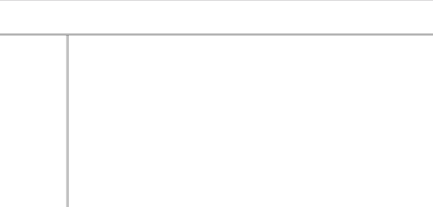
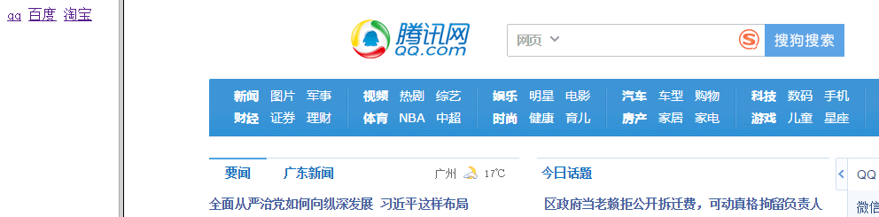

# HTML超文本标记语言
WWW 是“World Wide Web”（全球广域网）的缩写，简称为Web，中文又称为“万维网”。

HTML（Hypertext Markup Language，超文本标记语言）是一种文本类、解释执行的标记语言，
用于编写要通过WWW显示的超文本文件，称为HTML文件，也叫Web页面或网页。扩展名为.html或.htm 。

HTML文件的组成包含两部分内容：一是HTML标记；二是HTML标记所设置的内容。

## HTML基础

1. 文档类型：规范的`HTML/XHTML`文档需要以`<!DOCTYPE>`标记声明开始的。用于指定`DTD`(说明当前这个html版本)
 
2. HTML文件的基本结构: 头部(`head`)，标题(`title`)，页面主体(`body`)

3. HTML标记: html文件的开始和结束标签：`<html></html>`

> html中标签的大致写法：

* 由开始标签和结束标签组成,空标签写法为：`<标签名/>`,双标签`<标签名></标签名>`
* 标签名不区分大小写，但在`XHTML`中必须小写
* 标签具有属性，属性用来表示标签的性质和特征，属性在一开始的标签中指定，如下图：


## 页面的头部标记

### HTML头部标记

* `<title>`: 设定显示在浏览器标题栏中的内容
* `<meta>`: 定义网页的字符集、关键字、描述信息等内容
* `<style>`: 设置CSS层叠样式表的内容
* `<link>`: 对外部文件的链接
* `<script>`: 设置页面脚本或链接外部脚本文件

### 元信息标记`<meta>`

1. 定义文件编码
```html
<meta http-equiv="Content-Type" content="text/html; charset=utf-8" />
```
2. 搜索引擎优化-关键字
```html
<meta name="keywords" content="关键字1，关键字2，…" />
```
3. 搜索引擎优化-描述
```html
<meta name="description" content="内容介绍" />
```
4. 设置页面刷新或者跳转
```html
<!--设置页面每隔3s刷新一次-->
<meta http-equiv="refresh" content="3">
<!--在当前页面停留3s后，自动跳转到新浪网站首页-->
<meta http-equiv="refresh" content="3;url=http://www.sina.com.cn">
```

### 网页标题栏图标

```html
<!--在网页标题栏左侧显示-->
<link rel="icon" href="图标地址" type="image/x-icon">
<!--也可以在收藏夹显示图标-->
<link rel="shortcut icon" href="图标地址" type="image/x-icon">
```

## 页面的主题标记`<body>`

1. 一个网站的三大元素: 图片，超链接，文字

2. 添加网页背景图片

默认情况下，背景图片会随着页面的滚动而滚动，设置`<body>`标记的`bgproperties="fixed"`,可以使背景图片固定不动。

```html
<body background="images/***.jpg" bgproperties="fixed">
```

3\. 设置网页链接文字颜色

`link`属性设置未访问链接文字颜色；`alink`属性设置正在访问链接文字颜色；`vlink`属性设置访问过后的链接文字颜色

```html
<body link="颜色值" alink="颜色值" vlink="颜色值">
```

4\. 设置网页边距

设置网页与浏览器边框的间距
```html
<body leftmargin="边距值" rightmargin="边距值" topmargin="边距值" bottommargin="边距值">
```

### HTML的注意事项和建议

* 凡是标签都应该闭合！
* 凡是标签都应该小写！
* 文件编码跟设置的编码保持一致！
* 标签属性加引号(英文输入法下的引号)
* `HTML`缩进统一使用`tab`键

## 文字与段落标记

1. 标题字 `h1~h6`

h1的字最大，递减至 h6 最小
```html
<h2 align="对齐方式">标题字</h2>
```

2\. 空格

在HTML里面，浏览器不能解析源代码中使用的`Enter`键，所有的空格，换行符，水平制表符等等。无论你打再多个，都会视为一个空格。

3\. 字体标签`<font>`
```html
<font face="字体名称" size="字号" color="颜色值">文字内容</font>
```

属性 | 说明
 :-: | :-:
`color` | 颜色,默认黑色
`size` | 默认字号为3号字。取值范围1~7，可+1到+7，-1到-7(正负取值相对于页面默认字号)，超出取值范围，与取值范围的最近的值效果相同。
`face` | 默认宋体[黑体,微软雅黑...]

4\. 字体格式化标签 {#tagSymbol}

 标签 | 意义 | 标签 | 意义
 :-: | :-: | :-: | :-:
 `<i></i>` | italic,斜体 | `<em></em>` | 斜体
 `<b></b>` | blod,加粗 | `<strong></strong>` | 粗体
 `<big></big>` | 大字号 | `<small></small>` | 小字号
 `<u></u>` | underline,下划线 | `<s></s>` | 删除线
 `<strike></strike>` | 删除线 | `<del></del>` | 删除线
 `<q></q>` | 引用"" | `<dfn></dfn>` | 举例
 `<mark></mark>` | 高亮 | `<sup></sup>` | 上标字
 `<sub></sub>` | 下标字 | `<ruby></ruby>` | 注释
 `<rt></rt>` | 注释 | `<rp></rp>` | 注释
 
举例：
```html
<ruby>OJ<rp>(<rt>Orange Juice<rp>)</ruby>
```

<ruby>OJ<rp>(<rt>Orange Juice<rp>)</ruby>

```html
(x+y)<sup>2</sup> = x<sup>2</sup> + y<sup>2</sup> + 2xy
```

(x+y)<sup>2</sup> = x<sup>2</sup> + y<sup>2</sup> + 2xy

5\. 注释语句

__语法：__ `<!-- 注释内容 -->`

为了提高代码的维护性和可读性，常常在源代码中添加注释语句，用于对代码进行说明。注释语句并不显示在浏览器中。

6\. 实体字符  
实体名称对大小写敏感！

__HTML 中有用的字符实体__

实体字符 | 描述 | 实体名称 | 实体编号 | 实体字符 | 描述 | 实体名称 | 实体编号
:-: | :-: | :-: | :-: | :-: | :-: | :-: | :-:
  | 空格 | `&emsp;` 这个兼容性比较好 | | | 空格 | `&nbsp;` 有些浏览器不能使用 | &amp;#160;
< | 小于号 | `&lt;` | &amp;#60; | > | 大于号 | `&gt;` | &amp;#62;
" | 引号 | `&quot;` | &amp;#34; | ' | 撇号 | `&apos;` (IE不支持) | &amp;#39;
& | 和号 | `&amp;` | &amp;#38; | ¥ | 元 yen | `&yen;` | &amp;#165;
x | 乘号 | `&times;` | &amp;#215; | ÷ | 除号 | `&divide;` | &amp;#247;
© | 版权 | `&copy;` | &amp;#169; | ® | 商标 | `&reg;` | &amp;#174;

__html特殊符号对照表__


7\. 段落标记

* 段落标签 `<p>` 全称: `paragraph`

语法说明：在HTML中即可使用单标记也可使用双标记,但XHTML只能用双标记。  
区别是`双标记`会与上下文同时产生一空行的间隔,而`单标记`只与上文产生一空行间隔

* 换行标签 `<br />`
* 居中标记 `<center></center>`
* 缩排标记 `<blockquote></blockquote>`
* 预格式化标记 `<pre></pre>`
* 水平线标签 `<hr align="center" width="50%" size="2" noshade />` noshade 实心的不带阴影的效果

## 超链接a标签 {#link}

> 属性

属性 | 描述
 :-: | :-:
`href` | 规定链接指向的页面的 URL。
`title` | 指定元素的提示文本。
`name` | 规定锚的名称。
`download` | 规定被下载的超链接目标。
`target` | 规定在何处打开链接文档。

__`<a>` 标签的 `target` 属性__

属性值 | 描述
 :-: | :-:
`_seft` | 默认。在相同的框架中打开被链接文档。
`_blank` | 在新窗口中打开被链接文档。
`_parent` | 在上一级窗口中打开，一般在框架页面中经常使用。
`_top` | 在浏览器的整个窗口中打开，忽略任何框架。
`framename` | 在指定的框架窗口中打开链接文档。

> 链接类型

1. 引用外部链接: `<a href="http://www.baidu.com">超级链接</a>`

2. 引用内部链接: `<a href="同一网站内部网页名称">内部链接是指在同一个网站内部，不同网页之间的链接关系</a>`

3. 锚点，也叫书签链接。锚点需要满足两个条件。锚点名，锚链接

```html
<a name="top"></a><!--锚点名-->
<!-- 一大段内容 -->
<a href="#top">点击跳转到顶部</a>
<!--这个是内部书签链接即链接到同一页面的书签，若要外部则为<a href="地址#书签名">...</a>-->
```

4\. 图片链接 `<a href="图片链接目标"></a>`

5\. foxmail发邮箱的软件,发送邮箱,比较少用 `<a href="mailto:chenha0qiang@163.com">联系我们</a>`
<!-- 注意文件的路径必须是英文 ,且使用反斜杠因为linux系统无法识别'\'-->

6\. skype手机调试，在移动端很有用。
```html
<a href="tel:159157*****">拨打</a>
<a href="sms:159157*****">发短信</a>
```

7\. 脚本链接 `<a href="javascript:alert('您好，欢迎访问我的站点！')">欢迎访问</a>`

8\. 下载链接：当`<a>`连接的`href`加载的是浏览器无法打开的文件，比如`zip,rar`。是会提供下载的  
`<a href="01.zip">下载</a>`

> 链接路径

* 在当前目录下，直接写文件名 (默认 ./  当前目录)  
`<a href="readme.txt">本地文件</a>`
* 当文件在当前目录的某个(dir)文件夹下，这么来写  
`<a href="dir/readme.txt">本地文件</a>`
* 当文件在当前目录的上一级，这么来写 (使用 ../ 返回上一层)  
`<a href="../readme.txt">本地文件</a>`
* 绝对路径  
`<a href="E:/image/img2.png">用绝对路径打开图片</a>`

## 图片标签`` {#img}

> 属性

属性 | 描述
 :-: | :-:
`src` | 图片的来源，路径。(source)
`alt` | 图片加载失败的说明文字。建议写图片标签的时候都加上，有利于SEO优化。
`width` | 宽度(如果只设置一个宽度或高度，那么对应得高度或宽度会等比例放大缩小)
`height` | 高度(如果只设置一个宽度或高度，那么对应得高度或宽度会等比例放大缩小)
`hspace` | 设置图片与周围对象的水平间距
`vspace` | 设置图片与周围对象的垂直间距
`title`  | 提示信息。
`border` | 图片的边框。(后面课程中会经常用到)
`align`  | 设置图片与周围对象的对齐方式(可取值有:top、bottom、middle、left、right)

### 图像热区

概念：图片映射是指源端点为图片热区的超链接。一幅图像被切分成不同的区域，每一个区域可以链接到不同的地址，这些区域称为图像的热区。

__基本语法：__
```html

<map name="map 名称">
    <area shape="rect" coords="x1,y1,x2,y2" href="链接地址1" />
    <area shape="circle" coords="x,y,r" href="链接地址2" />
    <area shape="poly" coords="x1,y1,x2,y2,x3,y3,..." href="链接地址3" />
</map>
```
area标签属性 | 描述 | 类型shape属性值 | 描述
 :-: | :-: | :-: | :-:
`shape` | 类型 | `rect` | 矩形（2个坐标）
`coords` | 坐标 | `circle` | 圆形（1个）
`href` | 跳转地址 | `poly` | 多边形（N个）

链接属性`href`(a标签和area标签中可使用该属性)：当链接到不可解析的文件时会提示下载信息

什么地方用图像热区呢？  
一般如果图片很大，很长，只取某部分，那就使用图像热区。

图像热区超级不好调试的，会以目标图片的左上角为原点，就是占位大小不包括`margin`，占位大小有占位宽和站位高。  
占位宽=`width+border+padding`;  
站位高=`height+border+padding`;  
而这个可以使用`photoshop`找到坐标，使用到标尺等工具。使用`photoshop打开图片->将鼠标放在坐标上->在控制面板查看坐标信息`

## 列表 {#ul}

### 有序列表
```html
<ol type="A">
  <li>这里是第1个li</li>
  <li>这里是第2个li</li>
  <li>这里是第3个li</li>
</ol>
```
__ol属性：__
* `type` : 数字(1); 大小写字母(A,a); 大小写罗马数字(I,i)
* `start`: "起始编号位序"表示列表项的开始编号所处的位置序号，即li前面开始的数值 -->  `<ol type="a" start="3">`

### 无序列表
```html
<ul type="square">
  <li>这里是第1个li</li>
  <li>这里是第2个li</li>
  <li>这里是第3个li</li>
</ul>
```
__ul属性：__
* `type` : 实心圆(disc); 空心圆(circle); 实心矩形(square)
该属性顺序是li中继续包含ul后的type默认属性,后面默认为实心矩形

> [!Warning|label: 注意]
> 无论是有序列表还是无序列表，ul和ol能接的标签只能是li，但li中可以添加任意标签

### 定义列表
```html
<dl>
    <dt>html是什么</dt>
    <dd>HyperText Markup Languagehtml
    <br/>
    是一种超文本标记语言
    </dd>
</dl>
```
dd标签相当于其他列表中的li标签，可以在其中添加任意标签，不过建议只放dt和dd标签，  
一般情况下使用标签+样式实现文本的解析，不使用多个dd或dt标签

__定义列表的应用场景__
1. 做网站尾部的相关信息
2. 做图文混排

### 嵌套列表
```html
<ul> -->无序列表
  <li>
    <ol> -->有序列表
      <li>...</li>          -->无序列表中嵌套了一个有序列表
    </ol>
   
</ul>
```

## 表格 {#table}

### 表格标签

标签 | 描述 | 标签 | 描述 | 标签 | 描述
 :-: | :-: | :-: | :-: | :-: | :-:
 `<table>` | 定义表格 | `<th>` | 定义表格的表头 | |
 `<caption>` | 定义表格标题 | `<colgroup>` | 定义表格列的组 | `<col>` | 定义用于表格列的属性
 `<thead>` | 定义表格的页眉 | `<tbody>` | 定义表格的主体 | `<tfoot>` | 定义表格的页脚
 `<tr>` | 定义表格的行 | `<td>` | 定义表格单元 | |
 
 ### 表格属性
 
 属性 | 描述 | 属性 | 描述 | 属性 | 描述
 :-: | :-: | :-: | :-: | :-: | :-:
 `width` | 宽 | `height` | 高 | `summary` | 摘要
 `title` | 提示信息 | `bgcolor` | 背景颜色 | `background` | 背景图片
 `align` | 水平方向对齐 | `valign` | 垂直方向对齐 | `cellspacing` | 单元格之间的空白(默认2px)
 `cellpadding` | 内容与单元格的空白 | `colspan` | 表示横向合并单元格 | `rowspan` | 表示纵向合并单元格
 `border` | 规定表格边框的宽度。| `frame` | 规定外侧边框的哪个部分是可见的。| `rules` | 规定内侧边框的哪个部分是可见的。

__对齐属性__
* `align`: 水平方向对齐,值为left,center,right.  适用于table,tr,td
* `valign`: 垂直方向对齐。值为top,middle,bottom. 适用于tr,td
* `cellspacing` :  单元格之间的空白(默认2px)     适用于table
* `cellpadding` :  内容与单元格的空白            适用于table

__bgcolor、background__ 两个属性也适用与表格。(table,tr,td)  
在表格里面给宽度并不能真正的限制死表格的宽度，如果内容超出表格的实质宽高，依然会将表格的单元格甚至整个表格撑开

__summary__ 属性规定表格内容的摘要。`summary` 属性不会对普通浏览器中产生任何视觉变化。屏幕阅读器可以利用该属性。

__frame和rules属性__，可以控制边框的显示。`frame`属性控制着表格最外围的四条边框的可见性，而`rules`则控制着表格内部边框的可见性。  

__frame属性可取的值及含义如下：__

属性值 | 描述 | 属性值 | 描述
 :-: | :-: | :-: | :-:
`above` | 显示上部的外侧边框 | `below` | 显示下部的外侧边框
`lhs` | 显示左边的外侧边框 | `rhs` | 显示右边的外侧边框
`hsides` | 显示上部和下部的外侧边框 | `vsides` | 显示左边和右边的外侧边框
`void` | 默认值，表示不显示表格最外围的边框 | `box` | 在所有四个边上显示外侧边框
`border` | 在所有四个边上显示外侧边框 | | 

__rules 属性可取的值有五个，分别是：__
* `none` - 默认值，无边框
* `rows` - 为行加边框
* `cols` - 为列加边框
* `groups` - 为行组或列组加边框
* `all` - 为所有行列（单元格）加边框

### table的三个基本组成部分：`行`，`列`，`单元格`

1. 表格标题标记：`<caption align="水平对齐方式(左中右)" valign="垂直对齐(上下)"></caption>`
2. 表格可以分成表头、主体和表尾三部分，在HTML语言中分别用`<thead>`、`<tbody>`、`<tfoot>`表示
> [!Warning|label: 这里有三个注意点]
> 1. `<thead>`和`<tfoot>`在一张表中都只能有一个，而`<tbody>`可以有多个。
> 2. `<tfoot>`必须出现在`<tbody>`前面，这样浏览器在接收主体数据之前，就能渲染表尾，有利于加快表格的显示速度。这一点对大型表格尤其重要。
> 3. `<thead>`、`<tbody>`和`<tfoot>`里面都必须使用`<tr>`标签。

3\. CSS中的`table-layout`语句：`table { table-layout: fixed/auto/inherit }`
* `auto`表示单元格的大小由内容决定。
* `fixed`表示单元格的大小是固定的，由第一个指定大小的单元格决定；如果所有单元格都没有指定大小，则由第一个单元格的默认大小决定；如果单元格中的内容超出单元格的大小，则用CSS中的overflow命令控制。微软公司声称使用这个命令，表格的显示速度可以加快100倍。
* `inherit`表示从父元素继承table-layout属性的值，任何版本的IE都不支持。

4\. `<tbody>`可以用来对`行`进行分组，而`<colgroup>`则用来对`列`进行分组。 
比如，下面的代码表示前40列为一组，每列的宽度为20像素。`<colgroup span="40" width="20"></colgroup>`  
`span`属性，可以指定`colgroup`标签能够影响到的列数。在`colgroup`标签内部，可以使用`col`标签为这一列组中的每一列指定属性。  
比如，下面的代码表示列组中每一列的段度为为不同宽度：`<colgroup><col width="20"><col width="50"><col width="30"></colgroup>`  
__代码示例：__
```html
<table border="1" width="600" frame="hsides" rules="groups">
    <caption>My Ultimate Table</caption>
    <colgroup span="1" width="200"></colgroup>
    <colgroup span="3" width="400"></colgroup>
    <thead>
        <tr><td>cell 1-1</td><td>cell 1-2</td><td>cell 1-3</td><td>cell 1-4</td></tr>
    </thead>
    <tfoot>
        <tr><td>cell 4-1</td><td>cell 4-2</td><td>cell 4-3</td><td>cell 4-4</td></tr>
    </tfoot>
    <tbody>
        <tr><td>cell 2-1</td><td>cell 2-2</td><td>cell 2-3</td><td>cell 2-4</td></tr>
        <tr><td>cell 3-1</td><td>cell 3-2</td><td>cell 3-3</td><td>cell 3-4</td></tr>
    </tbody>
</table>
```
__显示效果如下：__


5\. 合并单元格`colspan`和`rowspan`


__代码示例：__
```html
<table border="1" summary="这个表格给出了一些关于果蝇的统计数据:平均身高和体重，红眼睛的比例(雄性和雌性)。">
　<caption><em>a test table with merged cells</em></caption>
　<tr><th rowspan="2"></th><th colspan="2">average</th>
　<th rowspan="2">red<br>eyes</th></tr>
　<tr><th>height</th><th>weight</th></tr>
　<tr><th>males</th><td>1.9</td><td>0.003</td><td>40%</td></tr>
　<tr><th>females</th><td>1.7</td><td>0.002</td><td>43%</td></tr>
</table>
```
__显示效果如下：__


## 表单 {#form}

### `form`表单标记
```html
<form name="表单名称" method="提交方法" action="处理程序">……</form>
```

#### 表单属性

* `action` 用于指定表单的服务端程序,规定当提交表单时，向何处发送表单数据。action取值为:第一，一个URL（绝对URL/相对URL），一般指向服务器端一个程序，程序接受到表单提交过来的数据（即表单元素值）作相应处理。比如：

当用户提交这个表单时，第一，服务器将执行网址<http://i.blog.sina.com.cn//>上的名为`reg.ashx`的一般处理程序。  
第二，使用`mailto`协议的`URL`地址，这样会将表单内容以电子邮件的形式发送出去。这种情况比较少见的，因为它要求访问者的计算机上安装和正确设置好了邮件发送程序。  
第三，空值，如果`action`为空或不写，表示提交给当前页面。
* `method` 该属性定义浏览器将表单中的数据提交给服务器处理程序的方式。最常用的是`get`和`post`，默认时使用`get`方法。 
 
__get 与 post 有什么区别呢？__  
1. 数据的查询：比如浏览论坛时，`URL`一般包含了分类、页码数、每页记录数等信息。 `get`方式，能一目了然的看到所要查询的信息(条件)。 `post` 因为隐藏掉了这些信息，不方便进行检验查询条件。  
2. 敏感数据的提交(安全性)：对一项记录，进行更改、添加操作时，比如注册用户、更改用户资料等。`get` 方式附加在URL上，会泄露掉敏感的消息。 `post` 方式，能隐藏掉敏感的信息。下面各用个例子说明一下：
 * 用`get`方式点击提交后：`URL`变为：`http://localhost:4778/ashx/login.ashx?login_username=admin&login_pswd=123456`
 * 用`post`方式点击提交后：`URL`变为：`http://localhost:4778/ashx/login.ashx` 可以看到只是`action`指定的`URL`，参数并没有附加在`URL`后面。
3. 大数据文本传递：`get`虽然方便查询，但由于是附加在`URL`上，各浏览器对`URL`也有个长度限制。`IE`:`2048字符`。`Chrome、FF`好像是 `8182字符`。`post`好像没此限制。

* `onsubmit` 用于指定处理表单的脚本函数
* `enctype` 设置`MIME类型`，默认值为`application/x-www-form-urlencoded`。需要上传文件到服务器时，应将该属性设置为`multipart/form-data`

### `input`输入标记
多数表单元素都可使用`input`定义,为了标识每一个数据，我们需要给表单元素添加`name`属性，所以`name`为必设属性，`name="域名称"`

#### `<input>`文本框的主要属性:

* `width` 宽度 `height` 高度
* `name` 名称，在脚本中可作为标识获取数据
* `maxlength` 设置在文本框中最多可输入的字符数
* `max` 规定输入字段的最大值。`min` 规定输入字段的最小值。`max`和`min`属性配合使用，来创建合法值的范围。
* `size` 文本框长度，大约以字节为单位
* `value` 指定文本框的默认值，是在浏览器第一次显示表单或者用户单击重置按钮之后在文本框中显示的值
* `placeholder` 规定帮助用户填写输入字段的提示
* `autofocus` 规定输入字段在页面加载时是否获得焦点
* `readonly` 只读属性，当设置`readonly`属性后，文本框可以获得焦点，但用户不能改变文本框中的`value`
* `disabled` 禁用，当文本框被禁用时，不能获得焦点，当然，用户也不能改变文本框的值。并且在提交表单时，浏览器不会将该文本框的值发送给服务器
* `required` 指示输入字段的值是必需的
* `pattern` 规定输入字段的值的模式或格式，例如 pattern="[0-9]" 表示输入值必须是 0 与 9 之间的数字
* `type` 规定`input`元素的类型，下面详细介绍

#### `type`属性规定`input`元素的类型

1. 文本框`text`: 输入信息以明文显示
```html
用户名: <input type="text" name="user" />
```

2. 密码框`password`: 以"*"或"●"符号回显所输入的字符，从而起到保密的作用
```html
密码: <input type="password" name="pwd" />
```

3. 隐藏域`hidden`: 隐藏域不会被浏览者看到，它主要用于在不同页面传递域中所设定的值
```html
<input type="hidden" name="hid" value="域值">
```

4. 文件域`file`: 文件域可以将本地文件上传到服务器端,文件上传没有默认值,利用这项功能时，在 form 标签中要指定method属性。要把method 指定为post, enctype属性指定为 multipart/form-data。否则无法上传文件内容
```html
<input type="file" name="photo">
```

5. 单选按钮`radio`: 在一组选项中进行单项选择，以一个圆框表示  
    使用方式：要实现单选功能，name值必须相等。使用name相同的一组单选按钮，不同radio设定不同的value值，这样通过取指定name的值就可以知道谁被选中了，不用单独的判断。单选按钮的元素值由value属性显式设置，表单提交时，选中项的value和name被打包发送，不显式设置value。
```html
性别: 男:<input type="radio" name="gender" value="female" checked="checked"> <!-- checked表示此项被默认选中,单复选都适用 -->
      女:<input type="radio" name="gender" value="male"/>  <!-- 像这些用户不能填写的表单元素，我们需要设置一些值给用户进行选择。 -->
```

6. 复选按钮`checkbox`: 在一组选项中进行多项选择，以一个方框表示
```html
爱好: <input type="checkbox" name="hobby[m1]" value="music"/>音乐
      <input type="checkbox" name="hobby[m2]" value="trip"/>旅游
      <input type="checkbox" name="hobby[m3]" value="reading"/>阅读
```

7. 提交按钮`submit`: 用于将表单内容提交到指定服务器处理程序或指定客户端脚本进行处理
```html
<input type="submit" name="按钮名称" value="按钮显示文本">
```

8. 普通按钮`button`: 用于激发提交表单动作，配合JavaScript脚本对表单执行处理操作
```html
<input type="button" value="按钮显示文本" onclick="javascript函数名" name="按钮名称">
```

9. 重置按钮`reset`: 用于清楚表单中所输入的内容，将表单内容恢复成默认的状态
```html
<input type="reset" name="按钮名称" value="按钮显示文本">
```

10. 图像按钮`image`: 按钮外形以图像表示，功能与提交按钮一样，具有提交表单内容的作用
```html
<input type="image" name="按钮名称" src="图像路径" width="宽" height="高">
```

### `select`选择列表标记

#### 选择列表
一次可以选择多个列表选项，且一次可以显示1个以上列表选项的选择列表  
select 标记用于声明选择列表，option标记用于设置各个选项
```html
<select name="列表名称" size="显示的选项数目(默认为1)" multiple="multiple"><!-- multiple设置列表中的项目可多选 -->
    <option value="banana" selected="selected">香蕉</option><!-- selected设置默认选项，可设置多个 -->
    <option value="apple">苹果</option>
    <option value="watermelon" selected="selected">西瓜</option>
    <option value="grape" selected="selected">葡萄</option>
</select>
```

#### 下拉列表
一次只能选择一个列表选项，且一次只能显示一个列表选项的选择列表，即size默认1不能设置 size和 multiple属性
```html
<select name="area">
    <optgroup label="国外"> <!-- <optgroup> 标签用于组合选项，即给选项分组类别,属性为label,指定选项组合名称 -->
        <option value="1">华盛顿</option>
        <option value="2">旧金山</option>
    </optgroup>
    <optgroup label="国内">
        <option value="3">广州</option>
        <option value="4">湛江</option>
    </optgroup>
</select>
```

### `textarea`文本域标记
一般用于给用户填写备注信息或留言信息的多行多列文本区域
```html
<textarea name="文本区域名称" rows="行数" cols="字符数">
    ...(此处输入的为默认文本，比如)请在此处输入备注信息
</textarea>
```

### `label`标签：为`input`元素定义标注
`lable`元素不会向用户呈现任何特殊效果。不过，它为鼠标用户改进了可用性。如果您在`label`元素内点击文本，就会触发此控件。就是说，当用户选择该标签时，浏览器就会自动将焦点转到和标签相关的表单控件上。

> [!Warning|label: 注意]
> __"for"__属性可把__label__绑定到另外一个元素。请把__"for"__属性的值设置为相关元素的__id__属性的值。即为下面说的隐式的联系。

#### 隐式和显式的联系
标记通常以下面两种方式中的一种来和表单控件相联系：将表单控件作为标记标签的内容，这样的就是隐式形式， 
或者为`<label>`标签下的__for__属性命名一个目标表单__id__，这样就是显式形式。

**显式的联系**
```html
<label for="SSN">Social Security Number:</label>
<input type="text" name="SocSecNum" id="SSN" />
```

**隐式的联系**
```html
<label>Date of Birth: <input type="text" name="DofB" /></label>
```

### `fieldset`标签
把表单中元素组合起来，通俗的讲就是把表单围起来，顺便给个标题注释，看起来更规整。

**基本语法：**`<fieldset> <legend>...</legend> <form>...</form> </fieldset>`

**demo**
```html
<fieldset>
    <legend>我最喜爱的:</legend>
    <label for="computer">计算机</label> <input type="checkbox" value="1" id="fav" name="fav" />
    <label for="trval">旅游</label> <input type="checkbox" value="2" id="fav" name="fav" />
    <label for="buy">购物</label> <input type="checkbox" value="3" id="fav" name="fav" />
</fieldset>
```
**显示效果**

<fieldset>
    <legend>我最喜爱的:</legend>
    <label for="computer">计算机</label> <input type="checkbox" value="1" id="fav" name="fav" />
    <label for="trval">旅游</label> <input type="checkbox" value="2" id="fav" name="fav" />
    <label for="buy">购物</label> <input type="checkbox" value="3" id="fav" name="fav" />
</fieldset>

## 框架 {#frame}

### 框架概述

框架的作用，就是把浏览器窗口划分成若干个小窗口，每个小窗口可以分别显示不同的网页。这样在一个页面中可以同时显示不同网页内容，不同窗口的内容相互独立。框架的主要用途是导航，通常会在一个窗口中显示导航条，另外一个窗口则作为内容窗口，用于显示导航栏目的目标页面内容，窗口的内容会根据导航栏目的不同而动态变化。

html框架集与body同级,因此不能同时出现。框架的基本结构主要分为框架集`<frameset>`和框架`<frame>`两个部分。

**基本语法如下：**
```html
<frameset>
    <frame/> <!-- 一个框架集中可以包括多个框架，每个框架窗口显示的页面由框架的 src 属性指定。 -->
    <frame/>
    ...
</frameset>
```

### 框架集标记`frameset`

定义浏览器窗口的分割方式、各分割窗口（框架）的大小以及设置框架边框的颜色和粗细等属性。**主要属性有：**

属性 | 说明 | 属性 | 说明 | 属性 | 说明
:-: | :-: | :-: | :-: | :-: | :-:
border | 边框宽度，框架粗细 | frameborder | 是否显示边框（取值1, 0或yes，no）| rows | 上下分割窗口
bordercolor | 边框颜色 | framespacing | 边框间距| cols | 左右分割窗口

`<frameset>`标记对浏览器窗口的分割存在不同的方式，主要分为以下几种类型：
* cols左右（水平）分割  `<frameset cols="80,*">`
* rows上下（垂直）分割  `<frameset rows="80,*">`
cols把框架分成左右两半,上下分割使用rows(分成上下两半)。每个框架的大小使用逗号隔开，最后一个使用*会把剩下的都分配给它
* 嵌套分割：左右上下分割都有。`<frameset>`里面再嵌套一个`<frameset>`标记.
```html
<frameset rows="100,*">
    <frame/>
    <frameset cols="20%,*">
    <frame/>
    </frameset>
</frameset>
```
**效果图如下：**



### 框架标记`frame`

`<frameset>`分割得到的每个子窗口都需要显示不同的页面内容，这些页面内容由`<frame>`标记来设置。  
`<frame>`是个单标记，它必须放在框架集`frameset`中，`<frameset>`分割了几个子窗口就必须对应几个`<frame>`标记。

**基本语法：**
```html
<frame src="01.html" name="test" /> <!-- src 框架的源文件地址，name 框架名(命名框架，以便超链接使用它作为目标窗口) -->
```

**`<frame>`标记的常用属性有：**

属性 | 属性值 | 说明 | 属性 | 属性值 | 说明
:-: | :-: | :-: | :-: | :-: | :-:
scrolling | yes、no、auto | 是否显示滚动条 | noresize | | 禁止改变框架的尺寸大小
border | | 边框宽度，框架粗细 | bordercolor | | 边框颜色
marginwidth | | 设置内容与框架窗口左右边框的距离 | marginheight | | 设置内容与框架窗口上下边框的距离
src | | 显示页面的URL地址 | | |

### 浮动框架标记`iframe`（也有叫“内嵌框架”的）

浮动框架时一种特殊的框架页面，主要体现在这个框架时嵌套在一个HTML页面中，作为页面的一个组成部分。具有和`<frame>`一样的属性，也有自己的属性：
`<iframe src="源文件地址" name="名" width="宽" height="高" align="对齐方式">`

### 不支持框架标记`noframes`

当用户浏览器版本太低不支持框架时，浏览器制作人员无法改变这一现象，所能做的只是告诉用户事实，把显示给用户看的文本信息放在`<body></body>`标记对之间；而`<noframes>`放在`</frameset>`标记后面。如：
```html
<frameset cols="130,*"><frame src="menu.html"/><frame src="introduce.html"/></frameset>
<noframes>
    <body>抱歉，您的浏览器版本太低，不支持框架，无法看到页面内容，请使用较新的浏览器来浏览。</body>
</noframes>
```
当用户浏览器版本太低不支持框架时，浏览器窗口将显示`<body></body>`标记对之间的文本内容，否则将显示`<frameset></frameset>`中各个框架的页面内容。

### 框架与超链接

一般情况下在框架中的a链接使用target属性实现框架内文件跳转时：
* `href` 一直不变，即指向打开的文件路径不需要变
* `_self` 自己框架页面打开
* `_blank` 新页面打开
* `_top` 顶级框架页面打开
* `_parent` 到其父级框架页面打开
* `_framename` 将我们想要打开的页面在指定的框架中打开

**下面用个例子来说明**  
1. 首先，新建一个网页“框架集和框架.html”，为右侧框架窗口添加"name"标识，输入下面的内容：
```html
<!DOCTYPE html>
<html lang="en">
<head>
    <meta charset="UTF-8">
    <title>框架集frameset和框架frame</title>
</head>
<frameset cols="10%,*">
<frame src="menu.html" />
<frame  src="http://qq.com" name="RightFrame" />
</frameset>
</html>
```
2. 然后，新建一个网页“menu.html”，在左侧窗口中，设置"target"属性显示的窗口名，输入下面的内容：
```html
<!DOCTYPE html>
<html lang="en">
<head>
    <meta charset="UTF-8">
    <title>Document</title>
</head>
<body>
    <a href="http://qq.com/"  target="RightFrame">qq</a>
    <a href="http://baidu.com" target="RightFrame">百度</a>
    <a href="http://taobao.com" target="RightFrame">淘宝</a>
</body>
</html>
```
如下图，刚开始打开这个“框架集和框架.html”这个网页时，显示的效果如下：  
左边相当于是一个菜单，右边是显示效果，当你单击“百度”或者“淘宝”时都可以链接到相应网站。



## 在网页中嵌入多媒体内容 {#media}

现在在制作网页时，除了可以在网页中放置文本、图片外，还可以在页面中嵌入声音、视频、动画等多媒体内容，使得页面看上去更加丰富多彩、动感十足。

### 设置滚动字幕`marquee`

    属性          属性值                             说明
    ——————————————————————————————————————————————————————————————————————————————————————————————————————————————————
    demo：`<marquee direction="up">文字从下往上循环滚动</marquee>`
                  up(从下往上)down(从上往下)
    direction     left(从右往左，默认滚动方向)       设置滚动字幕的滚动方向
    (滚动方向)     right(从左往右)
    ——————————————————————————————————————————————————————————————————————————————————————————————————————————————————
    demo：`<marquee behavior="alternate">设置文字循环交替往返进行滚动</marquee>`
    behavior      scroll      设置文字循环往复滚动(默认行为)
    (滚动行为)     slide       设置文字只进行一次滚动
                  alternate   设置文字循环交替往返进行滚动
    ——————————————————————————————————————————————————————————————————————————————————————————————————————————————————
    demo：`<marquee scorllamount="滚动速度值" scrolldelay="延迟时间">滚动文字</marquee>`
    scorllamount  设置文字滚动速度，取值为某个数字，越大滚动越快，默认的速度值是6
    scrolldelay   设置文字在每一次滚动后，延迟一段时间后再进行下一次滚动，value以毫秒为单位，值越小越快，默认值是100ms
    ——————————————————————————————————————————————————————————————————————————————————————————————————————————————————
    设置字幕的滚动区域、背景颜色、与周围对象的间距等
    width         设置文字滚动区域的宽度，可以是数字像素或百分比数值%
    height        设置文字滚动区域的宽度，可以是数字像素或百分比数值%
    bgcolor       设置文字滚动区域的背景颜色
    hspace        水平间距
    vspace        垂直间距
    ———————————————————————————————————————————————————————————————————————————————————————————————————————————————————

### 设置背景音乐`bgsound`

```html
<bgsound src="路径/文件名称" loop="循环次数">
<--loop默认情况下，背景音乐播放一次；如果取值为-1，则表示背景音乐循环不断地播放-->
```

### 嵌入音视频文件`embed`

`<embed src="路径/文件名称"></embed>`

属性 | 说明
:-: | :--
src    | 文件路径
width  | 以像素为单位定义嵌入式对象的宽度
height | 以像素为单位定义嵌入式对象的宽度
loop   | 设置嵌入式对象的播放是否循环不断，取值true时循环不断，否则只播放一次，默认值是false
hidden | 设置多媒体播放软件的可视性，默认值是false

### 嵌入Flash动画`object`

```html
<object classid="clsid:d27cdb6e-ae6d-11cf-96b8-444553540000" codebase="http://download.macromedia.com/pub/shockwave/cabs/flash/swflash.cab#version=7,0,19,0" width="500" height="300" id="一个字" >
    <param name="movie" value="一个字.swf">
    <param name="FlashVars" value="prizeResult=3">
    <param name="quality" value="high">
    <param name="menu" value="false">
    <param name="wmode" value="transparent">
    <param name="allowScriptAccess" value="always" />
    <embed src="../../images/html5/一个字.swf" FlashVars="prizeResult=3" allowScriptAccess="always" wmode="transparent" menu="false" quality="high" width="500" height="300" type="application/x-shockwave-flash" pluginspage="http://get.adobe.com/cn/flashplayer/" name="一个字"/>
</object>
```
其中 __OBJECT__ 的__classid__和__codebase__的值是必须这么写的，告诉浏览器自动下载__flash player__的地址,OBJECT标签是用于windows平台的IE浏览器的，EMBED是用于windows和Macintosh平台下的Netscape Navigator浏览器以及Macintosh平台下的IE浏览器，就是所谓的非IE浏览器。windows平台的IE利用__Activex控件__来播放flash而其它的浏览器则使用Netscape插件技术来播放__flash__。

**代码效果显示如下：**

<object classid="clsid:d27cdb6e-ae6d-11cf-96b8-444553540000" codebase="http://download.macromedia.com/pub/shockwave/cabs/flash/swflash.cab#version=7,0,19,0" width="500" height="300" id="一个字" >
        <param name="movie" value="一个字.swf">
        <param name="FlashVars" value="prizeResult=3">
        <param name="quality" value="high">
        <param name="menu" value="false">
        <param name="wmode" value="transparent">
        <param name="allowScriptAccess" value="always" />
        <embed src="../../images/html5/一个字.swf" FlashVars="prizeResult=3" allowScriptAccess="always" wmode="transparent" menu="false" quality="high" width="500" height="300" type="application/x-shockwave-flash" pluginspage="http://get.adobe.com/cn/flashplayer/" name="一个字"/>
</object>

### 嵌入Java Applet（扩展）

Applet 是用 Java开发的一种小程序，不能独立运行，必须嵌入HTML文件中，并通过支持Java的浏览器来运行。  
**基本语法：** `<applet code="XXX.class" width="区域宽度" height="区域高度"></applet>`  
**语法说明：** `XXX.class`表示所嵌入的`applet`类文件，`width、height`属性用来设置`applet`文件显示区域，单位是像素。

## HTML5的语义化标签 {#semantic}

HTML5简化了许多,它的设计遵循了3个原则:1.兼容性、2.实用性、3.通用访问性

### `header`元素

`<header>` 标签定义文档或者文档的一部分区域的页眉，又可用于设置文章标题。  
`<header>` 元素应该作为介绍内容或者导航链接栏的容器。在一个文档中，您可以定义多个`<header>`元素。  
**注释：** `<header>` 标签不能被放在 `<footer>`、`<address>` 或者另一个 `<header>` 元素内部。  
**语法说明:** `<header></header>`标记对之间可以包含 h1~h6 六个标题元素，以及p、span等元素。

### `hgroup`元素

`<hgroup>` 标签定义文档的主标题及副标题，也就是标题组合，标记对之间通常只使用 h1~h6 六个标题元素。
```html
<hgroup>
    <h1>hqbook</h1>
    <h2>学的不仅是技术更是梦想</h2>
</hgroup>
```

### `footer`元素

footer 元素主要用于为页面或某篇文章定义脚注内容，包括文章的版权信息、作者联系方式等内容，一个页面可以包含多个 footer 元素。
```html
<footer>
    <ul>
        <li>Copyright © 2000-2013 华软 All Rights Reserved</li>
        <li>学院地址：广州.从化.广从大道13号 电话：020-87818918</li>
    </ul>
</footer>
```

### `article`元素

`<article>` 标签定义独立的内容，页面中一块与上下文不相关的独立内容。比如一个帖子、一篇博客文章等。  
`<article>` 标签定义的内容本身必须是有意义的且必须是独立于文档的其余部分。  
`<article>` 的潜在来源：论坛帖子、博客文章、新闻故事、评论等。

**语法说明:** `<article></article>`标记对之间可以包含header、footer、section以及嵌套的article等元素。

### `section` 元素

`<section>` 元素用于对页面的某块内容进行分块，如将该块内容进一步分成章节的标题、内容和页脚等几部分。

**语法说明：** `<section></section>`标记对之间可以包含 h1~h6 六个标题元素、p元素以及多个article元素以表示该"分块"内部又包含多篇文章。此外，还可以嵌套section元素。

### `nav`元素

nav 元素用于定义页面上的各种导航条，一个页面中可以拥有多个 nav 元素，作为整个页面或不同部分内容的导航。  
nav 唯一不可能出现的位置是 address 元素内  
**基本语法:** `<nav><a href="">#</a><a href="">#</a><a href="">#</a></nav>`

### `aside` 元素

aside 元素表示article元素的内容之外的、与article元素的内容相关的辅助信息，  
它可以包含与当前页面或主要内容相关的引用、侧边栏、广告、导航条，以及其他类似的有别于主要内容的部分。

### `audio`音频标签

`<audio>`标签定义声音，比如音乐或其他音频流。目前，`<audio>`元素支持的3种文件格式：MP3、Wav、Ogg。

属性 | 说明
:-- | :--
src      | 要播放的音频的URL
autoplay | 音频在就绪后马上播放
controls | 向用户显示音频控件，比如播放/暂停按钮
loop     | 每当音频结束时重新开始播放
preload  | 音频在页面加载时进行加载，并预备播放

```html
<audio src="../../images/html5/bell.mp3" controls="controls"></audio>
```
**显示效果如下**

<audio src="../../images/html5/bell.mp3" controls="controls"></audio>

### `video`视频标签

`<video>`标签定义视频，比如电影片段或其他视频流。目前，`<video>`元素支持三种视频格式：MP4、WebM、Ogg。

属性 | 说明
:-- | :--
src      | 要播放的视频的URL
width    | 设置视频播放器的宽度
height   | 设置视频播放器的高度
autoplay | 视频在就绪后马上播放
controls | 向用户显示视频控件，比如播放/暂停按钮
loop     | 当媒介文件完成播放后再次开始播放
muted    | 规定视频的音频输出应该被静音
poster   | 规定视频下载时显示的图像，或者在用户点击播放按钮前显示的图像
preload  | 视频在页面加载时进行加载并预备播放，属性值(none:只有单击了Play按钮才加载视频;metadata:仅加载元数据,例如视频长度、作者、版权)

```html
<video src="../../images/html5/一拳打碎屏幕的老外.mp4" width="320" controls muted poster="images/logo.png" preload></video>
```
**显示效果如下**

<video src="../../images/html5/一拳打碎屏幕的老外.mp4" width="320" controls muted poster="images/logo.png" preload></video>

### 图形中的`figure`及`figcaption`

元素`figure`及`figcaption`实际上不能算作结构性元素，但在组织独立图片、图像、图表及编码列表时仍然很受欢迎。  
`<figure>`用于对元素进行组合。一般用于图片或视频。`<figcaption>` figure的子元素，用于对figure的内容进行说明。  
每一个`figure`元素中只能包括一个`figcaption`元素。图片排列一起可用。常常用到一种图片列表，图片+标题或者图片+标题+简单描述。

```html
<figure>
    
    <figcaption style="color: red">黄浦江上的的卢浦大桥</figcaption>
</figure>
```
**显示效果如下**

<figure>
    
    <figcaption style="color: red">黄浦江上的的卢浦大桥</figcaption>
</figure>

### `time`用于表示时间或日期

`<time datetime="2016-08-03">2016-08-03</time>`

### `datalist`选项列表

`<datalist>`与`input`元素配合使用，来定义 input 可能的值。

```html
<input type="text" list="valList">
<datalist id="valList">
    <option value="html">html</option>
    <option value="css">css</option>
    <option value="javascript">javascript</option>
</datalist>
```
**显示效果如下：**


### `progress`元素

`<progress></progress>`定义进度条
```html
<progress max="100" value="76">
    <span>76</span>%
</progress>
```
**显示效果如下：**

<progress max="100" value="76">
    <span>76</span>%
</progress>

### `details`和`summary`描述文档

#### `details`元素用于描述文档或文档某个部分的细节

* 该元素用于摘录引用等，应该与页面的主要内容区分开的其他内容
* Open 属性 展开

#### `summary`元素 __details__元素的标题

```html
<details open>
    <summary>hqbook</summary>
    <p>学的不仅是技术更是梦想</p>
</details>
```

**显示效果如下：**

<details open>
    <summary>hqbook</summary>
    <p>学的不仅是技术更是梦想</p>
</details>

### 其他语义化标签

* `<dialog></dialog>`定义一段对话

```html
<dialog open>
    <dt>老师</dt>
    <dd>2+2等于？</dd>
    <dt>学生</dt>
    <dd>4</dd>
    <dt>老师</dt>
    <dd>答对了！</dd>
</dialog>
```

* `<address></address>` 定义文章或页面作者的详细联系信息  
* `<mark></mark>` 需要标记的词或句子  
* `<keygen></keygen>` 给表单添加一个公钥

## 智能表单 {#smartForm}

### 表单新增属性

#### `autofocus` 属性

`<input type="text" autofocus/>`设置 `autofocus` 属性，使文本框自动获得焦点

> [!Warning|label: 注意]
> 一个页面中最多只能有一个表单元素设置该属性，否则功能将失效，建议对第一个`input`元素设置`autofocus`属性。

#### `formaction` 属性

```html
<input type="submit" formaction="处理逻辑"><!-- 处理逻辑可为add.jsp(添加)、update.jsp(修改)、delete.jsp(删除)。 -->
```
所有提交按钮(`<input type="submit">`、`<input type="image">`、`<button type="submit">`)都可以使用 `formaction` 属性。  
HTML5只需添加`formaction`属性就可实现增加、修改和删除3个按钮功能，不再需要脚本的控制。

#### `autocomplete` 属性

若一个元素内包含有 `autocomplete="off"` 属性，这意味着涉及机密信息，不应被浏览器保存。  
若表单未定义 `autocomplete`，则默认设置为开启自动完成、显示输入提示(记忆用户在曾访问网站上所输入的内容)。

#### `pattern` 属性

`pattern` 属性是input元素的验证属性，该属性的值是一个正则表达式，通过这个表达式可以验证输入内容的有效性。
```html
用户名：<input type="text" name="username" pattern="^[a-zA-Z]\w{2,7}" title="必须以字母开头，包含字符或数字，长度是3~8" /><br />
密码：<input type="text" name="password" pattern="\d{6}" title="必须输入6个数字" /><br />
```

#### `placeholder` 属性，也叫占位符

占位符值可以给予用户一个快速提示，让他们了解该在输入字段中输入什么，它并不会取代标签元素。当需要用户输入某一特定格式的内容时，  
占位符显得尤其有用。浏览器会在输入字段显示提示文字。当该输入字段被聚焦(focus)激活，该提示文字则消失，失去焦点时又将自动显示。
```html
姓名：<input type="text" placeholder="请输入您的真实姓名" name="username"><br />
```

#### `required` 属性  定义必填项

required 是一个布尔型属性，包含此属性的表单元素必须被填写。在发送时若仍为空，浏览器就会给予相关相应。

### 新增的`input`元素类型

> 输入类型`tel`及`search`

`tel`(电话输入文本) 及 `search`(搜索关键字输入的文本框) 类型与普通的文本没什么不同，  
唯一不同的是输入关键字后search文本框右侧会出现一个`X`按钮，单击`X`后清空输入内容，由此带来方便。
```html
手机tel：<input type="tel" name="phone" pattern="\d{11}" title="请输入11位的手机号码" form="register" />pattern="\d{11}" title="请输入11位的手机号码"<br/>
搜索search：<input type="search" name="search" results="n" form="register" />
```

手机tel：<input type="tel" name="phone" pattern="\d{11}" title="请输入11位的手机号码" form="register" />pattern="\d{11}" title="请输入11位的手机号码"<br/>
搜索search：<input type="search" name="search" results="n" form="register" />

> 输入类型`url`及`email`

URL地址输入框要求必须输入一个包含访问协议的完整的URL路径。
```html
URL网址：<input type="url" name="rul" title="URL应包括访问协议">
```
email邮箱输入框要求输入正确格式，此外，还可以添加 multiple 属性以允许同时输入多个以逗号分隔的email。
```html
Email：<input type="email" name="email" title="email的格式是 XXX@XXX.XX ">
```

> 输入类型`number`及`range`

`number` 及 `range` 类型与包含数值的输入有关，并且支持浮点数表达式。不同的是range类型是用一个滑块来进行输入。  
输入数值的取值范围由 min和 max两个属性来设置，默认是不限定；调节步长使用 step属性，默认步长是1.  
**基本语法：**`<input type="number/range" min="最小值" max="最大值" step="改变数值的步长" name="number/range">`
```html
滚动条range：<input type="range" name="range" min="1" max="10" form="register"/>
```
**显示效果**

滚动条range：<input type="range" name="range" min="1" max="10" form="register"/>

> 输入类型 `color`

color 类型让 input元素生成一个颜色选择器。`<input type="color" name="color">`

**显示效果：** <input type="color" name="color">

> `datalist` 选项列表

datalist 元素用于生成一个隐藏的下拉菜单，其相当于一个“看不见”的 select元素。为什么需要设置id值呢？  
因为 datalist元素一般需要跟某个文本框结合使用，结合方式是通过将文本框的"list"属性值设置为 datalist的 id值，这样就将 datalist绑定到了某个文本框。用户选中选项后datalist元素自动隐藏。记住，跟文本框一起使用并给文本框list和自身id相同的值。

> 用 `datetime`(日期和时间),`date`(日期),`time`(时间),`month`,`week`以及`datetime-local`(本地日期时间)这几个`type类型`表示`日期和时间`

**基本语法：**`<input type="datetime/date/time/month/week/datetime-local" name="...">`

`datetime`包括日期以及时间信息；时间设置始终为UTC。规范允许用户通过浏览器选择不同时区，但input元素的值始终会被转换为UTC格式。datetime属性 字符串必须以 Z 结束以表明它是UTC格式。"YYYY-MM-DDThh:mm:ss.ssZ"这是UTC格式.目前，很多浏览器都不支持datetime这个类型。  
在 date和 month中，时间及时区则被忽略。根据规范定义，date必须是所选月份中的一个有效日期，同时考虑到闰年。年、月、日必须用“ - ”号隔开。为了确保星期与月份不被混淆，week前面通常会加上一个字母 W 。  
datetime-local 与之前描述过的 datetime 作用基本相同，唯一不同之处是不需要表明时区。
```html
日期和时间datetime：<input type="datetime" name="datetime" form="register" />目前，很多浏览器都不支持datetime这个类型。故没效果<br/>
本地日期和时间datetime-local：<input type="datetime-local" name="datetime-local" form="register" /><br/>
日期date：<input type="date" name="date" form="register" /><br/>
时间time：<input type="time" name="time" form="register" /><br/>
月份month：<input type="month" name="month" form="register" /><br/>
星期week：<input type="week" name="week" form="register" />
```
**显示效果**

日期和时间datetime：<input type="datetime" name="datetime" form="register" />目前，很多浏览器都不支持datetime这个类型。故没效果<br/>
本地日期和时间datetime-local：<input type="datetime-local" name="datetime-local" form="register" /><br/>
日期date：<input type="date" name="date" form="register" /><br/>
时间time：<input type="time" name="time" form="register" /><br/>
月份month：<input type="month" name="month" form="register" /><br/>
星期week：<input type="week" name="week" form="register" />

> 使用`meter`显示度量

`<meter>` 标签定义已知范围或分数值内的标量测量。也被称为 `gauge`（尺度）。例子：磁盘用量、查询结果的相关性，等等。  
注释：`<meter>` 标签虽说也可标记进度条，但并不应用于指示进度（在进度条中）。如果标记进度条，请使用 `<progress>` 标签。  
```html
<meter value="3" min="0" max="10">十分之三</meter>或<meter value="0.6"></meter>
```
**显示效果**

<meter value="3" min="0" max="10">十分之三</meter>或<meter value="0.6"></meter>

> 用`progress`显示任务进程

`progress` 元素被作用于展示一个任务的完成度，典型的例子是用户文件上传或下载。

举例来说，设计10个 checkbox类型的 input元素，当它们全部被激活时，进度条将显示到100%。
```html
<h1>Please activate all the checkboxes</h1>
<form method="get">
  <input type="checkbox" onchange="updateProgress()" />
  <input type="checkbox" onchange="updateProgress()" />
  <!--and 8 more-->
<p>
Progress:<progress value="0" max="10" id="pb"></progress></p>
</form>
```
元素 `progress`的初始值为0，最大值为10.当 input元素被激活时，就会调用 `updateProgress()`函数，函数内容如下：
```html
<script type="text/javascript">
    function updateProgress(){
      var pb=document.getElementById("pb");
      var ip=document.getElementsByTagName("input");
      var cnt=0;
      for(var i=0;i<ip.length;i++){
        if(ip[i].checked==true){
          cnt++;
        }
      }
      pb.value=cnt;
    }
</script>
```
变量 ip包括了一个包含所有输入元素的节点列表`(NodeList)`。for循环测试每一个元素的当前状态，若其被激活`(checked==true)`,计数器变量cnt将增加1.同时，`progress`元素值将被设成计数器值。

> 用`output`进行计算

`output` 元素用于显示各种表单元素的内容或脚本执行结果，它的作用只是用于显示输出。最常用的例子是电子商务网站的购物车。通过可选的 for属性，你可以决定将哪些字段添加到计算机中。执行运算需要提供一个或更多的相对应输入字段的 id。

举例来说，3种不同商品购物车：为了在 `output`元素中及时更新每次数量变化，使用表单的 `oninput` 事件：
```html
<table border="1" width="369" height="169">
  <tr><th>Product</th><th>Price(US$)</th><th>Quantity</th></tr>
  <tr><td>Keyboard</td><td class="num" id="i1Price">39.50</td>
  <td><input name="i1" id="i1" type="number" min="0" value="0" max="99" /></td></tr>
  <tr><td>Mouse</td><td class="num" id="i2Price">26.30</td>
  <td><input name="i2" id="i2" type="number" min="0" value="0" max="99" /></td></tr>
  <tr><td>Monitor</td><td class="num" id="i3Price">264.50</td>
  <td><input name="i3" id="i3" type="number" min="0" value="0" max="99" /></td></tr>
</table>
<!-- output 元素在表格下方，相应输入字段中商品的 ID被赋值给 for属性。 -->
<p>Your shopping cart contains
<output name="sumProd" for="i1 i2 i3" id="sumProd"></output>
items.Total price:
<output name="sum" for="i1 i2 i3" id="sum"></output>US$</p>
<!-- 在这段JavaScript代码中，会遍历计算所有的 input元素，得出总数量和总价格。 -->
<script type="text/javascript">
    function updateSum(){
      var ips = document.getElementsByTagName("input");
      var sum = 0;
      var prods = 0;
      for (var i=0;i<ips.length;i++){
          var cnt=Number(ips[i].value);
          if (cnt>0){
            sum +=cnt*Number(document.getElementById(
              ips[i].name+"Price").innerHTML);
            prods +=cnt;
          }
        }
        document.getElementById("sumProd").value=prods;
        document.getElementById("sum").value=sum;
    }
</script>
```
我们运用JavaScript的 `Number()`函数将相关列的 innerHTML值转换为数字，并根据它直接从表格中的到商品价格，input字段也用这个方法取值(ips[i].value)。如果略过这个步骤的话，JavaScript会直接将字符串加入计算，这样可能导致无法得到正确的结果，计算结果将被赋值给 output 元素的 value 属性。

### 客户端表单验证

> 自动校验

通过对元素使用 required、pattern、min、max和 step等属性以及新增的 input类型，可实现在表单提交时进行自动校验。前面有介绍过，
下面仅举一个简单的执行自动校验的示例。
```html
姓名：<input type="text" name="username" required>
年龄：<input type="number" name="age" min="1" max="150" step="1">
手机号码：<input type="text" name="phone" pattern="\d{11}" title="请输入11位的手机号码">
```

> 显式校验：`check Validity()`方法进行校验

`check Validity()`返回一个布尔值，为表单中所有的元素或某个元素的内容无效时，返回 false值，否则返回 true。  
我们可以通过编写JavaScript代码调用该方法，以将校验结果显示出来，所以又称该方法为“显式校验方法”。
```html
<script type="text/javascript">
  function check(){
    var psw=document.getElementById("psw");
    if(psw.checkValidity())
      alert("密码输入正确");
    else
      alert("密码输入错误，请再输一次");
    return false;
  }
</script>
<form onsubmit="return check()">
  密码：<input type="password" pattern="^[a-zA-Z]\w{3,6}"
  name="psw" id="psw" required /><br />
  <input type="submit" value="提交" />
</form>
```
上述代码对密码输入有效性进行显式校验，分别将校验结果以警告对话框的形式展现。

> 取消校验

有时需要把表单中已填写好的数据暂存一下，以便将来继续填写，即不管数据是否有效，取消表单的有效性校验。  
取消表单校验的常用方法有两种：一种是为`<form>`元素设置 `novalidate`属性；另一种是对提交按钮设置`formnovalidate`属性。  
第一种方式将关闭整个表单的校验，不管提交什么按钮都将不进行校验。第二种方式则由指定的提交按钮来关闭表单的输入校验，只有当用户通过指定了`fornvalidate`属性的按钮提交表单时才会关闭表单的输入校验。
```html
方法一：<form novalidate>
方法二：<input type="submit" value="保存" formaction="save.jsp" formnovalidate>
```

> 自定义校验错误提示信息

使用`setCustomValidity()`自定义错误提示信息，可用于检测两次密码输入是否一致：
```html
<script type="text/javascript">
  function check(){
    var psw1=document.getElementById("password1");
    var psw2=document.getElementById("password2");
    if(psw1.value!=psw2.value)
      psw2.setCustomValidity("密码和确定密码不一致");
    return false;
  }
</script>
<form action="">
  密码：<input type="password" id="password1" name="password1" /><br />
  确认密码：<input type="password" id="password2" name="password2" /><br />
  <input type="submit" name="" id="" value="提交" onclick="check()" />
</form>
```
