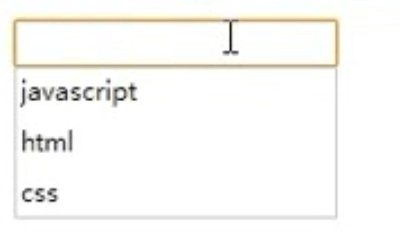

# HTML5


HTML5是HTML最新的修订版本，2014年10月由万维网联盟（W3C）完成标准制定。

HTML5的设计目的是为了在移动设备上支持多媒体。

HTML5 仍处于完善之中。然而，大部分现代浏览器已经具备了某些 HTML5 支持。

HTML5简化了许多,它的设计遵循了3个原则:1.兼容性、2.实用性、3.通用访问性

## HTML5 浏览器支持

你可以让一些较早的浏览器（不支持HTML5）支持 HTML5。

**完美的 IE浏览器 兼容 解决方案**
```html
<!--[if lt IE 9]>
  <script src="http://cdn.static.runoob.com/libs/html5shiv/3.7/html5shiv.min.js"></script>
<![endif]-->
```
html5shiv.js 引用代码必须放在 <head> 元素中，因为 IE 浏览器在解析 HTML5 新元素时需要先加载该文件。

## HTML5新元素(语义化标签) {#semantic}

### `header`元素

`<header>` 标签定义文档或者文档的一部分区域的页眉，又可用于设置文章标题。  
`<header>` 元素应该作为介绍内容或者导航链接栏的容器。在一个文档中，您可以定义多个`<header>`元素。  
**注释：** `<header>` 标签不能被放在 `<footer>`、`<address>` 或者另一个 `<header>` 元素内部。  
**语法说明:** `<header></header>`标记对之间可以包含 h1~h6 六个标题元素，以及p、span等元素。

### `hgroup`元素

`<hgroup>` 标签定义文档的主标题及副标题，也就是标题组合，标记对之间通常只使用 h1~h6 六个标题元素。
```html
<hgroup>
    <h1>hqbook</h1>
    <h2>学的不仅是技术更是梦想</h2>
</hgroup>
```

### `footer`元素

footer 元素主要用于为页面或某篇文章定义脚注内容，包括文章的版权信息、作者联系方式等内容，一个页面可以包含多个 footer 元素。
```html
<footer>
    <ul>
        <li>Copyright © 2000-2013 华软 All Rights Reserved</li>
        <li>学院地址：广州.从化.广从大道13号 电话：020-87818918</li>
    </ul>
</footer>
```

### `article`元素

`<article>` 标签定义独立的内容，页面中一块与上下文不相关的独立内容。比如一个帖子、一篇博客文章等。  
`<article>` 标签定义的内容本身必须是有意义的且必须是独立于文档的其余部分。  
`<article>` 的潜在来源：论坛帖子、博客文章、新闻故事、评论等。

**语法说明:** `<article></article>`标记对之间可以包含header、footer、section以及嵌套的article等元素。

### `section` 元素

`<section>` 元素用于对页面的某块内容进行分块，如将该块内容进一步分成章节的标题、内容和页脚等几部分。

**语法说明：** `<section></section>`标记对之间可以包含 h1~h6 六个标题元素、p元素以及多个article元素以表示该"分块"内部又包含多篇文章。此外，还可以嵌套section元素。

### `nav`元素

nav 元素用于定义页面上的各种导航条，一个页面中可以拥有多个 nav 元素，作为整个页面或不同部分内容的导航。  
nav 唯一不可能出现的位置是 address 元素内  
**基本语法:** `<nav><a href="">#</a><a href="">#</a><a href="">#</a></nav>`

### `aside` 元素

aside 元素表示article元素的内容之外的、与article元素的内容相关的辅助信息，  
它可以包含与当前页面或主要内容相关的引用、侧边栏、广告、导航条，以及其他类似的有别于主要内容的部分。

### `audio`音频标签

`<audio>`标签定义声音，比如音乐或其他音频流。目前，`<audio>`元素支持的3种文件格式：MP3、Wav、Ogg。

属性 | 说明
:-- | :--
src      | 要播放的音频的URL
autoplay | 音频在就绪后马上播放
controls | 向用户显示音频控件，比如播放/暂停按钮
loop     | 每当音频结束时重新开始播放
preload  | 音频在页面加载时进行加载，并预备播放

```html
<audio src="../../images/html5/bell.mp3" controls="controls"></audio>
```
**显示效果如下**

<audio src="../../images/html5/bell.mp3" controls="controls"></audio>

### `video`视频标签

`<video>`标签定义视频，比如电影片段或其他视频流。目前，`<video>`元素支持三种视频格式：MP4、WebM、Ogg。

属性 | 说明
:-- | :--
src      | 要播放的视频的URL
width    | 设置视频播放器的宽度
height   | 设置视频播放器的高度
autoplay | 视频在就绪后马上播放
controls | 向用户显示视频控件，比如播放/暂停按钮
loop     | 当媒介文件完成播放后再次开始播放
muted    | 规定视频的音频输出应该被静音
poster   | 规定视频下载时显示的图像，或者在用户点击播放按钮前显示的图像
preload  | 视频在页面加载时进行加载并预备播放，属性值(none:只有单击了Play按钮才加载视频;metadata:仅加载元数据,例如视频长度、作者、版权)

```html
<video src="../../images/html5/一拳打碎屏幕的老外.mp4" width="320" controls muted poster="images/logo.png" preload></video>
```
**显示效果如下**

<video src="../../images/html5/一拳打碎屏幕的老外.mp4" width="320" controls muted poster="images/logo.png" preload></video>

### 图形中的`figure`及`figcaption`

元素`figure`及`figcaption`实际上不能算作结构性元素，但在组织独立图片、图像、图表及编码列表时仍然很受欢迎。  
`<figure>`用于对元素进行组合。一般用于图片或视频。`<figcaption>` figure的子元素，用于对figure的内容进行说明。  
每一个`figure`元素中只能包括一个`figcaption`元素。图片排列一起可用。常常用到一种图片列表，图片+标题或者图片+标题+简单描述。

```html
<figure>
    
    <figcaption style="color: red">黄浦江上的的卢浦大桥</figcaption>
</figure>
```
**显示效果如下**

<figure>
    
    <figcaption style="color: red">黄浦江上的的卢浦大桥</figcaption>
</figure>

### `time`用于表示时间或日期

`<time datetime="2016-08-03">2016-08-03</time>`

### `datalist`选项列表

`<datalist>`与`input`元素配合使用，来定义 input 可能的值。

```html
<input type="text" list="valList">
<datalist id="valList">
    <option value="html">html</option>
    <option value="css">css</option>
    <option value="javascript">javascript</option>
</datalist>
```
**显示效果如下：**



### `progress`元素

`<progress></progress>`定义进度条
```html
<progress max="100" value="76">
    <span>76</span>%
</progress>
```
**显示效果如下：**

<progress max="100" value="76">
    <span>76</span>%
</progress>

### `details`和`summary`描述文档

#### `details`元素用于描述文档或文档某个部分的细节

* 该元素用于摘录引用等，应该与页面的主要内容区分开的其他内容
* Open 属性 展开

#### `summary`元素 __details__元素的标题

```html
<details open>
    <summary>hqbook</summary>
    <p>学的不仅是技术更是梦想</p>
</details>
```

**显示效果如下：**

<details open>
    <summary>hqbook</summary>
    <p>学的不仅是技术更是梦想</p>
</details>

### 其他语义化标签

* `<dialog></dialog>`定义一段对话

```html
<dialog open>
    <dt>老师</dt>
    <dd>2+2等于？</dd>
    <dt>学生</dt>
    <dd>4</dd>
    <dt>老师</dt>
    <dd>答对了！</dd>
</dialog>
```

* `<address></address>` 定义文章或页面作者的详细联系信息  
* `<mark></mark>` 需要标记的词或句子  
* `<keygen></keygen>` 给表单添加一个公钥

## 智能表单 {#smartForm}

### 表单新增属性

#### `autofocus` 属性

`<input type="text" autofocus/>`设置 `autofocus` 属性，使文本框自动获得焦点

> [!danger]
> 一个页面中最多只能有一个表单元素设置该属性，否则功能将失效，建议对第一个`input`元素设置`autofocus`属性。

#### `formaction` 属性

```html
<input type="submit" formaction="处理逻辑"><!-- 处理逻辑可为add.jsp(添加)、update.jsp(修改)、delete.jsp(删除)。 -->
```
所有提交按钮(`<input type="submit">`、`<input type="image">`、`<button type="submit">`)都可以使用 `formaction` 属性。  
HTML5只需添加`formaction`属性就可实现增加、修改和删除3个按钮功能，不再需要脚本的控制。

#### `autocomplete` 属性

若一个元素内包含有 `autocomplete="off"` 属性，这意味着涉及机密信息，不应被浏览器保存。  
若表单未定义 `autocomplete`，则默认设置为开启自动完成、显示输入提示(记忆用户在曾访问网站上所输入的内容)。

#### `pattern` 属性

`pattern` 属性是input元素的验证属性，该属性的值是一个正则表达式，通过这个表达式可以验证输入内容的有效性。
```html
用户名：<input type="text" name="username" pattern="^[a-zA-Z]\w{2,7}" title="必须以字母开头，包含字符或数字，长度是3~8" /><br />
密码：<input type="text" name="password" pattern="\d{6}" title="必须输入6个数字" /><br />
```

#### `placeholder` 属性，也叫占位符

占位符值可以给予用户一个快速提示，让他们了解该在输入字段中输入什么，它并不会取代标签元素。当需要用户输入某一特定格式的内容时，  
占位符显得尤其有用。浏览器会在输入字段显示提示文字。当该输入字段被聚焦(focus)激活，该提示文字则消失，失去焦点时又将自动显示。
```html
姓名：<input type="text" placeholder="请输入您的真实姓名" name="username"><br />
```

#### `required` 属性  定义必填项

required 是一个布尔型属性，包含此属性的表单元素必须被填写。在发送时若仍为空，浏览器就会给予相关相应。

### 新增的`input`元素类型

> 输入类型`tel`及`search`

`tel`(电话输入文本) 及 `search`(搜索关键字输入的文本框) 类型与普通的文本没什么不同，  
唯一不同的是输入关键字后search文本框右侧会出现一个`X`按钮，单击`X`后清空输入内容，由此带来方便。
```html
手机tel：<input type="tel" name="phone" pattern="\d{11}" title="请输入11位的手机号码" form="register" />pattern="\d{11}" title="请输入11位的手机号码"<br/>
搜索search：<input type="search" name="search" results="n" form="register" />
```

手机tel：<input type="tel" name="phone" pattern="\d{11}" title="请输入11位的手机号码" form="register" />pattern="\d{11}" title="请输入11位的手机号码"<br/>
搜索search：<input type="search" name="search" results="n" form="register" />

> 输入类型`url`及`email`

URL地址输入框要求必须输入一个包含访问协议的完整的URL路径。
```html
URL网址：<input type="url" name="rul" title="URL应包括访问协议">
```
email邮箱输入框要求输入正确格式，此外，还可以添加 multiple 属性以允许同时输入多个以逗号分隔的email。
```html
Email：<input type="email" name="email" title="email的格式是 XXX@XXX.XX ">
```

> 输入类型`number`及`range`

`number` 及 `range` 类型与包含数值的输入有关，并且支持浮点数表达式。不同的是range类型是用一个滑块来进行输入。  
输入数值的取值范围由 min和 max两个属性来设置，默认是不限定；调节步长使用 step属性，默认步长是1.  
**基本语法：**`<input type="number/range" min="最小值" max="最大值" step="改变数值的步长" name="number/range">`
```html
滚动条range：<input type="range" name="range" min="1" max="10" form="register"/>
```
**显示效果**

滚动条range：<input type="range" name="range" min="1" max="10" form="register"/>

> 输入类型 `color`

color 类型让 input元素生成一个颜色选择器。`<input type="color" name="color">`

**显示效果：** <input type="color" name="color">

> `datalist` 选项列表

datalist 元素用于生成一个隐藏的下拉菜单，其相当于一个“看不见”的 select元素。为什么需要设置id值呢？  
因为 datalist元素一般需要跟某个文本框结合使用，结合方式是通过将文本框的"list"属性值设置为 datalist的 id值，这样就将 datalist绑定到了某个文本框。用户选中选项后datalist元素自动隐藏。记住，跟文本框一起使用并给文本框list和自身id相同的值。

> 用 `datetime`(日期和时间),`date`(日期),`time`(时间),`month`,`week`以及`datetime-local`(本地日期时间)这几个`type类型`表示`日期和时间`

**基本语法：**`<input type="datetime/date/time/month/week/datetime-local" name="...">`

`datetime`包括日期以及时间信息；时间设置始终为UTC。规范允许用户通过浏览器选择不同时区，但input元素的值始终会被转换为UTC格式。datetime属性 字符串必须以 Z 结束以表明它是UTC格式。"YYYY-MM-DDThh:mm:ss.ssZ"这是UTC格式.目前，很多浏览器都不支持datetime这个类型。  
在 date和 month中，时间及时区则被忽略。根据规范定义，date必须是所选月份中的一个有效日期，同时考虑到闰年。年、月、日必须用“ - ”号隔开。为了确保星期与月份不被混淆，week前面通常会加上一个字母 W 。  
datetime-local 与之前描述过的 datetime 作用基本相同，唯一不同之处是不需要表明时区。
```html
日期和时间datetime：<input type="datetime" name="datetime" form="register" />目前，很多浏览器都不支持datetime这个类型。故没效果<br/>
本地日期和时间datetime-local：<input type="datetime-local" name="datetime-local" form="register" /><br/>
日期date：<input type="date" name="date" form="register" /><br/>
时间time：<input type="time" name="time" form="register" /><br/>
月份month：<input type="month" name="month" form="register" /><br/>
星期week：<input type="week" name="week" form="register" />
```
**显示效果**

日期和时间datetime：<input type="datetime" name="datetime" form="register" />目前，很多浏览器都不支持datetime这个类型。故没效果<br/>
本地日期和时间datetime-local：<input type="datetime-local" name="datetime-local" form="register" /><br/>
日期date：<input type="date" name="date" form="register" /><br/>
时间time：<input type="time" name="time" form="register" /><br/>
月份month：<input type="month" name="month" form="register" /><br/>
星期week：<input type="week" name="week" form="register" />

> 使用`meter`显示度量

`<meter>` 标签定义已知范围或分数值内的标量测量。也被称为 `gauge`（尺度）。例子：磁盘用量、查询结果的相关性，等等。  
注释：`<meter>` 标签虽说也可标记进度条，但并不应用于指示进度（在进度条中）。如果标记进度条，请使用 `<progress>` 标签。  
```html
<meter value="3" min="0" max="10">十分之三</meter>或<meter value="0.6"></meter>
```
**显示效果**

<meter value="3" min="0" max="10">十分之三</meter>或<meter value="0.6"></meter>

> 用`progress`显示任务进程

`progress` 元素被作用于展示一个任务的完成度，典型的例子是用户文件上传或下载。

举例来说，设计10个 checkbox类型的 input元素，当它们全部被激活时，进度条将显示到100%。
```html
<h1>Please activate all the checkboxes</h1>
<form method="get">
  <input type="checkbox" onchange="updateProgress()" />
  <input type="checkbox" onchange="updateProgress()" />
  <!--and 8 more-->
<p>
Progress:<progress value="0" max="10" id="pb"></progress></p>
</form>
```
元素 `progress`的初始值为0，最大值为10.当 input元素被激活时，就会调用 `updateProgress()`函数，函数内容如下：
```html
<script type="text/javascript">
    function updateProgress(){
      var pb=document.getElementById("pb");
      var ip=document.getElementsByTagName("input");
      var cnt=0;
      for(var i=0;i<ip.length;i++){
        if(ip[i].checked==true){
          cnt++;
        }
      }
      pb.value=cnt;
    }
</script>
```
变量 ip包括了一个包含所有输入元素的节点列表`(NodeList)`。for循环测试每一个元素的当前状态，若其被激活`(checked==true)`,计数器变量cnt将增加1.同时，`progress`元素值将被设成计数器值。

> 用`output`进行计算

`output` 元素用于显示各种表单元素的内容或脚本执行结果，它的作用只是用于显示输出。最常用的例子是电子商务网站的购物车。通过可选的 for属性，你可以决定将哪些字段添加到计算机中。执行运算需要提供一个或更多的相对应输入字段的 id。

举例来说，3种不同商品购物车：为了在 `output`元素中及时更新每次数量变化，使用表单的 `oninput` 事件：
```html
<table border="1" width="369" height="169">
  <tr><th>Product</th><th>Price(US$)</th><th>Quantity</th></tr>
  <tr><td>Keyboard</td><td class="num" id="i1Price">39.50</td>
  <td><input name="i1" id="i1" type="number" min="0" value="0" max="99" /></td></tr>
  <tr><td>Mouse</td><td class="num" id="i2Price">26.30</td>
  <td><input name="i2" id="i2" type="number" min="0" value="0" max="99" /></td></tr>
  <tr><td>Monitor</td><td class="num" id="i3Price">264.50</td>
  <td><input name="i3" id="i3" type="number" min="0" value="0" max="99" /></td></tr>
</table>
<!-- output 元素在表格下方，相应输入字段中商品的 ID被赋值给 for属性。 -->
<p>Your shopping cart contains
<output name="sumProd" for="i1 i2 i3" id="sumProd"></output>
items.Total price:
<output name="sum" for="i1 i2 i3" id="sum"></output>US$</p>
<!-- 在这段JavaScript代码中，会遍历计算所有的 input元素，得出总数量和总价格。 -->
<script type="text/javascript">
    function updateSum(){
      var ips = document.getElementsByTagName("input");
      var sum = 0;
      var prods = 0;
      for (var i=0;i<ips.length;i++){
          var cnt=Number(ips[i].value);
          if (cnt>0){
            sum +=cnt*Number(document.getElementById(
              ips[i].name+"Price").innerHTML);
            prods +=cnt;
          }
        }
        document.getElementById("sumProd").value=prods;
        document.getElementById("sum").value=sum;
    }
</script>
```
我们运用JavaScript的 `Number()`函数将相关列的 innerHTML值转换为数字，并根据它直接从表格中的到商品价格，input字段也用这个方法取值(ips[i].value)。如果略过这个步骤的话，JavaScript会直接将字符串加入计算，这样可能导致无法得到正确的结果，计算结果将被赋值给 output 元素的 value 属性。

### 客户端表单验证

> 自动校验

通过对元素使用 required、pattern、min、max和 step等属性以及新增的 input类型，可实现在表单提交时进行自动校验。前面有介绍过，
下面仅举一个简单的执行自动校验的示例。
```html
姓名：<input type="text" name="username" required>
年龄：<input type="number" name="age" min="1" max="150" step="1">
手机号码：<input type="text" name="phone" pattern="\d{11}" title="请输入11位的手机号码">
```

> 显式校验：`check Validity()`方法进行校验

`check Validity()`返回一个布尔值，为表单中所有的元素或某个元素的内容无效时，返回 false值，否则返回 true。  
我们可以通过编写JavaScript代码调用该方法，以将校验结果显示出来，所以又称该方法为“显式校验方法”。
```html
<script type="text/javascript">
  function check(){
    var psw=document.getElementById("psw");
    if(psw.checkValidity())
      alert("密码输入正确");
    else
      alert("密码输入错误，请再输一次");
    return false;
  }
</script>
<form onsubmit="return check()">
  密码：<input type="password" pattern="^[a-zA-Z]\w{3,6}"
  name="psw" id="psw" required /><br />
  <input type="submit" value="提交" />
</form>
```
上述代码对密码输入有效性进行显式校验，分别将校验结果以警告对话框的形式展现。

> 取消校验

有时需要把表单中已填写好的数据暂存一下，以便将来继续填写，即不管数据是否有效，取消表单的有效性校验。  
取消表单校验的常用方法有两种：一种是为`<form>`元素设置 `novalidate`属性；另一种是对提交按钮设置`formnovalidate`属性。  
第一种方式将关闭整个表单的校验，不管提交什么按钮都将不进行校验。第二种方式则由指定的提交按钮来关闭表单的输入校验，只有当用户通过指定了`fornvalidate`属性的按钮提交表单时才会关闭表单的输入校验。
```html
方法一：<form novalidate>
方法二：<input type="submit" value="保存" formaction="save.jsp" formnovalidate>
```

> 自定义校验错误提示信息

使用`setCustomValidity()`自定义错误提示信息，可用于检测两次密码输入是否一致：
```html
<script type="text/javascript">
  function check(){
    var psw1=document.getElementById("password1");
    var psw2=document.getElementById("password2");
    if(psw1.value!=psw2.value)
      psw2.setCustomValidity("密码和确定密码不一致");
    return false;
  }
</script>
<form action="">
  密码：<input type="password" id="password1" name="password1" /><br />
  确认密码：<input type="password" id="password2" name="password2" /><br />
  <input type="submit" name="" id="" value="提交" onclick="check()" />
</form>
```
