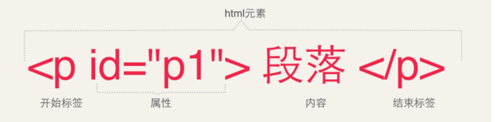

# HTML超文本标记语言
WWW 是“World Wide Web”（全球广域网）的缩写，简称为Web，中文又称为“万维网”。

HTML（Hypertext Markup Language，超文本标记语言）是一种文本类、解释执行的标记语言，
用于编写要通过WWW显示的超文本文件，称为HTML文件，也叫Web页面或网页。扩展名为.html或.htm 。

HTML文件的组成包含两部分内容：一是HTML标记；二是HTML标记所设置的内容。

## HTML基础

1. 文档类型：规范的`HTML/XHTML`文档需要以`<!DOCTYPE>`标记声明开始的。用于指定`DTD`(说明当前这个html版本)
 
2. HTML文件的基本结构: 头部(`head`)，标题(`title`)，页面主体(`body`)

3. HTML标记: html文件的开始和结束标签：`<html></html>`

> html中标签的大致写法：

* 由开始标签和结束标签组成,空标签写法为：`<标签名/>`,双标签`<标签名></标签名>`
* 标签名不区分大小写，但在`XHTML`中必须小写
* 标签具有属性，属性用来表示标签的性质和特征，属性在一开始的标签中指定，如下图：



## 页面的头部标记

### HTML头部标记

* `<title>`: 设定显示在浏览器标题栏中的内容
* `<meta>`: 定义网页的字符集、关键字、描述信息等内容
* `<style>`: 设置CSS层叠样式表的内容
* `<link>`: 对外部文件的链接
* `<script>`: 设置页面脚本或链接外部脚本文件

### 元信息标记`<meta>`

1. 定义文件编码
```html
<meta http-equiv="Content-Type" content="text/html; charset=utf-8" />
```
2. 搜索引擎优化-关键字
```html
<meta name="keywords" content="关键字1，关键字2，…" />
```
3. 搜索引擎优化-描述
```html
<meta name="description" content="内容介绍" />
```
4. 设置页面刷新或者跳转
```html
<!--设置页面每隔3s刷新一次-->
<meta http-equiv="refresh" content="3">
<!--在当前页面停留3s后，自动跳转到新浪网站首页-->
<meta http-equiv="refresh" content="3;url=http://www.sina.com.cn">
```

### 网页标题栏图标

```html
<!--在网页标题栏左侧显示-->
<link rel="icon" href="图标地址" type="image/x-icon">
<!--也可以在收藏夹显示图标-->
<link rel="shortcut icon" href="图标地址" type="image/x-icon">
```

## 页面的主题标记`<body>`

1. 一个网站的三大元素: 图片，超链接，文字

2. 添加网页背景图片

默认情况下，背景图片会随着页面的滚动而滚动，设置`<body>`标记的`bgproperties="fixed"`,可以使背景图片固定不动。
```html
<body background="images/***.jpg" bgproperties="fixed">
```

3. 设置网页链接文字颜色

`link`属性设置未访问链接文字颜色；`alink`属性设置正在访问链接文字颜色；`vlink`属性设置访问过后的链接文字颜色
```html
<body link="颜色值" alink="颜色值" vlink="颜色值">
```

4. 设置网页边距

设置网页与浏览器边框的间距
```html
<body leftmargin="边距值" rightmargin="边距值" topmargin="边距值" bottommargin="边距值">
```

### HTML的注意事项和建议

* 凡是标签都应该闭合！
* 凡是标签都应该小写！
* 文件编码跟设置的编码保持一致！
* 标签属性加引号(英文输入法下的引号)
* `HTML`缩进统一使用`tab`键

## 文字与段落标记

1. 标题字 `h1~h6`
h1的字最大，递减至 h6 最小
```html
<h2 align= "对齐方式">标题字</h2>
```
2. 空格

在HTML里面，浏览器不能解析源代码中使用的`Enter`键，所有的空格，换行符，水平制表符等等。无论你打再多个，都会视为一个空格。

3. 字体标签`<font>`
```html
<font face="字体名称" size="字号" color="颜色值">文字内容</font>
```

属性 | 说明
 :-: | :-:
color | 颜色,默认黑色
size | 默认字号为3号字。取值范围1~7，可+1到+7，-1到-7(正负取值相对于页面默认字号)，超出取值范围，与取值范围的最近的值效果相同。
face | 默认宋体[黑体,微软雅黑...]

4. 字体格式化标签

 标签 | 意义 | 标签 | 意义
 :-: | :-: | :-: | :-:
 `<i></i>` | italic,斜体 | `<em></em>` | 斜体
 `<b></b>` | blod,加粗 | `<strong></strong>` | 粗体
 `<big></big>` | 大字号 | `<small></small>` | 小字号
 `<u></u>` | underline,下划线 | `<s></s>` | 删除线
 `<strike></strike>` | 删除线 | `<del></del>` | 删除线
 `<q></q>` | 引用"" | `<dfn></dfn>` | 举例
 `<mark></mark>` | 高亮 | `<sup></sup>` | 上标字
 `<sub></sub>` | 下标字 | `<ruby></ruby>` | 注释
 `<rt></rt>` | 注释 | `<rp></rp>` | 注释
 
举例：
```html
<ruby>OJ<rp>(<rt>Orange Juice<rp>)</ruby>
```

<ruby>OJ<rp>(<rt>Orange Juice<rp>)</ruby>

```html
(x+y)<sup>2</sup> = x<sup>2</sup> + y<sup>2</sup> + 2xy
```

(x+y)<sup>2</sup> = x<sup>2</sup> + y<sup>2</sup> + 2xy
