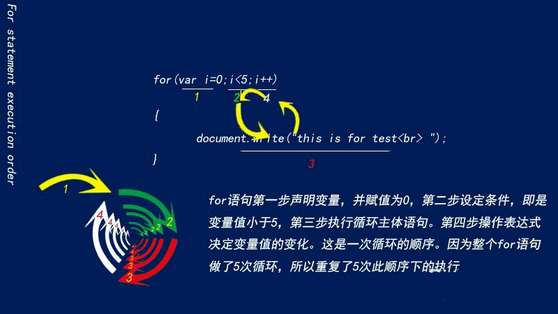
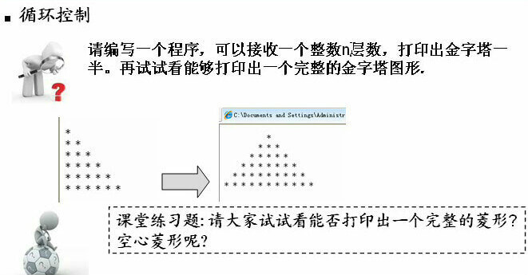

# JavaScript


JavaScript 是一种轻量级的编程语言。

JavaScript 是可插入 HTML 页面的编程代码。JavaScript 插入 HTML 页面后，可由所有的现代浏览器执行。

JavaScript 很容易学习。

## JS 简介

javascript因为兼容于ECMA标准，因此也称为ECMAScript。
JavaScript作为一种脚本语言，已经被广泛地应用于Web页面当中，通过嵌入HTML来实现各种酷炫的动态效果，为用户提供赏心悦目的浏览效果。  
除此之外，也可以用于控制cookies以及基于Node.js技术进行服务器端编程。

发展初期，JavaScript的标准并未确定，同期有Netscape的JavaScript，微软的JScript和CEnvi的ScriptEase三足鼎立。  
1997年，在ECMA(欧洲计算机制造商协会)的协调下，由Netscape、Sun、微软、Borland组成的工作组确定统一标准：ECMA-262。

javascript是甲骨文公司的注册商标，完整的JavaScript实现包含三个部分：ECMAScript，文档对象模型（DOM）和浏览器对象模型（BOM）。  
1. ECMAScript : 核心  (描述了javascript组成语言的语法和基本对象)
2. DOM : 文档对象模型  (描述处理网页内容的方法和接口)
3. BOM : 浏览器对象模型 (描述与浏览器进行交互的方法和接口)

### Javascript与Java的比较

JavaScript和Java除了在名字上有一点类似，以及JavaScript语法源自于Java外，两者其实存在很大的不同，主要体现在以下几点。

1. JavaScript由浏览器解释执行，Java程序则是编译执行。
2. JavaScript是一种基于对象的脚本语言；Java则是一种面向对象的编程语言。
3. JavaScript是弱类型语言，可以不声明变量而直接使用变量；Java是强制类型语言，变量在使用前必须先声明。

强/弱类型是指类型检查的严格程度的。语言有无类型，弱类型和强类型三种。无类型的不检查，甚至不区分指令和数据。  
弱类型的检查很弱，仅能严格的区分指令和数据。强类型的则严格的在编译期进行检查。

JAVA是强类型语言：因此每个变量和对象都必须具有声明类型。  
javascript是弱类型语言：因此它可以不先定义类理和对象、或用var定义所有变量

## JS 用法

HTML 中的脚本必须位于 `<script>` 与 `</script>` 标签之间。脚本可被放置在 HTML 页面的 `<body>` 和 `<head>` 部分中。  
也可以把脚本保存到外部文件中。外部文件通常包含被多个网页使用的代码。外部 JavaScript 文件的文件扩展名是 .js。  
如需使用外部文件，请在 `<script>` 标签的 "src" 属性中设置该 .js 文件

* 大小写敏感（严格区分字母大小写）
* 执行顺序：JavaScript程序按照在HTML文件中出现的顺序逐行执行。如果需要在整个HTML文件中执行（如函数、全局变量等），最好将其放在
  HTML文件的`<head>...</head>`标记中。某些代码，比如函数体内的代码，不会被立即执行，只有当所在的函数被其他程序调用时，该代码才会被执行。
* 与Java语言不同，JavaScript并不要求必须以分号`;`作为语句的结束标记。JavaScript会自动将该行代码的结尾作为语句的结尾。

### JS 字面量/常量

在编程语言中，一般固定值称为字面量，如 3.14。
1. **数字（Number）字面量** 可以是整数或者是小数，或者是科学计数(e):`3.14`；
2. **字符串（String）字面量** 可以使用单引号或双引号:`'John Doe'`；
3. **表达式字面量** 用于计算：`5 + 6`；
4. **数组（Array）字面量** 定义一个数组：`[1,2]`；
5. **对象（Object）字面量** 定义一个对象：`{a: 1, b: 2}`；
6. **函数（Function）字面量** 定义一个函数：`function fun(a) {return a}`。

### JS 关键字

JavaScript 关键字用于标识要执行的操作。关键字是不能作为变量名和函数名使用的。比如 `var` 关键字告诉浏览器创建一个新的变量。  
以下是 JavaScript 中最重要的保留字（按字母顺序）：

   |   |   |   |   |   |   |   |   |   |  
 - | - | - | - | - | - | - | - | - | - 
abstract | boolean | break | byte | case | catch | char | class | const | continue
debugger | default | delete | do | double | else | enum | export | extends | false
final | finally | float | for | function | goto | if | implements | import | in
instanceof | int | interface | let | long | native | new | null | package | private
protected | public | return | short | static | super | switch | synchronized | this | throw
throws | transient | true | try | typeof | var | void | volatile | while | with

### JS 变量

在编程语言中，变量用于存储数据值。JavaScript 使用关键字 var 来定义变量， 使用等号来为变量赋值。

> 变量的命名规则

* 第一个字符必须是`字母`或者 `$` 和 `_` 符号开头;
* 变量名中不能包含空格或标点符号或加号减号等符号（`$` 除外);
* 变量名称对大小写敏感（y 和 Y 是不同的变量）;
* 不能使用保留字、关键字;
* 为了让变量名有更好的可读性，可以在变量名中适当的插入下划线分隔，如：`var my_mood = 'happy'`

> 变量的声明和赋值

* 可以用 var 同时声明多个变量：`var a,b,c`
* 可以声明的同时对其赋值，即为初始化：`var a=1,b=2,c=3`
* 如果只是声明了变量而未对其赋值，则其值默认为 `undefined`  
  `var sex = male; console.log(male);` `// male is not defined`  将male当做一个变量
* 如果声明同一个变量，而且其已经有一个初始值的话，那么重新声明就相当于对变量重新赋值。
* 变量也可以不使用var作声明而直接使用，这样虽然简单但不易发现变量各方面的错误。

> [!tip]
> 一个好的编程习惯是，在代码开始处，统一对需要的变量进行声明。

### JavaScript 注释

//      单行注释  
/\* \*/   多行注释，注意：多行注释不能互相嵌套

### Chrome 浏览器中执行 JavaScript

我们在 Chrome 浏览器中可以通过按下 `F12` 按钮或者右击页面，选择"检查"来开启开发者工具。
打开开发者工具后，我们可以在 Console 窗口调试 JavaScript代码。

我们也可以在 Chrome 浏览器中创建一个脚本来执行，在开发者工具中点击 Sources 面板，选择 Snippets 选项卡，在导航器中右击鼠标，
然后选择 Creat new snippet 来新建一个脚本文件：


## JS 数据类型 {#datatype}

**值类型(基本类型)**：字符串（String）、数字(Number)、布尔(Boolean)、对空（Null）、未定义（Undefined）、Symbol。  
**引用数据类型**：对象(Object)、数组(Array)、函数(Function)。

> [!Warning|label: 注意]
> Symbol 是 ES6 引入了一种新的原始数据类型，表示独一无二的值。

### JS 拥有动态类型

JavaScript 拥有动态类型。这意味着相同的变量可用作不同的类型：
```js
var x;               // x 为 undefined
var x = 5;           // 现在 x 为数字
var x = "John";      // 现在 x 为字符串
```

### JS 字符串（String）

字符串由零个或多个Unicode字符构成，可以是引号中的任意文本。您可以使用单引号或双引号。  
单引号中可以含有单引号或双引号，只要不匹配包围字符串的引号即可；但是单包单或双包双时必须进行转义，用\隔开。
```js
var str = 'I like "JavaScript"'; // 单包双
var str = "I like 'JavaScript'"; // 双包单

var str = 'I like \'JavaScript\''; // 单包单
var str = "I like \"JavaScript\""; // 双包双
```

> [!note]
> javascript中的字符串是不可变的。一旦字符串被创建，就永远无法改变它。要改变某个变量保存的字符串，  
> 首先要销毁原来的字符串，然后再用另一个包含新值的字符串填充该变量，可以通过`+`运算符连接其他字符串来创建一个新字符串。  
> 举例：`var lang = "java"; lang = lang + "script";` => 'javascript'  
> 以上代码的实际过程是：首先创建一个能够容纳`10个字符`的新字符串，然后在这个字符串中填充`java`和`script`，  
最后一步是销毁原来的字符串`java`和`script`，因为这两个字符串已经没用了。

### JS 数字（Number）

JavaScript 只有一种数字类型。数字可以带小数点，也可以不带：
```js
var x1 = 34.00; // 使用小数点来写
var x2 = 34; // 不使用小数点来写
```
极大或极小的数字可以通过科学（指数）计数法来书写：
```js
var y = 123e5; // 12300000
var z = 123e-5; // 0.00123
```

### JS 布尔（Boolean）

布尔（逻辑）只能有两个值：true 或 false。

> [!danger]
> 在`Number()`方法中空字符串和空白字符串都转换为`0`，而在`Boolean`方法中，`空字符串""`转换为 false，而`空白字符串" "`转换为 true。  
> 与字符串不同，不要把布尔值用引号括起来。布尔值 false 与 字符串 "false"是两回事。

### JS 数组（Array）

我们的变量一般都只能存储一个内容，所以它其实是一个单一的容器。  
我们的数组一般可以存一个或者是多个值，所以数组是一个大的容器。

> 组成部分

数组其实是由多个(`键-值`)所组成的一个多容器，数组的索引 默认是从0开始的，所以第一个项目是 [0]，第二个是 [1]，以此类推。

### JS 对象（Object）

在 JavaScript中，几乎所有的事物都是对象。  
对象由花括号分隔。在括号内部，对象的属性以名称和值对的形式 (`name : value`) 来定义。属性由逗号分隔：
```js
var person = { firstname:"John", lastname:"Doe", id:5566 };
```
上面例子中的对象 (person) 有三个属性：firstname、lastname 以及 id。  
空格和折行无关紧要。声明可横跨多行：
```js
var person = {
  firstname: "John",
  lastname: "Doe",
  id: 5566
};
```
**对象属性有两种寻址方式：**
```js
name = person.lastname;
name = person["lastname"];
```

### 特殊数据类型

#### 转义字符

在javascript字符串，反斜线 ` \ ` 有着特殊的用途，反斜线符号后加一个字符，就不表示它们的字面含义，用来表示一些特殊字符，称为转义字符。

   |   |   |   |   |   |   |   |   |   |
 - | - | - | - | - | - | - | - | - | - 
 `\0` | 空字节 | `\n` | 换行 | `\t` | 制表 | `\b` | 空格 | `\r` | 回车
 `\f` | 换页符 | `\\` | 反斜杠,对自身转义 | `\'` | 单引号 | `\"` | 双引号 |  | 

`\xnn` 以十六进制nn表示一个字符(n为0-f)，如`\x41`表示`A`  
`\unnnn` 以十六进制nnnn表示一个Unicode字符(n为0-f)，如`\u03a3`表示`希腊字符ε`

> [!tip]
> 如果在非特殊字符前面使用反斜杠，则反斜杠会被省略，如 `'\a'` => `'a'`

#### null

在JavaScript中`null`表示"`什么都没有，为空值`"。  
`null`是一个只有一个值的特殊类型。表示一个空对象引用。  
`var person = null;` // 你可以设置为`null`来清空对象。  
**注意：`null` 不等同于`空的字符串（""）`或`0`**

#### undefined

在JavaScript中, `undefined`是一个没有设置值的变量，表示变量还没有赋值（如`var a;`），
或者赋予一个不存在的属性值（如`var a=String.notProperty;`）。`typeof`一个没有值的变量会返回`undefined`。  
`var person = undefined;` // 你可以设置为`undefined`来清空对象。

> `undefined`和`null`的区别

`null`表示一个“空”的值，它和`0`以及`空字符串''`不同，0是一个数值，''表示长度为0的字符串，而`null`表示“空”。`undefined`表示值未定义。
大多数情况下，我们都应该用`null`。`undefined`仅仅在判断函数参数是否传递的情况下有用。
```js
typeof undefined             // undefined
typeof null                  // object
null === undefined           // false
null == undefined            // true
```

#### NaN

特殊类型的数字常量`NaN`，即“非数字”。当在程序中由于某种原因发生计算错误后，将产生一个没有意义的数字，此时JavaScript返回的数字值就是`NaN`。

### 声明变量类型

当您声明新变量时，可以使用关键词 `new` 来声明其类型：
```js
var carname = new String;
var x = new Number;
var y = new Boolean;
var cars = new Array;
var person = new Object;
```

> [!note]
> JavaScript 变量均为对象。当您声明一个变量时，就创建了一个新的对象。

## JS 数据类型转换

### typeof 操作符

你可以使用 typeof 操作符来检测变量的数据类型。
```js
typeof "John"                // 返回 string
typeof 3.14                  // 返回 number
typeof false                 // 返回 boolean
typeof [1,2,3,4]             // 返回 object
typeof {name:'John', age:34} // 返回 object
```

> [!tip]
> 在JavaScript中，数组是一种特殊的对象类型。 因此 `typeof [1,2,3,4]` 返回 `object`。  
> `NaN` 的数据类型是 `number`; 日期(Date)的数据类型为 object; `null` 的数据类型是 `object`。

### constructor 属性

constructor 属性返回所有 JavaScript 变量的构造函数。
```js
"John".constructor                 // 返回函数 String()  { [native code] }
(3.14).constructor                 // 返回函数 Number()  { [native code] }
false.constructor                  // 返回函数 Boolean() { [native code] }
[1,2,3,4].constructor              // 返回函数 Array()   { [native code] }
{name:'John', age:34}.constructor  // 返回函数 Object()  { [native code] }
new Date().constructor             // 返回函数 Date()    { [native code] }
function() {}.constructor         // 返回函数 Function(){ [native code] }
```
你可以使用 constructor 属性来查看对象是否为数组 (包含字符串 "Array")，也可以使用 constructor 属性来查看对象是否为日期 (包含字符串 "Date"):

> @[constructor 属性实例]{`../../demo/demo.html?demoname=constructor`}
> `../../images/home/javascript.png`

### JS 数据类型转换

#### 强制转换

强制转换主要指使用Number、String和Boolean三个构造函数，手动将各种类型的值，转换成数字、字符串或者布尔值

**1. Number函数：强制转换成数值**
```js
Number("324") // 324
Number("324abc") // NaN
Number("") // 0
Number(false) // 0
Number(undefined) // NaN
Number(null) // 0
```
**2. String函数：强制转换成字符串**
```js
String(123) // "123"
String("abc") // "abc"
String(true) // "true"
String(undefined) // "undefined"
String(null) // "null"
```
**3. Boolean函数：强制转换成布尔值**
```js
Boolean(undefined) // false
Boolean(null) // false
Boolean(0) // false
Boolean(NaN) // false
Boolean('') // false
```

#### 转换函数

1. **toString()**：转换为字符串
2. **parseInt()**：转换成整数
3. **parseFloat()**：转换成浮点数

更多更新转换函数在 [高级章节]，待完善。

#### 自动转换

当遇到以下几种情况，JavaScript会自动转换数据类型：

* 不同类型的数据进行互相运算；
* 对非布尔值类型的数据求布尔值;
* 对非数值类型的数据使用一元运算符（即“+”和“-”）。

**1. 自动转换为布尔值**

除了以下六个值，其他都是自动转为true：`undefined`, `null`, `-0`, `+0`, `NaN`, `''`(空字符串)
```js
if (!undefined && !null && !0 && !NaN && !''){
    console.log('true');
}
// true
```

**2. 自动转换为字符串**

字符串的自动转换，主要发生在加法运算时。当一个值为字符串，另一个值为非字符串，则后者转为字符串。
```js
'5' + 1 // '51'
1 + 2 + '5'  // '35'
'5' + true // "5true"
'5' + {} // "5[object Object]"
'5' + [] // "5"
'5' + function (){} // "5function (){}"
'5' + undefined // "5undefined"
'5' + null // "5null"
```

**3. 自动转换为数值**

除了加法运算符有可能把运算子转为字符串，其他运算符都会把两侧的运算子自动转成数值。
```js
'5' - '2' // 3
'5' * '2' // 10
true - 1 // 0
false - 1 // -1
'1' - 1 // 0
'5'*[] // 0
false/'5' // 0
'abc'-1 // NaN
```

> 下表展示了使用不同的数值转换为数字(Number), 字符串(String), 布尔值(Boolean):

 原始值 | 转换为数字 | 转换为字符串 | 转换为布尔值
    :-:   |   :-:   |   :-:   |   :-:   
 false  |	0   |	"false" |	false	
 true   |	1   |	"true"  |	true	
 0  |	0   |	"0" |	false	
 1  |	1   |	"1" |	true	
 "0"    |	0   |	"0" |	true	
 "000"  |	0   |	"000"   |	true	
 "1"    |	1   |	"1" |	true	
 NaN    |	NaN |	"NaN"   |	false	
 Infinity   |	Infinity    |	"Infinity"  |	true	
 -Infinity  |	-Infinity   |	"-Infinity" |	true	
 "" |	0   |	""  |	false	
 "20"   |	20  |	"20"    |	true	
 "Hqbook"   |	NaN |	"Hqbook"    |	true	
 [ ]    |	0   |	""  |	true	
 [20]   |	20  |	"20"    |	true	
 [10,20]    |	NaN |	"10,20" |	true	
 ["Hqbook"] |	NaN |	"Hqbook"    |	true	
 ["Hqbook","Google"]    |	NaN |	"Hqbook,Google" |	true	
 function(){}   |	NaN |	"function(){}"  |	true	
 { }    |	NaN |	"[object Object]"   |	true	
 null   |	0   |	"null"  |	false	
 undefined  |	NaN |	"undefined" |	false

> @[javascript数据类型转换]{`https://www.css88.com/archives/5199`}
> `../../images/home/javascript.png`

## JS 运算符 {#operator}

### 算术运算符

`+`（加）; `-`（减）; `*`（乘）; `/`（除）; `%`（求模、取余数）(前面正得正，负得负)：`10.5 % 3`; // 1.5;  
无非就是数学的四则运算，过于简单就不做详细介绍，不懂就回去问你们小学数学老师

**`++`（自增）**  
1. 后加加：`i++`先赋值后自增加1   
2. 前加加：`++i`先自增加1后赋值

`--`（自减）：同`++`（自增）类似
```js
// 如果 y = 5
x = ++y; // x=6 y=6
x = y++; // x=5 y=6
x = --y; // x=4 y=4
x = y--; // x=5 y=4
```

### 赋值运算符

`=`   将右边表达式的值付给左边的变量  
`+=`  给当前这个变量增加多少  `a += 3`;等同于（`a = a+3`）  
同理：`-=`(加), `*=`(减), `/=`(乘), `%=`(求模)

还有`&=`(与运算) `a &= b`, 相当于`a = a&b`  
同理：`|=`(或运算), `^=` (异运算)

### 字符串的 + 运算符（类似拼接）

当`+`存在于变量与字符串中间位置的时候就代表是拼接或者连接的作用，而 `+=` 运算符则用于连接两个字符串，并将结果赋给第一个字符串。
```js
var a = "23", b = 1;
a+b // 231  这个例子说明 如果不是同种类型的话 那么`+`代表的是拼接的意思
a-b // 22   这个例子说明  除了+ 这种特殊的运算方式以外  即使是不同类型那么也能够进行运算

var name = "JavaScript"; name+=" book"; // JavaScript book
```

### 比较运算符

`>`（大于）, `<`（小于）, `>=`（大于或等于）, `<=`（小于或等于）,   
`==`（等于）, `!=`（不等于），`===`（全等于、绝对等于)，`!==` (不全等于，不绝对等于，值和类型有一个不相等，或两个都不相等)

在js里面一个等号`=`代表赋值，两个等号`==`才代表判断是否相等（判断数值相等，当数值0和1和布尔值做比较会将数值转换成布尔值）,
三个等于号`===`代表全等于（判断数值且类型相等）

|   |  |
- | - | - 
`null == false` // false  |    `undefined == false` // false   |   `null == undefined` // true  
`null === undefined` // false  |    `null == 0` // false      |   `null === 0` // false  
`0 == false ` // true      |    `1 == true` // true       |   `4 == true` // false  
假如两个变量进行比较，它的全等于`===`为假，那么它的不全等于`!==`为真 // true

### 逻辑运算符

* `&&`（与）：一假全假；`(x < 10 && y > 1) 为 true`
* `||`（或）：一真则真；`(x==5 || y==5) 为 false`
* `!`（非）：假变真，真变假。`!(x==y) 为 true`

### 运算符优先级

JavaScript中的运算符优先级是一套规则。该规则在计算表达式时控制运算符执行的顺序。具有较高优先级的运算符先于较低优先级的运算符执行。例如，乘法的执行先于加法。

下表按从最高到最低的优先级列出JavaScript运算符。具有相同优先级的运算符按从左至右的顺序求值。

 运算符 | 描述
 - | - 
`.``[]``()` | 字段访问、数组下标、函数调用以及表达式分组
`++` `--` `-` `~` `!` `delete` `new` `typeof` `void` | 一元运算符、返回数据类型、对象创建、未定义值
`*` `/` `%` | 乘法、除法、取余
`+` `-` `+` | 加法、减法、字符串连接
`<<` `>>` `>>>` | 移位
`<` `<=` `>` `>=` `instanceof` | 小于、小于等于、大于、大于等于、instanceof
`==` `!=` `===` `!==` | 等于、不等于、全等于、不全等于
`&` | 按位与
`^` | 按位异或
&#124; | 按位或
`&&` | 逻辑与
&#124;&#124; | 逻辑或
`?:` | 条件
`=` `oP=` | 赋值、运算赋值
`,` | 多重求值

## JS 条件语句 {#if_else}

### JS 流程控制

就是程序代码执行顺序，通过规定的语句让程序代码有条件的按照一定的方式执行。

三大流程控制结构：
* `顺序结构`：按照书写顺序来执行，是程序中最基本的流程结构。
* `条件结构（分支结构）`：根据给定的条件有选择的执行相应的语句，分支控制有三种：①单分支，②双分支，③多分支，④嵌套分支。
* `循环结构`：在给定的条件满足的情况下，反复的执行同一段代码。

### 条件语句

> **if 语句** - (单分支)，只有当指定条件为 true 时，使用该语句来执行代码。

```js
if (condition) {
 // 当条件为 true 时执行的代码，如果只包含一条语句，那么可以省略{}，一般最好不要省略
}
```

> **if...else 语句** - (双分支)，当条件为 true 时执行代码，当条件为 false 时执行其他代码

```js
if (condition) {
 // 当条件为 true 时执行的代码
} else {
 // 当条件不为 true 时执行的代码
}
```

> **if...else if...else 语句** - (多分支)，如果某个条件成立，则后续就不再继续判断了，直接结束整个多分支。

```js
if (condition1) {
 // 当条件 1 为 true 时执行的代码
} else if (condition2) {
 // 当条件 2 为 true 时执行的代码
} else {
 // 当条件 1 和 条件 2 都不为 true 时执行的代码
}
```

> [!danger]
> 一旦找到一个满足条件的入口，执行完毕后，就直接结束整个多分支，所以需要用对条件语句。比如：
> `10<=A<=30`需要写成 `10<=A && A<=30`;

```js
var a = 5;
if (a > 1) {
 // 条件满足，执行这里的代码
} else if (a > 3) {
 // 这个入口条件虽然也满足条件，但是上面入口已经满足，所以这里不会执行。
}
```

> **if...if... 语句** - (嵌套分支)，如果某个条件成立，则后续就不再继续判断了，直接结束整个多分支。

```js
if (condition1) {
 // 当条件 1 为 true 时执行的代码
 if (condition2) {
  // 当条件1和条件2 都为 true 时执行的代码
 }
} else {
 // 当条件 1 不为 true 时执行的代码
}
```

### switch 语句

当有很多种选项的时候，`switch`比`if else`使用更方便。`switch`适合处理判断分支较多的情况下(代码可读性好)，而`if`适合处理判断分支较少的情况下(反之代码可读性差，容易出现漏判或重复判断)。尽管`if`括号内也支持常量、枚举但也是有前提的那就是常量或枚举必须要显式给出相应的数值，而`switch`则不必。

```js
switch('条件表达式') {
  case '常量1':
    '语句'; 
    break;
  case '常量2':
    '语句'; 
    break;
  // …
  case '常量n':
    '语句'; 
    break;
  default:
    '语句';
}
```
1. `case`有几个都行，`default`可以没有。当`case`所有条件都不满足的时候，则`default`。`default`并不一定要在最后。
2. `case`后面一般是常量（能作用在int和比int范围下的数字型数据类型，int,short,char,byte。long和String类型是不行的。）而不同于`if else`的条件判断，`switch`不是`if`的替代品。编译时会对`switch`进行优化，根据`case`标签后面的常量值，生成跳转表，只经过少数次数的比较，就可以跳到对应标签下面。所以，标签也是不能重复的。如果允许变量，`switch`只能退化成跟一连串的`if else`, 对于一个数据也只能从头到尾地进行比较，也就失去了`switch`的意义。跳转表和逐个比较，这两种方式的复杂度差很多。
3. `break`是中断跳转语句，表示在完成相应的`case`标号规定的操作之后，不继续执行`switch`语句的剩余部分而直接跳出`switch`语句之外，继而执行`switch`结构后面的第一条语句，如果不在`switch`结构的`case`中使用`break`语句。程序就会接着执行下面的语句。
4. `default`用于处理所有`switch`结构的非法操作。当表达式的值与任何一个`case`都不匹配时，则执行`default`语句。

**举例**：我们将上面用if语句做的例子改用`switch`语句来判断学生分数的水平。
```js
var score = prompt('你的成绩是?');
// 因为`case`后面是常量，我们又不至于把`0~100`的每个分数都判断一遍吧，所以可以进行取整判断
// 在上面的代码中，`break`作用是跳出整个`switch`语句，如果没有`break`停止语句，那么当输入`100`后将每种结果都弹窗一次，不信你试试
switch(parseInt(score/10)){
  case 10:
    alert('非常优秀');
    break;
  case 9:
    alert('优秀');
    break;
  case 8:
    alert('良好');
    break;
  case 7:
    alert('中等');
    break;
  default:
    alert('继续努力');
    break;
}
```

## JS 循环语句 {#for_or_while}

**循环结构**：在给定的条件满足的情况下，反复的执行同一段代码  
循环结构以下几种：`while`循环、`do while`循环、`for`循环

* **`for`** - 循环代码块一定的次数
* **`for/in`** - 循环遍历对象的属性
* **`while`** - 当指定的条件为 `true` 时循环指定的代码块
* **`do/while`** - 同样当指定的条件为 `true` 时循环指定的代码块

### for 循环

```js
for('循环初值'; '循环条件'; '步长') {
  '循环体语句';
}
```

**for 循环的执行顺序**

通俗的讲：`for(a;b;c){循环体语句}`  
执行顺序：先执行`a`，再判断`b`是否为真，若为真，执行循环体，执行`c`  
然后再次判断`b`是否为真，若为真，执行循环体，执行`c`  
直到`b`为假，跳出循环



详情看这里：[http://jingyan.baidu.com/article/7f766dafaa6ee04101e1d0e6.html](http://jingyan.baidu.com/article/7f766dafaa6ee04101e1d0e6.html)

**下面详细介绍`for`循环一个非常有趣的例子：** 打印出【金字塔型】【完整菱形】和【自定义菱形】的思路算法。  
而且还有很多有趣的例子你们可以网上百度找找，像九九乘法口诀表或者国际象棋等。

> @[for循环 金字塔等有趣例子]{`https://blog.csdn.net/wenximalong/article/details/8224891`}
> `../../images/home/javascript.png`



> [!danger|label:注意：少用for循环]
> 要知道，循环计算的话电脑运行会消耗内存资源，为提高性能效率，`for`循环用的少比较好，2个for循环可以解决就别用3个，虽然可读性降低了，但是性能好。  

### while 循环

`while` 循环会在指定条件为真时循环执行代码块。

```js
while('循环条件') {
    '循环体语句'; 
}
```
**用一个例子来说明**

用while循环计算从1累加到n的总和。接下来就是思路了，思路最重要啊，这个数学不好就。。。  
首先从1开始加，加2得到一个值，然后加3又得到一个值，循环加，所以

1. 如何确定循环条件表达式，一般我们会用“变量<=结束值”来表示
2. 满足表达式条件应该执行什么循环体语句
3. 如何存放总和

```js
var n = window.prompt("请输入一个整数");
n = parseInt(n);
var i = 1;
var sum = 0;
while(i<=n){
  sum = sum + i; //还记得这里可以怎么简写吗，前面小浩的笔记（运算符）已经有介绍，不知道的可以去看哦
  i++;          //这里可以将sum=sum+i;i++; 简写成一句：sum+=i++;
}
document.writeln("结果是" + sum);
```

### do while循环

`do/while`循环是`while`循环的变体。该循环会在检查条件是否为真之前执行一次代码块，然后如果条件为真的话，就会重复这个循环。

```js
do {
    '循环体语句'
} while ('循环条件');
```
眼尖的人已经看出来，跟`while`语句语法颠倒过来差不多，其实也是，因为它用法确实跟`while`差不多，只不过还是有区别的：  
`while`循环是先判断再执行语句。`do while`循环是先执行，再判断。  
所以`while`的循环体里面的语句可能不执行，而`do while`循环体里面的语句则至少执行一次。

用罚抄作业来通俗讲解的话就是  
`while`：上来先问你作业做了没，做了，就不打你（先判断，再执行）
`do while`：上来先打一顿，打完了再问，作业做了吗（先执行，再判断）

```js
<script>
  var i = 10;
  //【do while循环】
  do{
    document.write('不管作业，先打再说');
    i++;
  }while(i<10);
  console.log(i);
 
  //【while循环】
  // while(i<10){
  //  document.write('先问作业，做了不打');
  //  i++;
  // }
  // console.log(i);
</script>
```
这里我已经先将`while`循环那段注释掉了，你们复制的时候注意，没用到哪段哪段就注释掉，这样效果更明显。  
可以看到，`do while`循环体里面的语句先执行一次，所以会浏览器显示出“不管作业，先打再说”，并且打印出 i 的值，i 变成11。  
接下来我们把`【do while循环】`那段代码注释，把`while`循环这段代码清掉注释，然后运行后可以看到，浏览器并没有显示什么东西，只有打印出 i的值为10。

### break 和 continue 语句

`break` 语句用于跳出循环。  
`continue` 用于跳过循环中的一个迭代。

**break和continue有什么区别**  
`break` 语句可以立即退出循环;  
`continue` 语句只是退出当前循环;  
看看下面的例子，输出10个数，如果数值为5，break就停止输出。而continue却是不输出5但是后面继续循环输出。
```js
for(var num=1;num<=10;num++) {
  if(num==5){
    break;
    //continue;
  }
  document.writeln(num);
}
// break运行的结果为：1 2 3 4
// continue运行的结果为：1 2 3 4 6 7 8 9 10
```

### with 语句

将代码的作用域设置到一个特定的对象中，先来看一般我们是怎么样输出对象的属性的值的：
```js
var box = {
  name: "张三",
  age: 24,
  sex: "男"
};
var n = box.name;
var a = box.age;
var s = box.sex;
document.write(n + "<br/>");
document.write(a + "<br/>");
document.write(s);
```
改用with语句来写：
```js
var box={
  name: "张三",
  age: 24,
  sex: "男"
};
with(box){
  var n = name;
  var a = age;
  var s = sex;
};
document.write(n + "<br/>");
document.write(a + "<br/>");
document.write(s);
```
两个运行的结果是一样的，可以看出`with`语句的简洁明了，不过在代码的世界里是很难找到真正的完美。  
js的解释器需要检查`with`块中的变量是否属于`with`包含的对象，这将使`with`语句执行速度大大下降，并且导致js语句很难被优化。  
所以在以后的高效代码开发中我们应该尽可能的避免使用`with`语句。

## 函数

### 什么是函数？

函数就是完成某个功能的一组语句，函数由关键字`function` + `函数名` + `一组参数定义`;  
函数在定义后可以被重复调用，通常将常用的功能写成一个函数，利用函数可以使代码的组织结构更多清晰。  
Javascript Function无处不在，而且功能强大！通过Javascript函数可以让JS具有面向对象的一些特征，实现封装、继承等，也可以让代码得到复用。  
但事物都有两面性，Javascript函数有的时候也比较“任性”，你如果不了解它的“性情”，它很可能给你制造出一些意想不到的麻烦（bugs)出来。

**基本语法**
```js
function functionname(arg0, arg1, '…', 'argN') {
  '这里是要执行的代码'
}
```
函数就是一段可以反复调用的代码块。函数声明由三部分组成：`函数名`，`函数参数`，`函数体`。整体的构造是function命令后面是函数名，函数名后面是一对圆括号，里面是传入函数的参数。  
函数体放在大括号里面。当函数体没有使用`return`关键字返回函数时，函数调用时返回默认的`undefined`；如果有使用`return`语句，则返回指定内容。函数最后不用加上冒号。
```js
function say_hello(name,msg) {
    alert('hello' + name + ':' + msg);
}
say_hello('david', 'How are you today?');
```

> 使用`return`语句从函数返回值

```js
function sum (num1, num2){
    return num1 + num2;
}
var s = sum(1, 2);
alert(s);
```
**注意事项**

1. 位于`return`语句之后的任何代码都永远不会执行！整个`JavaScript`并不会停止执行，仅仅是函数。`JavaScript`将继续执行代码，从调用函数的地方。
2. 在`JavaScript`中，不一定要指定返回值！
3. 定义函数的参数时，如果调用函数时没有传进参数，并不会报错，但可以在函数里面判断一下是否有传进参数，例如可以这样判断:
```js
if(variable == 'undefined' || variable == null){
  variable = '1'; // 可以给他一个默认值
}
```

### 函数参数

#### 函数的实参和形参

声明函数时，定义括号内的变量是形参；调用时传入的值是实参。  
可选形参：(1)实参个数 < 形参个数 时，剩余的形参传入`undefined`；(2)可选项必须放在参数列表的末尾，必选项先传入。

默认值:在JavaScript中，函数参数的默认值是`undefined`。然而，在某些情况下设置不同的默认值是有用的。一般策略是在函数的主体测试参数值是否为`undefined`，如果是则赋予一个值，如果不是，则返回实际参数传递的值。
```js
function keith(a, b) {
    (typeof b !== 'undefined') ? b = b: b = 1;
    return a * b;
}
console.log(keith(15)); //15
console.log(keith(15, 2)) //30
```
上面代码中，做了个判断。当在调用时没有传入`b`参数，则默认为`1`。
从ECMAScript 6开始，定义了默认参数(default parameters)。使用默认参数，在函数体的检查就不再需要了。
```js
function keith(a, b = 1) {
    return a * b;
}
```

#### 参数传递方式

函数参数的传递方式有两种，一个是传值传递，一个是传址传递。  
当函数参数是原始数据类型时（字符串，数值，布尔值），参数的传递方式为传值传递。也就是说，在函数体内修改参数值，不会影响到函数外部。
```js
var a = 1;
function keith(num) {
    num = 5;
}
keith(a);
console.log(a); //1
```
上面代码中，全局变量`a`是一个原始类型的值，传入函数`keith`的方式是传值传递。因此，在函数内部，`a`的值是原始值的拷贝，无论怎么修改，都不会影响到原始值。  
但是，如果函数参数是复合类型的值（数组、对象、其他函数），传递方式是传址传递（pass by reference）。也就是说，传入函数的是原始值的地址，因此在函数内部修改参数，将会影响到原始值。
```js
var arr = [2, 5];
function keith(Arr) {
    Arr[0] = 3;
}
keith(arr);
console.log(arr[0]); //3
```
上面代码中，传入函数`keith`的是参数对象`arr`的地址。因此，在函数内部修改`arr`第一个值，会影响到原始值。  
注意，如果函数内部修改的，不是参数对象的某个属性，而是替换掉整个参数，这时不会影响到原始值。
```js
var arr = [2, 3, 5];
function keith(Arr) {
    Arr = [1, 2, 3];
}
keith(arr);
console.log(arr); // [2,3,5]
```
上面代码中，在函数`keith`内部，参数对象`arr`被整个替换成另一个值。这时不会影响到原始值。这是因为，形式参数（Arr）与实际参数arr存在一个赋值关系。

#### 同名参数

如果有同名参数，则取最后面出现的那个值，如果未提供最后一个参数的值，则取值变成`undefined`。
```js
function keith(a, a) {
    return a;
}
console.log(keith(1, 3)); //3
console.log(keith(1)); //undefined
```
如果想访问同名参数中的第一个参数，则使用`arguments`对象。
```js
function keith(a, a) {
    return arguments[0];
}
console.log(keith(2)); // 2
```

#### `arguments`对象

JavaScript 中每个函数内都能访问一个特别变量 `arguments`。这个变量维护着所有传递到这个函数中的参数列表。  
`arguments`对象包含了函数运行时的所有参数，`arguments[0]`就是第一个参数，`arguments[1]`就是第二个参数，以此类推，通过`arguments[n]`,来访问第n个参数。  
标识符`arguments`是指向实参对象的引用。这个对象只有在函数体内部，才可以使用。

可以访问`arguments`对象的`length`属性，判断函数调用时到底带几个参数。
```js
function keith(a, b, c) {
    console.log(arguments[0]); //1
    console.log(arguments[2]); //3
    console.log(keith.length);  //3     fn.length：表示形参个数
    console.log(arguments.length); //4  arguments.length：表示实参个数
}
keith(1, 2, 3, 4);
```
**arguments对象与数组的关系**  
`arguments`对象不是一个数组（Array）。 尽管在语法上它有数组相关的属性`length`，但它不从`Array.prototype`继承，实际上它是一个类数组对象。  
因此，无法对`arguments`变量使用标准的数组方法，比如`push`, `pop` 或者`slice`。但是可以使用数组中的`length`属性。非严格模式下，`argument`为标识符。严格模式下，`argument`为保留字。  
通常使用如下方法把`arguments`对象转换为数组：`var arr = Array.prototype.slice.call(arguments);`

### 如何定义一个函数？

> 函数声明

```js
function functionName(parameters) {
  '执行的代码'
}
```
函数声明后`js`解析器会优先读取，不会立即执行，会在我们需要的时候调用到。如果同一个函数被多次声明，后面的声明就会覆盖前面的声明。

> 函数表达式，又叫函数字面量

函数表达式可以存储在变量中：
```js
var x = function (a, b) {
    return a * b
};
```
在函数表达式存储在变量后，变量也可作为一个函数使用：`var z = x(4, 3);`

> @[函数声明和函数表达式的区别]{`https://www.jb51.net/article/90792.htm`}
> `../../images/home/css3.png`

可将调用语句写在函数声明之前。但是在 函数表达式之前调用函数会报错，因为这个时候函数变量值是`undefined`。

> 命名函数的函数表达式

采用函数表达式声明函数时，`function`命令后面不带有函数名。如果加上函数名，该函数名只在函数体内部有效，在函数体外部无效。
```js
var keith = function boy(){
  console.log(typeof boy);
};

console.log(boy); // ReferenceError: boy is not defined
keith(); // function
```
上面代码在函数表达式中，加入了函数名`boy`。这个`boy`只在函数体内部可用，指代函数表达式本身，其他地方都不可用。  
这种写法的用处有两个，一是可以在函数体内部调用自身，二是方便除错（除错工具显示函数调用栈时，将显示函数名，而不再显示这里是一个匿名函数）。

> Function() 构造函数

函数同样可以通过内置的 JavaScript 函数构造器`Function()`定义。
```js
var myFunction = new Function("a", "b", "return a * b");
var x = myFunction(4, 3);
```

### 函数的部分属性和方法

> name属性

`name`属性返回紧跟在`function`关键字之后的那个函数名。
```js
function k1() {};
console.log(k1.name); //'k1'
 
var k2 = function() {};
console.log(k2.name); //''
 
var k3 = function hello() {};
console.log(k3.name); //'hello'
```
上面代码中，`name`属性返回`function`后面紧跟着的函数名。对于`k2`来说，返回一个空字符串，  
注意：匿名函数的`name`属性总是为空字符串。对于`k3`来说，返回函数表达式的名字（真正的函数名为k3，hello这个函数名只能在函数内部使用。）

> length属性

`length`属性返回函数预期传入的参数个数，即函数定义之中的参数个数。返回的是个数，而不是具体参数。
```js
function keith(a, b, c, d, e) {};
console.log(keith.length) // 5
```
上面代码定义了空函数`keith`，它的`length`属性就是定义时的参数个数。不管调用时输入了多少个参数，`length`属性始终等于5。也就是说，当调用时给实参传递了6个参数，`length`属性会忽略掉一个。

> toString()方法

函数的`toString`方法返回函数的代码本身。
```js
function keith(a, b, c, d, e) {
  // 这是注释。
}
console.log(keith.toString());  //function keith(a, b, c, d, e) { // 这是注释。 }
```
可以看到，函数内部的注释段也被返回了。

### 全局变量和局部变量

> JS 作用域

在 JavaScript 中, 作用域为可访问变量，对象，函数的集合。  
变量既可以是全局，也可以是局部的。

**全局变量**：可以在脚本中的任何位置被引用，一旦你在某个脚本里声明了全局变量，你就可以在这个脚本的任何位置（包括函数内部）引用它，全局变量的作用域是整个脚本。  
**局部变量**：只存在于对它做出声明的函数内部，在函数的外部无法相用它，局部变量的作用域仅限于函数内部。您可以在不同的函数中使用名称相同的局部变量，因为只有声明过该变量的函数才能识别出该变量。只要函数运行完毕，本地变量就会被删除。  
**向未声明的 JavaScript 变量分配值**：如果您把值赋给尚未声明的变量，该变量将被自动作为全局变量声明。`carname="Volvo"`;将声明一个全局变量`carname`，即使它在函数内执行。

> 函数本身的作用域

函数本身也是一个值，也有自己的作用域。它的作用域与变量一样，就是其声明时所在的作用域，与其运行时所在的作用域无关。
```js
var a = 1;
var b = function() {
    console.log(a);
};
function c() {
    var a = 2;
    b();
}
c(); // 1
```
很容易犯错的一点是，如果函数A调用函数B，却没考虑到函数B不会引用函数A的内部变量。
```js
var b = function() {
  console.log(a);
};

function c(f) {
  var a = 1;
  f();
}
c(b); // Uncaught ReferenceError: a is not defined
 
var b = function() {
  return a;
};
 
function c(f) {
  var a = 1;
  return f();
}
console.log(c(b)); // Uncaught ReferenceError: a is not defined
```
上面代码将函数`b`作为参数，传入函数`c`。但是，函数`b`是在函数`c`体外声明的，作用域绑定外层，因此找不到函数`c`的内部变量`a`，导致报错。  
同样的，函数体内部声明的变量，作用域绑定在函数体内部。总之，函数执行时所在的作用域，是定义时的作用域，而不是调用时所在的作用域。

> [!tip]
> 无论函数是在哪里调用，也无论函数是如何调用的，其确定的词法作用域永远都是在函数被声明的时候确定下来的。理解这一点非常重要。  
> 总之，函数执行时所在的作用域，是定义时的作用域，而不是调用时所在的作用域。

---

> JS 变量的生存期

JavaScript 变量的生命期从它们被声明的时间开始。  
局部变量会在函数运行以后被删除。 全局变量会在页面关闭后被删除。
```js
function square(num) {
    var total;
    total = num * num;
    return total;
}

var total = 50;
alert(total);
var number = square(20);
alert(total);

var global = "global";  // 全局变量

function test() {
　　var local = "local"; // 局部变量
　　global2 = "global2"; // 全局变量
}
```
在函数 外 用 `var` 声明的变量
定义在函数当中，但是没有用`var`声明的是全局变量
定义在函数当中，用`var`声明的是局部变量

### JS 变量提升

JavaScript 中，函数及变量的声明都将被提升到函数的最顶部。  
JavaScript 中，变量可以在使用后声明，也就是变量可以先使用再声明。
```js
x = 5; // 变量 x 设置为 5
elem = document.getElementById("demo"); // 查找元素
elem.innerHTML = x;                     // 在元素中显示 x
var x; // 声明 x
```
这就是先使用后声明，运行结果为5；
```js
var x; // 声明 x
x = 5; // 变量 x 设置为 5
elem = document.getElementById("demo"); // 查找元素
elem.innerHTML = x;
```
这个呢就是先声明后使用，运行结果同样为5；

> 原理：hoisting(声明提升)

声明提升：函数声明和变量声明总是会被解释器悄悄地被"提升"到方法体的最顶部。

#### JS 初始化不会提升

JavaScript 只有声明的变量会提升，初始化的不会。  
以下两个实例结果结果不相同：
```js
// demo1：
var x = 5; // 初始化 x
var y = 7; // 初始化 y
elem = document.getElementById("demo"); // 查找元素
elem.innerHTML = x + " " + y;           // 显示 x 和 y
// demo2：
var x = 5; // 初始化 x
elem = document.getElementById("demo"); // 查找元素
elem.innerHTML = x + " " + y;           // 显示 x 和 y
var y = 7; // 初始化 y
```
demo2 的`y`输出了**`undefined`**，这是因为变量声明`var y`提升了，但是初始化`y = 7`并不会提升，所以`y`变量是一个未定义的变量。

> [!danger|label:在头部声明你的变量]
> 有时候不能很好的理解声明提升，写的程序就容易出现一些问题。  
> 为了避免这些问题，通常我们在每个作用域开始前声明这些变量，这也是正常的 JavaScript 解析步骤，易于我们理解。  
> JavaScript 严格模式(strict mode)不允许使用未声明的变量。

### JS 严格模式(use strict)

JavaScript 严格模式（strict mode）即在严格的条件下运行。

#### 使用 "use strict" 指令

"use strict" 指令在 JavaScript 1.8.5 (ECMAScript5) 中新增。 它不是一条语句，但是是一个字面量表达式，在 JavaScript 旧版本中会被忽略。  
"use strict" 的目的是指定代码在严格条件下执行。 严格模式下你不能使用未声明的变量。  
严格模式通过在脚本或函数的头部添加**use strict**; 表达式来声明。
> 为什么使用严格模式:

消除Javascript语法的一些不合理、不严谨之处，减少一些怪异行为;
* 消除代码运行的一些不安全之处，保证代码运行的安全；
* 提高编译器效率，增加运行速度；
* 为未来新版本的Javascript做好铺垫。

"严格模式"体现了Javascript更合理、更安全、更严谨的发展方向，包括IE 10在内的主流浏览器，都已经支持它，许多大项目已经开始全面拥抱它。  
另一方面，同样的代码，在"严格模式"中，可能会有不一样的运行结果；一些在"正常模式"下可以运行的语句，在"严格模式"下将不能运行。掌握这些内容，有助于更细致深入地理解Javascript，让你变成一个更好的程序员。

#### 严格模式的限制

1. 不允许使用未声明的变量
2. 不允许删除变量或对象
3. 不允许删除函数
4. 不允许变量重名
5. 不允许使用八进制
6. 不允许使用转义字符
7. 不允许对只读属性赋值
8. 不允许对一个使用getter方法读取的属性进行赋值
9. 不允许删除一个不允许删除的属性
10. 变量名不能使用 "eval" 字符串
11. 变量名不能使用 "arguments" 字符串
12. 不允许使用以下这种语句
13. 由于一些安全原因，在作用域 eval() 创建的变量不能被调用
14. 禁止this关键字指向全局对象
还有很多其他的等等，就不再一一赘述了。

