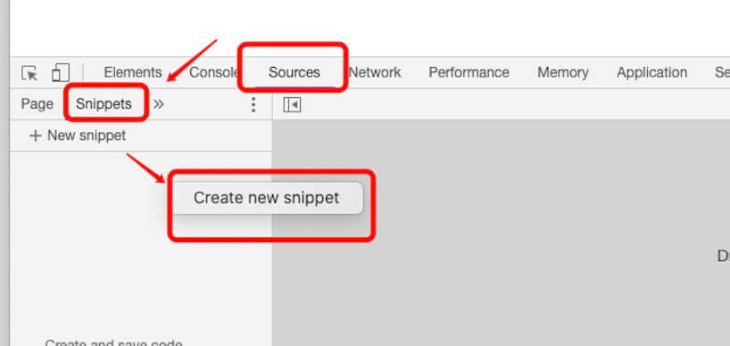

# JavaScript


JavaScript 是一种轻量级的编程语言。

JavaScript 是可插入 HTML 页面的编程代码。JavaScript 插入 HTML 页面后，可由所有的现代浏览器执行。

JavaScript 很容易学习。

## JS 简介

javascript因为兼容于ECMA标准，因此也称为ECMAScript。
JavaScript作为一种脚本语言，已经被广泛地应用于Web页面当中，通过嵌入HTML来实现各种酷炫的动态效果，为用户提供赏心悦目的浏览效果。  
除此之外，也可以用于控制cookies以及基于Node.js技术进行服务器端编程。

发展初期，JavaScript的标准并未确定，同期有Netscape的JavaScript，微软的JScript和CEnvi的ScriptEase三足鼎立。  
1997年，在ECMA(欧洲计算机制造商协会)的协调下，由Netscape、Sun、微软、Borland组成的工作组确定统一标准：ECMA-262。

javascript是甲骨文公司的注册商标，完整的JavaScript实现包含三个部分：ECMAScript，文档对象模型（DOM）和浏览器对象模型（BOM）。  
1. ECMAScript : 核心  (描述了javascript组成语言的语法和基本对象)
2. DOM : 文档对象模型  (描述处理网页内容的方法和接口)
3. BOM : 浏览器对象模型 (描述与浏览器进行交互的方法和接口)

### Javascript与Java的比较

JavaScript和Java除了在名字上有一点类似，以及JavaScript语法源自于Java外，两者其实存在很大的不同，主要体现在以下几点。

1. JavaScript由浏览器解释执行，Java程序则是编译执行。
2. JavaScript是一种基于对象的脚本语言；Java则是一种面向对象的编程语言。
3. JavaScript是弱类型语言，可以不声明变量而直接使用变量；Java是强制类型语言，变量在使用前必须先声明。

强/弱类型是指类型检查的严格程度的。语言有无类型，弱类型和强类型三种。无类型的不检查，甚至不区分指令和数据。  
弱类型的检查很弱，仅能严格的区分指令和数据。强类型的则严格的在编译期进行检查。

JAVA是强类型语言：因此每个变量和对象都必须具有声明类型。  
javascript是弱类型语言：因此它可以不先定义类理和对象、或用var定义所有变量

## JS 用法

HTML 中的脚本必须位于 `<script>` 与 `</script>` 标签之间。脚本可被放置在 HTML 页面的 `<body>` 和 `<head>` 部分中。  
也可以把脚本保存到外部文件中。外部文件通常包含被多个网页使用的代码。外部 JavaScript 文件的文件扩展名是 .js。  
如需使用外部文件，请在 `<script>` 标签的 "src" 属性中设置该 .js 文件

* 大小写敏感（严格区分字母大小写）
* 执行顺序：JavaScript程序按照在HTML文件中出现的顺序逐行执行。如果需要在整个HTML文件中执行（如函数、全局变量等），最好将其放在
  HTML文件的`<head>...</head>`标记中。某些代码，比如函数体内的代码，不会被立即执行，只有当所在的函数被其他程序调用时，该代码才会被执行。
* 与Java语言不同，JavaScript并不要求必须以分号`;`作为语句的结束标记。JavaScript会自动将该行代码的结尾作为语句的结尾。

### JS 字面量/常量

在编程语言中，一般固定值称为字面量，如 3.14。
1. **数字（Number）字面量** 可以是整数或者是小数，或者是科学计数(e):`3.14`；
2. **字符串（String）字面量** 可以使用单引号或双引号:`'John Doe'`；
3. **表达式字面量** 用于计算：`5 + 6`；
4. **数组（Array）字面量** 定义一个数组：`[1,2]`；
5. **对象（Object）字面量** 定义一个对象：`{a: 1, b: 2}`；
6. **函数（Function）字面量** 定义一个函数：`function fun(a) {return a}`。

### JS 关键字

JavaScript 关键字用于标识要执行的操作。关键字是不能作为变量名和函数名使用的。比如 `var` 关键字告诉浏览器创建一个新的变量。  
以下是 JavaScript 中最重要的保留字（按字母顺序）：

   |   |   |   |   |   |   |   |   |   |  
 - | - | - | - | - | - | - | - | - | - 
abstract | boolean | break | byte | case | catch | char | class | const | continue
debugger | default | delete | do | double | else | enum | export | extends | false
final | finally | float | for | function | goto | if | implements | import | in
instanceof | int | interface | let | long | native | new | null | package | private
protected | public | return | short | static | super | switch | synchronized | this | throw
throws | transient | true | try | typeof | var | void | volatile | while | with

### JS 变量

在编程语言中，变量用于存储数据值。JavaScript 使用关键字 var 来定义变量， 使用等号来为变量赋值。

> 变量的命名规则

* 第一个字符必须是`字母`或者 `$` 和 `_` 符号开头;
* 变量名中不能包含空格或标点符号或加号减号等符号（`$` 除外);
* 变量名称对大小写敏感（y 和 Y 是不同的变量）;
* 不能使用保留字、关键字;
* 为了让变量名有更好的可读性，可以在变量名中适当的插入下划线分隔，如：`var my_mood = 'happy'`

> 变量的声明和赋值

* 可以用 var 同时声明多个变量：`var a,b,c`
* 可以声明的同时对其赋值，即为初始化：`var a=1,b=2,c=3`
* 如果只是声明了变量而未对其赋值，则其值默认为 `undefined`  
  var sex = male; console.log(male); // male is not defined  将male当做一个变量
* 如果声明同一个变量，而且其已经有一个初始值的话，那么重新声明就相当于对变量重新赋值。
* 变量也可以不使用var作声明而直接使用，这样虽然简单但不易发现变量各方面的错误。

> [!tip]
> 一个好的编程习惯是，在代码开始处，统一对需要的变量进行声明。

### JavaScript 注释

//      单行注释  
/* */   多行注释，注意：多行注释不能互相嵌套

### Chrome 浏览器中执行 JavaScript

我们在 Chrome 浏览器中可以通过按下 `F12` 按钮或者右击页面，选择"检查"来开启开发者工具。
打开开发者工具后，我们可以在 Console 窗口调试 JavaScript代码。

我们也可以在 Chrome 浏览器中创建一个脚本来执行，在开发者工具中点击 Sources 面板，选择 Snippets 选项卡，在导航器中右击鼠标，
然后选择 Creat new snippet 来新建一个脚本文件：




## JS 数据类型 {#datatype}

**值类型(基本类型)**：字符串（String）、数字(Number)、布尔(Boolean)、对空（Null）、未定义（Undefined）、Symbol。  
**引用数据类型**：对象(Object)、数组(Array)、函数(Function)。

> [!Warning|label: 注意]
> Symbol 是 ES6 引入了一种新的原始数据类型，表示独一无二的值。

### JS 拥有动态类型

JavaScript 拥有动态类型。这意味着相同的变量可用作不同的类型：
```js
var x;               // x 为 undefined
var x = 5;           // 现在 x 为数字
var x = "John";      // 现在 x 为字符串
```

### JS 字符串（String）

字符串由零个或多个Unicode字符构成，可以是引号中的任意文本。您可以使用单引号或双引号。  
单引号中可以含有单引号或双引号，只要不匹配包围字符串的引号即可；但是单包单或双包双时必须进行转义，用\隔开。
```js
var str = 'I like "JavaScript"'; // 单包双
var str = "I like 'JavaScript'"; // 双包单

var str = 'I like \'JavaScript\''; // 单包单
var str = "I like \"JavaScript\""; // 双包双
```

> [!note]
> javascript中的字符串是不可变的。一旦字符串被创建，就永远无法改变它。要改变某个变量保存的字符串，  
> 首先要销毁原来的字符串，然后再用另一个包含新值的字符串填充该变量，可以通过+运算符连接其他字符串来创建一个新字符串。  
> 举例：`var lang = "java"; lang = lang + "script";` => 'javascript'  
> 以上代码的实际过程是：首先创建一个能够容纳10个字符的新字符串，然后在这个字符串中填充'java'和'script'，
最后一步是销毁原来的字符串'java'和'script'，因为这两个字符串已经没用了。

### JS 数字（Number）

JavaScript 只有一种数字类型。数字可以带小数点，也可以不带：
```js
var x1=34.00;      //使用小数点来写
var x2=34;         //不使用小数点来写
```
极大或极小的数字可以通过科学（指数）计数法来书写：
```js
var y=123e5;      // 12300000
var z=123e-5;     // 0.00123
```

### JS 布尔（Boolean）

布尔（逻辑）只能有两个值：true 或 false。

> [!danger]
> 在`Number()`方法中空字符串和空白字符串都转换为`0`，而在`Boolean`方法中，`空字符串""`转换为 false，而`空白字符串" "`转换为 true。  
> 与字符串不同，不要把布尔值用引号括起来。布尔值 false 与 字符串 "false"是两回事。

### JS 数组（Array）

我们的变量一般都只能存储一个内容，所以它其实是一个单一的容器。  
我们的数组一般可以存一个或者是多个值，所以数组是一个大的容器。

> 组成部分

数组其实是由多个(键-值)所组成的一个多容器，数组的索引 默认是从0开始的，所以第一个项目是 [0]，第二个是 [1]，以此类推。

### JS 对象（Object）

在 JavaScript中，几乎所有的事物都是对象。  
对象由花括号分隔。在括号内部，对象的属性以名称和值对的形式 (name : value) 来定义。属性由逗号分隔：
```js
var person={firstname:"John", lastname:"Doe", id:5566};
```
上面例子中的对象 (person) 有三个属性：firstname、lastname 以及 id。  
空格和折行无关紧要。声明可横跨多行：
```js
var person={
  firstname : "John",
  lastname  : "Doe",
  id        :  5566
};
```
**对象属性有两种寻址方式：**
```js
name=person.lastname;
name=person["lastname"];
```

### 特殊数据类型

#### 转义字符

在javascript字符串，反斜线 ` \ ` 有着特殊的用途，反斜线符号后加一个字符，就不表示它们的字面含义，用来表示一些特殊字符，称为转义字符。

   |   |   |   |   |   |   |   |   |   |
 - | - | - | - | - | - | - | - | - | - 
 `\0` | 空字节 | `\n` | 换行 | `\t` | 制表 | `\b` | 空格 | `\r` | 回车
 `\f` | 换页符 | `\\` | 反斜杠,对自身转义 | `\'` | 单引号 | `\"` | 双引号 |  | 

`\xnn` 以十六进制nn表示一个字符(n为0-f)，如`\x41`表示`A`  
`\unnnn` 以十六进制nnnn表示一个Unicode字符(n为0-f)，如`\u03a3`表示`希腊字符ε`

> [!tip]
> 如果在非特殊字符前面使用反斜杠，则反斜杠会被省略，如 `'\a'` => `'a'`

#### null

在JavaScript中`null`表示"`什么都没有，为空值`"。  
`null`是一个只有一个值的特殊类型。表示一个空对象引用。  
`var person = null;` // 你可以设置为`null`来清空对象。  
**注意：`null` 不等同于`空的字符串（""）`或`0`**

#### undefined

在JavaScript中, `undefined`是一个没有设置值的变量，表示变量还没有赋值（如`var a;`），
或者赋予一个不存在的属性值（如`var a=String.notProperty;`）。`typeof`一个没有值的变量会返回`undefined`。  
`var person = undefined;` // 你可以设置为`undefined`来清空对象。

> `undefined`和`null`的区别

`null`表示一个“空”的值，它和`0`以及`空字符串''`不同，0是一个数值，''表示长度为0的字符串，而`null`表示“空”。`undefined`表示值未定义。
大多数情况下，我们都应该用`null`。`undefined`仅仅在判断函数参数是否传递的情况下有用。
```js
typeof undefined             // undefined
typeof null                  // object
null === undefined           // false
null == undefined            // true
```

#### NaN

特殊类型的数字常量`NaN`，即“非数字”。当在程序中由于某种原因发生计算错误后，将产生一个没有意义的数字，此时JavaScript返回的数字值就是`NaN`。

### 声明变量类型

当您声明新变量时，可以使用关键词 `new` 来声明其类型：
```js
var carname = new String;
var x = new Number;
var y = new Boolean;
var cars = new Array;
var person = new Object;
```

> [!note]
> JavaScript 变量均为对象。当您声明一个变量时，就创建了一个新的对象。

## JS 数据类型转换

### typeof 操作符

你可以使用 typeof 操作符来检测变量的数据类型。
```js
typeof "John"                // 返回 string
typeof 3.14                  // 返回 number
typeof false                 // 返回 boolean
typeof [1,2,3,4]             // 返回 object
typeof {name:'John', age:34} // 返回 object
```

> [!tip]
> 在JavaScript中，数组是一种特殊的对象类型。 因此 `typeof [1,2,3,4]` 返回 `object`。  
> `NaN` 的数据类型是 `number`; 日期(Date)的数据类型为 object; `null` 的数据类型是 `object`。

### constructor 属性

constructor 属性返回所有 JavaScript 变量的构造函数。
```js
"John".constructor                 // 返回函数 String()  { [native code] }
(3.14).constructor                 // 返回函数 Number()  { [native code] }
false.constructor                  // 返回函数 Boolean() { [native code] }
[1,2,3,4].constructor              // 返回函数 Array()   { [native code] }
{name:'John', age:34}.constructor  // 返回函数 Object()  { [native code] }
new Date().constructor             // 返回函数 Date()    { [native code] }
function () {}.constructor         // 返回函数 Function(){ [native code] }
```
你可以使用 constructor 属性来查看对象是否为数组 (包含字符串 "Array")，也可以使用 constructor 属性来查看对象是否为日期 (包含字符串 "Date"):

> @[constructor 属性实例]{`../../demo/demo.html?demoname=constructor`}
> `../../images/home/javascript.png`

### JS 数据类型转换

#### 强制转换

强制转换主要指使用Number、String和Boolean三个构造函数，手动将各种类型的值，转换成数字、字符串或者布尔值

**1. Number函数：强制转换成数值**
```js
Number("324") // 324
Number("324abc") // NaN
Number("") // 0
Number(false) // 0
Number(undefined) // NaN
Number(null) // 0
```
**2. String函数：强制转换成字符串**
```js
String(123) // "123"
String("abc") // "abc"
String(true) // "true"
String(undefined) // "undefined"
String(null) // "null"
```
**3. Boolean函数：强制转换成布尔值**
```js
Boolean(undefined) // false
Boolean(null) // false
Boolean(0) // false
Boolean(NaN) // false
Boolean('') // false
```

#### 转换函数

1. **toString()**：转换为字符串
2. **parseInt()**：转换成整数
3. **parseFloat()**：转换成浮点数

更多更新转换函数在 [高级章节]，待完善。

#### 自动转换

当遇到以下几种情况，JavaScript会自动转换数据类型：

* 不同类型的数据进行互相运算；
* 对非布尔值类型的数据求布尔值;
* 对非数值类型的数据使用一元运算符（即“+”和“-”）。

**1. 自动转换为布尔值**

除了以下六个值，其他都是自动转为true：`undefined`, `null`, `-0`, `+0`, `NaN`, `''`(空字符串)
```js
if (!undefined && !null && !0 && !NaN && !''){
    console.log('true');
}
// true
```

**2. 自动转换为字符串**

字符串的自动转换，主要发生在加法运算时。当一个值为字符串，另一个值为非字符串，则后者转为字符串。
```js
'5' + 1 // '51'
1 + 2 + '5'  // '35'
'5' + true // "5true"
'5' + {} // "5[object Object]"
'5' + [] // "5"
'5' + function (){} // "5function (){}"
'5' + undefined // "5undefined"
'5' + null // "5null"
```

**3. 自动转换为数值**

除了加法运算符有可能把运算子转为字符串，其他运算符都会把两侧的运算子自动转成数值。
```js
'5' - '2' // 3
'5' * '2' // 10
true - 1 // 0
false - 1 // -1
'1' - 1 // 0
'5'*[] // 0
false/'5' // 0
'abc'-1 // NaN
```

> 下表展示了使用不同的数值转换为数字(Number), 字符串(String), 布尔值(Boolean):

 原始值 | 转换为数字 | 转换为字符串 | 转换为布尔值
    :-:   |   :-:   |   :-:   |   :-:   
 false  |	0   |	"false" |	false	
 true   |	1   |	"true"  |	true	
 0  |	0   |	"0" |	false	
 1  |	1   |	"1" |	true	
 "0"    |	0   |	"0" |	true	
 "000"  |	0   |	"000"   |	true	
 "1"    |	1   |	"1" |	true	
 NaN    |	NaN |	"NaN"   |	false	
 Infinity   |	Infinity    |	"Infinity"  |	true	
 -Infinity  |	-Infinity   |	"-Infinity" |	true	
 "" |	0   |	""  |	false	
 "20"   |	20  |	"20"    |	true	
 "Runoob"   |	NaN |	"Runoob"    |	true	
 [ ]    |	0   |	""  |	true	
 [20]   |	20  |	"20"    |	true	
 [10,20]    |	NaN |	"10,20" |	true	
 ["Runoob"] |	NaN |	"Runoob"    |	true	
 ["Runoob","Google"]    |	NaN |	"Runoob,Google" |	true	
 function(){}   |	NaN |	"function(){}"  |	true	
 { }    |	NaN |	"[object Object]"   |	true	
 null   |	0   |	"null"  |	false	
 undefined  |	NaN |	"undefined" |	false

> @[javascript数据类型转换]{`https://www.css88.com/archives/5199`}
> `../../images/home/javascript.png`

## JS 运算符 {#operator}

### 算术运算符

`+`（加）; `-`（减）; `*`（乘）; `/`（除）; `%`（求模、取余数）[(前面正得正，负得负)：10.5 % 3; // 1.5];  
无非就是数学的四则运算，过于简单就不做详细介绍，不懂就回去问你们小学数学老师

**`++`（自增）**  
1. 后加加：`i++`先赋值后自增加1   
2. 前加加：`++i`先自增加1后赋值

`--`（自减）：同`++`（自增）类似
```js
// 如果 y = 5
x = ++y; // x=6 y=6
x = y++; // x=5 y=6
x = --y; // x=4 y=4
x = y--; // x=5 y=4
```

### 赋值运算符

`=`   将右边表达式的值付给左边的变量  
`+=`  给当前这个变量增加多少  a += 3;等同于（a = a+3）  
同理：`-=`(加), `*=`(减), `/=`(乘), `%=`(求模)

还有`&=`(与运算) `a &= b`, 相当于`a = a&b`  
同理：`|=`(或运算), `^=` (异运算)

### 字符串的 + 运算符（类似拼接）

当`+`存在于变量与字符串中间位置的时候就代表是拼接或者连接的作用，而 `+=` 运算符则用于连接两个字符串，并将结果赋给第一个字符串。
```js
var a = "23", b = 1;
a+b // 231  这个例子说明 如果不是同种类型的话 那么`+`代表的是拼接的意思
a-b // 22   这个例子说明  除了+ 这种特殊的运算方式以外  即使是不同类型那么也能够进行运算

var name = "JavaScript"; name+=" book"; // JavaScript book
```

### 比较运算符

`>`（大于）, `<`（小于）, `>=`（大于或等于）, `<=`（小于或等于）,   
`==`（等于）, `!=`（不等于），`===`（全等于、绝对等于)，`!==` (不全等于，不绝对等于，值和类型有一个不相等，或两个都不相等)

在js里面一个等号`=`代表赋值，两个等号`==`才代表判断是否相等（判断数值相等，当数值0和1和布尔值做比较会将数值转换成布尔值）,
三个等于号`===`代表全等于（判断数值且类型相等）

null==false        =》 false  |    undefined == false =》 false   |   null == undefined  =》 true  
null === undefined =》 false  |    null == 0       =》 false      |   null === 0      =》 false  
0 == false      =》 true      |    1 == true       =》 true       |   4 == true       =》 false  
假如两个变量进行比较，它的全等于为假，那么它的不全等于为真   =》 true

### 逻辑运算符

* `&&`（与）：一假全假；`(x < 10 && y > 1) 为 true`
* `||`（或）：一真则真；`(x==5 || y==5) 为 false`
* `!`（非）：假变真，真变假。`!(x==y) 为 true`

### 运算符优先级

JavaScript中的运算符优先级是一套规则。该规则在计算表达式时控制运算符执行的顺序。具有较高优先级的运算符先于较低优先级的运算符执行。例如，乘法的执行先于加法。

下表按从最高到最低的优先级列出JavaScript运算符。具有相同优先级的运算符按从左至右的顺序求值。

 运算符 | 描述
 - | - 
`.``[]``()` | 字段访问、数组下标、函数调用以及表达式分组
`++` `--` `-` `~` `!` `delete` `new` `typeof` `void` | 一元运算符、返回数据类型、对象创建、未定义值
`*` `/` `%` | 乘法、除法、取余
`+` `-` `+` | 加法、减法、字符串连接
`<<` `>>` `>>>` | 移位
`<` `<=` `>` `>=` `instanceof` | 小于、小于等于、大于、大于等于、instanceof
`==` `!=` `===` `!==` | 等于、不等于、全等于、不全等于
`&` | 按位与
`^` | 按位异或
&#124; | 按位或
`&&` | 逻辑与
&#124;&#124; | 逻辑或
`?:` | 条件
`=` `oP=` | 赋值、运算赋值
`,` | 多重求值

## JS 条件语句 {#if_else}

