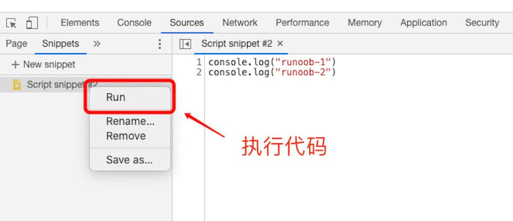

# JavaScript

JavaScript 是一种轻量级的编程语言。

JavaScript 是可插入 HTML 页面的编程代码。JavaScript 插入 HTML 页面后，可由所有的现代浏览器执行。

JavaScript 很容易学习。

## Javascript 简介

javascript因为兼容于ECMA标准，因此也称为ECMAScript。
JavaScript作为一种脚本语言，已经被广泛地应用于Web页面当中，通过嵌入HTML来实现各种酷炫的动态效果，为用户提供赏心悦目的浏览效果。  
除此之外，也可以用于控制cookies以及基于Node.js技术进行服务器端编程。

发展初期，JavaScript的标准并未确定，同期有Netscape的JavaScript，微软的JScript和CEnvi的ScriptEase三足鼎立。  
1997年，在ECMA(欧洲计算机制造商协会)的协调下，由Netscape、Sun、微软、Borland组成的工作组确定统一标准：ECMA-262。

javascript是甲骨文公司的注册商标，完整的JavaScript实现包含三个部分：ECMAScript，文档对象模型（DOM）和浏览器对象模型（BOM）。  
1. ECMAScript : 核心  (描述了javascript组成语言的语法和基本对象)
2. DOM : 文档对象模型  (描述处理网页内容的方法和接口)
3. BOM : 浏览器对象模型 (描述与浏览器进行交互的方法和接口)

### Javascript与Java的比较

JavaScript和Java除了在名字上有一点类似，以及JavaScript语法源自于Java外，两者其实存在很大的不同，主要体现在以下几点。

1. JavaScript由浏览器解释执行，Java程序则是编译执行。
2. JavaScript是一种基于对象的脚本语言；Java则是一种面向对象的编程语言。
3. JavaScript是弱类型语言，可以不声明变量而直接使用变量；Java是强制类型语言，变量在使用前必须先声明。

强/弱类型是指类型检查的严格程度的。语言有无类型，弱类型和强类型三种。无类型的不检查，甚至不区分指令和数据。  
弱类型的检查很弱，仅能严格的区分指令和数据。强类型的则严格的在编译期进行检查。

JAVA是强类型语言：因此每个变量和对象都必须具有声明类型。  
javascript是弱类型语言：因此它可以不先定义类理和对象、或用var定义所有变量

## JavaScript 用法

HTML 中的脚本必须位于 `` 标签之间。脚本可被放置在 HTML 页面的 `<body>` 和 `<head>` 部分中。  
也可以把脚本保存到外部文件中。外部文件通常包含被多个网页使用的代码。外部 JavaScript 文件的文件扩展名是 .js。  
如需使用外部文件，请在 `<script>` 标签的 "src" 属性中设置该 .js 文件

* 大小写敏感（严格区分字母大小写）
* 执行顺序：JavaScript程序按照在HTML文件中出现的顺序逐行执行。如果需要在整个HTML文件中执行（如函数、全局变量等），最好将其放在
  HTML文件的`<head>...</head>`标记中。某些代码，比如函数体内的代码，不会被立即执行，只有当所在的函数被其他程序调用时，该代码才会被执行。
* 与Java语言不同，JavaScript并不要求必须以分号`;`作为语句的结束标记。JavaScript会自动将该行代码的结尾作为语句的结尾。

### JavaScript 语法

#### JavaScript 字面量/常量

在编程语言中，一般固定值称为字面量，如 3.14。
1. **数字（Number）字面量** 可以是整数或者是小数，或者是科学计数(e):`3.14`；
2. **字符串（String）字面量** 可以使用单引号或双引号:`'John Doe'`；
3. **表达式字面量** 用于计算：`5 + 6`；
4. **数组（Array）字面量** 定义一个数组：`[1,2]`；
5. **对象（Object）字面量** 定义一个对象：`{a: 1, b: 2}`；
6. **函数（Function）字面量** 定义一个函数：`function fun(a) {return a}`。

#### JavaScript 关键字

JavaScript 关键字用于标识要执行的操作。关键字是不能作为变量名和函数名使用的。比如 `var` 关键字告诉浏览器创建一个新的变量。  
以下是 JavaScript 中最重要的保留字（按字母顺序）：

   |   |   |   |   |   |   |   |   |   |  
 - | - | - | - | - | - | - | - | - | - 
abstract | boolean | break | byte | case | catch | char | class | const | continue
debugger | default | delete | do | double | else | enum | export | extends | false
final | finally | float | for | function | goto | if | implements | import | in
instanceof | int | interface | let | long | native | new | null | package | private
protected | public | return | short | static | super | switch | synchronized | this | throw
throws | transient | true | try | typeof | var | void | volatile | while | with

#### JavaScript 变量

在编程语言中，变量用于存储数据值。JavaScript 使用关键字 var 来定义变量， 使用等号来为变量赋值。

> 变量的命名规则

* 第一个字符必须是`字母`或者 `$` 和 `_` 符号开头;
* 变量名中不能包含空格或标点符号或加号减号等符号（`$` 除外);
* 变量名称对大小写敏感（y 和 Y 是不同的变量）;
* 不能使用保留字、关键字;
* 为了让变量名有更好的可读性，可以在变量名中适当的插入下划线分隔，如：`var my_mood = 'happy'`

> 变量的声明和赋值

* 可以用 var 同时声明多个变量：`var a,b,c`
* 可以声明的同时对其赋值，即为初始化：`var a=1,b=2,c=3`
* 如果只是声明了变量而未对其赋值，则其值默认为 `undefined`  
  var sex = male; console.log(male); // male is not defined  将male当做一个变量
* 如果声明同一个变量，而且其已经有一个初始值的话，那么重新声明就相当于对变量重新赋值。
* 变量也可以不使用var作声明而直接使用，这样虽然简单但不易发现变量各方面的错误。

> [!tip]
> 一个好的编程习惯是，在代码开始处，统一对需要的变量进行声明。

#### JavaScript 注释

//      单行注释  
/* */   多行注释，注意：多行注释不能互相嵌套

### Chrome 浏览器中执行 JavaScript

我们在 Chrome 浏览器中可以通过按下 `F12` 按钮或者右击页面，选择"检查"来开启开发者工具。
打开开发者工具后，我们可以在 Console 窗口调试 JavaScript代码。

我们也可以在 Chrome 浏览器中创建一个脚本来执行，在开发者工具中点击 Sources 面板，选择 Snippets 选项卡，在导航器中右击鼠标，
然后选择 Creat new snippet 来新建一个脚本文件：

## JavaScript 数据类型 {#datatype}

**值类型(基本类型)**：字符串（String）、数字(Number)、布尔(Boolean)、对空（Null）、未定义（Undefined）、Symbol。  
**引用数据类型**：对象(Object)、数组(Array)、函数(Function)。

