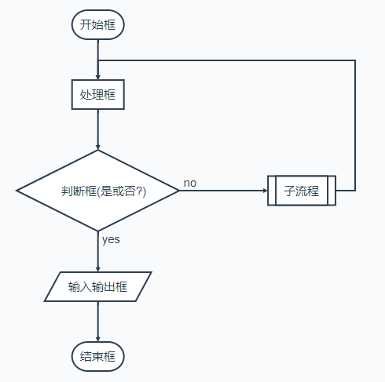

# Markdown


Markdown 是一种轻量级标记语言，它允许人们使用易读易写的纯文本格式编写文档。  

Markdown 语言在 2004 由约翰·格鲁伯（英语：John Gruber）创建。  

Markdown 编写的文档可以导出 HTML 、Word、图像、PDF、Epub 等多种格式的文档。
 
Markdown 编写的文档后缀为 `.md`, `.markdown`。

## Markdown 标题

Markdown 标题有两种格式。

**第一种：使用 = 和 - 标记一级和二级标题**

```markdown
这是一个一级标题
============================

这是一个二级标题
--------------------------------------------------
```
**第二种：使用 # 号可表示 1-6 级标题，一级标题对应一个 # 号，二级标题对应两个 # 号，以此类推**
```markdown
# 一级标题
## 二级标题
### 三级标题
#### 四级标题
##### 五级标题
###### 六级标题

一级标题字号最大，依级递减。
```

**显示效果：**  

------

## 段落格式

Markdown 段落没有特殊的格式，直接编写文字就好，**段落的换行是使用两个以上空格加上回车**。  
```markdown
第一行  ☞末尾添加两个空格 就可换行
第二行
```
当然也可以在段落后面使用一个空行来表示重新开始一个段落。
```markdown
第一行

第二段落第一行
```

### 字体

Markdown使用星号`*`和底线`_`作为标记强调字词的符号，被`*`或`_`包围的字词会被转成用`<em>`标签包围，用两个如`**`或`__`包起来的话，
则会被转成`<strong>`，用`~~`包起来的话，则会被转成`<del>`，但是目前markdownPad2和GitHub的markdown并不支持~~删除线~~这个语法功能，
可以直接用html的`<del></del>`或`<s></s>`代替，而且下划线只能通过 HTML 的 `<u>` 标签来实现。

```markdown
*斜体* 或 _斜体_
**粗体** 或 __粗体__
***加粗斜体*** 或 ___加粗斜体___
~~删除线~~
<u>带下划线文本</u>
```

**显示效果：**

- *这是一段斜体*
- **这是一段粗体**
- ***这是一段加粗斜体***
- ~~这是一段删除线~~
- <u>带下划线文本</u>
------

### 分隔线

你可以在一行中用三个以上的星号、减号、底线来建立一个分隔线，行内不能有其他东西。你也可以在星号或是减号中间插入空格。下面每种写法都可以建立分隔线：

```markdown
***
* * *
*****
- - -
----------
```
**显示效果都是一样的一条分隔线，显示效果如下**

------

### 脚注 {#footnote}

脚注是对文本的补充说明。  
在需要添加注脚的文字后加上脚注名字`[^注脚名字]`,称为脚注。 然后在文本的任意位置(一般在最后)添加脚注，脚注前必须有对应的脚注名字。

> [!Warning|label: 注意]
> 脚注 `id` 必须唯一；    
> 经测试脚注根据`不同编译器`会有不同效果。区别如下：  
> 一般`线上的markdown编译器`效果为：（1）无论脚注 `id` 如何起名，显示时一律标为数字，并且按出现顺序排列；  
> （2）即使你没有把注脚写在文末，显示出来的效果也会自动归类到文章的最后。
> `gitbook Cli` 脚注与注脚之间必须空一行，不然会失效。注脚并不会自动归类到文章最后，所以最好手动写到文章最后。

```markdown
创建脚注格式类似这样 [^HQBOOK]。

[^HQBOOK]: hqbook -- A book for note。
```
**gitbook Cli显示效果：**  
创建脚注格式类似这样 [^HQBOOK]。

**其他markdown编译器显示效果：**  


------

## 列表 {#list}

### 无序列表

使用 `*，+，-` 表示无序列表，三个都显示为实心圆点。

```markdown
- 无序列表项 一
- 无序列表项 二
- 无序列表项 三
```

**显示效果：**

- 无序列表项 一
- 无序列表项 二
- 无序列表项 三

### 有序列表

有序列表则使用数字接着一个英文句点`.`再加个`空格`。

```markdown
1. 有序列表项 一
2. 有序列表项 二
3. 有序列表项 三
```
**显示效果：**

1. 有序列表项 一
2. 有序列表项 二
3. 有序列表项 三

### 列表嵌套

列表嵌套只需在子列表中的选项添加`四个空格`即可。

```markdown
1. 第一项：
    - 第一项嵌套的第一个元素
    - 第一项嵌套的第二个元素
2. 第二项：
    - 第二项嵌套的第一个元素
    - 第二项嵌套的第二个元素
```
**显示效果：**

1. 第一项：
    - 第一项嵌套的第一个元素
    - 第一项嵌套的第二个元素
2. 第二项：
    - 第二项嵌套的第一个元素
    - 第二项嵌套的第二个元素

### 列表特殊情况
在特殊情况下，项目列表很可能会不小心产生，像是下面这样的写法：

```markdown
2008. 北京奥运会欢迎您！
```
会显示成：  
2008. 北京奥运会欢迎您！

换句话说，也就是在行首出现数字-句点-空白，要避免这样的状况，你可以在句点前面加上反斜杠：

```markdown
2008\. 北京奥运会欢迎您！
```
才能正常显示成：  
2008\. 北京奥运会欢迎您！

------

## 区块引用 {#block}

Markdown 区块引用是在段落开头使用 `>` 符号 ，然后后面紧跟一个`空格符号`：

```markdown
> 这是一个有两段文字的引用,  
> Markdown 区块引用

> hqbook  
> 学的不仅是技术更是梦想
```

**显示效果：**

> 这是一个有两段文字的引用,  
> Markdown 区块引用

> hqbook  
> 学的不仅是技术更是梦想

Markdown 也允许你偷懒只在整个段落的第一行最前面加上`>``：

```markdown
> 这是一个有两段文字的引用,
Markdown 区块引用

> hqbook
学的不仅是技术更是梦想
```
**显示效果：**
> 这是一个有两段文字的引用,  
Markdown 区块引用

> hqbook  
学的不仅是技术更是梦想

### 区块的多层嵌套
区块引用可以嵌套，一个`>` 符号是最外层，两个`>` 符号是第一层嵌套，以此类推：

```markdown
> 最外层  
>> 第一层嵌套  
>>> 第二层嵌套
```
**显示效果：**

> 最外层  
>> 第一层嵌套  
>>> 第二层嵌套

### 区块中引用其它要素

引用的区块内也可以使用其他的 Markdown 语法，包括标题、列表、代码区块等：

```markdown
> 区块中使用列表
> 1. 第一项
> 2. 第二项
>   + 第一项
>   + 第二项
>
> 给出一些例子代码：  
> return shell_exec("echo $input | $markdown_script");
```

**显示效果：**

> 区块中使用列表
> 1. 第一项
> 2. 第二项
>   + 第一项
>   + 第二项
>
> 给出一些例子代码：  
> return shell_exec("echo $input | $markdown_script");

### 列表中使用区块

如果要在列表项目内放进区块，那么就需要在 `>` 前添加四个空格的缩进。

```markdown
* 第一项
    > hqbook  
    > A book for note
* 第二项
```

**显示效果：**

* 第一项
    > hqbook  
    > A book for note
* 第二项

------

## 代码 {#code}

> [!Tip]
> Markdown 支持使用原生`html`代码

如果是段落上的一个函数或片段的代码可以用反引号<code>\`</code>把它包起来，也可以将某些字眼加上反引号达到`显眼`的作用。例如：

```markdown
`printf()` 函数  
随便敲打几个字，在这行字里面用`反引号`突出某些字眼，比如`hqbook`
```

**显示效果：**

`printf()` 函数  
随便敲打几个字，在这行字里面用`反引号`突出某些字眼，比如`hqbook`

### 代码区块

代码区块使用<code>```</code>包裹一段代码，并指定一种语言（也可以不指定）：

<pre>
```javascript
$(document).ready(function () {
    alert('hqbook');
});
```
</pre>

**显示效果：**

```javascript
$(document).ready(function () {
    alert('hqbook');
});
```

你也可以用`4 个空格`或者一个`制表符`（Tab 键）


**显示效果：**

    <?php
    echo 'RUNOOB';
    funtion test() {
        echo 'test';
    }

### 支持的 HTML 元素

不在 Markdown 涵盖范围之内的标签，都可以直接在文档里面用 HTML 撰写。
目前支持的 HTML 元素有：`<kbd> <b> <i> <em> <sup> <sub> <br>`等 ，如：

```html
使用 <kbd>Ctrl</kbd>+<kbd>Alt</kbd>+<kbd>Del</kbd> 重启电脑
```
**显示效果：**

使用 <kbd>Ctrl</kbd>+<kbd>Alt</kbd>+<kbd>Del</kbd> 重启电脑

### 转义

Markdown 使用了很多特殊符号来表示特定的意义，如果需要显示特定的符号则需要使用转义字符，Markdown 使用反斜杠转义特殊字符  
Markdown 支持以下这些符号前面加上反斜杠来帮助插入普通的符号：

| 符号 |       | 符号 |      | 符号 |       |
| --- | ----- | --- | ----- | --- | ----- |
|  \  | 反斜线 | \`  | 反引号 |  *  |  星号  |
|  _  | 下划线 | {}  | 花括号 | []  | 方括号 |
| ()  | 小括号 |  #  | 井字号 |  +  |  加号  |
|  -  |  减号  |  .  |英文句点|  *  | 感叹号 |

------

## 超链接 {#link}

`Markdown` 支持两种形式的链接语法： 行内式和参考式两种形式，行内式一般使用较多。

### 行内式

**语法说明：**

`[]`里写链接文字，`()`里写链接地址, `()`里面" "中的内容可以为链接指定`title属性`，`title属性`可加可不加。  
`title属性`的效果是鼠标悬停在链接上会出现指定的 `title文字`。\[链接文字\]\(链接地址 "链接标题"\)这样的形式。  
***链接地址与链接标题前有一个空格。***

```markdown
欢迎来到[Markdown语法篇](https://haoqiangchen.github.io/hqbook/Tools/markdown/)

欢迎来到[Markdown语法篇](https://haoqiangchen.github.io/hqbook/Tools/markdown/ "Markdown语法篇")
```

**显示效果：**

欢迎来到[Markdown语法篇](https://haoqiangchen.github.io/hqbook/Tools/markdown/)

欢迎来到[Markdown语法篇](https://haoqiangchen.github.io/hqbook/Tools/markdown/ "Markdown语法篇")

### 参考式

参考式超链接一般用在学术论文上面，或者另一种情况，如果某一个链接在文章中多处使用，那么使用引用 的方式创建链接将非常好，它可以让你对链接进行统一的管理。

**语法说明：**

参考式链接分为两部分，文中的写法 [链接文字][链接标记]，在文本的任意位置添加[链接标记]:链接地址 &#34;链接标题&#34;，***链接地址与链接标题前有一个空格。***

如果链接文字本身可以做为链接标记，你也可以写成[链接文字][]
[链接文字]：链接地址的形式，见代码的最后一行。

```markdown
欢迎阅读本[Markdown语法篇][1]，还有这几篇高手总结的也不错：[入门篇][2]、
[简明版][3]、[完整版][4]，我就喜欢把百家汇成[自己一家][]^_^。

[1]:https://haoqiangchen.github.io/hqbook/Tools/markdown/ "Markdown语法篇"
[2]:https://www.jianshu.com/p/1e402922ee32 "入门篇"
[3]:https://www.jianshu.com/p/6bf6735993ec "简明版"
[4]:https://www.runoob.com/markdown/md-tutorial.html "完整版"
[自己一家]:https://haoqiangchen.github.io/hqbook/Tools/markdown/
```

**显示效果：**

欢迎阅读本[Markdown语法篇][1]，还有这几篇高手总结的也不错：[入门篇][2]、  
[简明版][3]、[完整版][4]，我就喜欢把百家汇成[自己一家][]^_^。

[1]:https://haoqiangchen.github.io/hqbook/Tools/markdown/ "Markdown语法篇"
[2]:https://www.jianshu.com/p/1e402922ee32 "入门篇"
[3]:https://www.jianshu.com/p/6bf6735993ec "简明版"
[4]:https://www.runoob.com/markdown/md-tutorial.html "完整版"
[自己一家]:https://haoqiangchen.github.io/hqbook/Tools/markdown/

### 自动链接

**语法说明：**
`Markdown` 支持以比较简短的自动链接形式来处理网址和电子邮件信箱，只要是用`<>`包起来，`Markdown`就会自动把它转成链接。一般网址的链接文字就和链接地址一样，例如：

```markdown
<http://example.com/>
<address@example.com>
```

**显示效果：**

<http://example.com/>  
<address@example.com>

### 锚点

网页中，锚点其实就是页内超链接，也就是链接本文档内部的某些元素，实现当前页面中的跳转。比如我这里写下一个锚点，点击回到目录，就能跳转到目录。
在目录中点击这一节，就能跳过来。还有markdown的[脚注](#footnote)。这些根本上都是用锚点来实现的。

**语法描述：**
1. 使用`[TOC]`标记编辑器会把所有标题写到目录大纲中，该功能原生不支持；  
2. 在你准备跳转到的指定标题后插入锚点`{#标记}`，然后在文档的其它地方写上连接到锚点的链接`[标记](#标记)`。  
3. 直接HTML语法锚点功能。  

```markdown
[TOC]

## 脚注{#footnote}
跳转到[脚注](#footnote)

上面这两种方法原生markdown(GitHub)都不支持，不过第二种方法在`gitbook cli`可行

<span id="#footnote"></span>
```
**显示效果：**

跳转到[脚注](#footnote)

------

## 图片 {#picture}

图片的创建方式与超链接相似（在超链接前面加个`!`感叹号），而且和超链接一样也有两种写法，行内式和参考式写法。

语法中图片Alt的意思是如果图片因为某些原因不能显示，就用定义的图片Alt文字来代替图片。  
图片Title则和链接中的Title一样，表示鼠标悬停与图片上时出现的文字。 Alt 和 Title 都不是必须的，可以省略，但建议写上。

> [!Tip]
> Markdown 还没有办法指定图片的高度与宽度，如果你需要的话，你可以使用普通的 `` 标签  
> ``

### 行内式

**语法说明：**!\[图片Alt\]\(图片地址 "图片Title"\)

```markdown
美丽花儿：  

```

**显示效果：**

美丽花儿：  


### 参考式
**语法说明：**

在文档要插入图片的地方写![图片Alt][标记]

在文档的最后写上[标记]:图片地址 "Title"

```markdown
美丽花儿：
![美丽花儿][flower]

[flower]:../../images/markdown/flower.jpg "美丽花儿"
```

**显示效果：**

美丽花儿：   
![美丽花儿][flower]

[flower]:../../images/markdown/flower.jpg "美丽花儿"

------

## 表格 {#table}

**语法说明：**

1. 表格使用`|`来分隔不同的单元格，第一行为表头，第二行使用`-`来分隔表头和主体部分，第三行开始每一行为一个表格行；
2. 列于列之间用管道符`|`隔开。`原生markdown`的表格每一行的两边也要有管道符，而有些编辑器是可以省略的，具体使用视情况而定；
3. 第二行还可以为不同的列指定对齐方向。默认为左对齐。有时候为了代码可读好看，第二行`-`可以使用多个。
    * `:-`或者`-` 表格内容和表头居左对齐
    * `:-:` 居中对齐
    * `-:` 右对齐

```markdown
|  表头  | 左对齐 | 居中对齐 | 右对齐 |
| ----  | :---  |  :---:  |  ---:  |
| 单元格 | 单元格 |  单元格  | 单元格 |
| 单元格 | 单元格 |  单元格  | 单元格 |
```

**显示效果：**

  表头  | 左对齐 | 居中对齐 | 右对齐 
 ----  | :---  |  :---:  |  ---:  
 单元格 | 单元格 |  单元格  | 单元格 
 单元格 | 单元格 |  单元格  | 单元格 

---

## LaTeX 公式 {#formula}

> [!Warning|label: 注意]
> 原生markdown不支持LaTeX 公式，有两种可以解决，一种在线LaTeX 数学公式编辑工具生成图片展示，一种使用gitbook插件

* 在线LaTeX 数学公式编辑工具

可以用codecogs的云服务，在线LaTeX 数学公式编辑工具，api+一大串LaTex，比如：  
```html

```
当然这么强大的在线公式编辑器肯定提供了在线GUI给大家，打开网址：[http://www.codecogs.com/latex/eqneditor.php](http://www.codecogs.com/latex/eqneditor.php)，
你就可以随心所欲的编辑公式了，它同样想Mathtype一样提供了不少模板，直接编辑，也很方便。编辑完成之后，页面上就会实时得到编辑的Latex格式公式图片，
右击图片，选择“属性”，复制其链接地址，就是其引用地址了。（这种麻烦操作当然是针对IE了，其他浏览器直接点“复制图片地址”）  
或者这个网址：[http://latex.codecogs.com/](http://latex.codecogs.com/)  
这个网址的使用方法：`}\)` + 生成的公式地址

* gitbook插件 数学插件 & Tex

有不少gitbook插件 支持 Tex 公式绘制，比如`mathjax` 和 `katex`，具体可看[数学插件](../gitbook/config.md#mathjax)

### $ 表示行内公式

```markdown
支持LaTeX 公式的话：  
质能守恒方程可以用一个很简洁的方程式 $E=mc^2$ 来表达。 
不支持则使用  来表达。
```

**显示效果：**

支持LaTeX 公式的话：  
质能守恒方程可以用一个很简洁的方程式 $E=mc^2$ 来表达。  
不支持则使用  来表达。

### $$ 表示整行公式

当你需要在编辑器中插入数学公式时，可以使用两个美元符`$$`包裹`TeX`或`LaTeX`格式的数学公式来实现。提交后，问答和文章页会根据需要加载`Mathjax`对数学公式进行渲染。如：

```markdown
支持LaTeX 公式的话：  
$$\sum_{i=1}^n a_i=0$$

$$f(x_1,x_x,\ldots,x_n) = x_1^2 + x_2^2 + \cdots + x_n^2 $$

$$\sum^{j-1}_{k=0}{\widehat{\gamma}_{kj} z_k}$$

原生不支持，可使用以下图片：  
  


```

**显示效果：**


访问 [MathJax](http://meta.math.stackexchange.com/questions/5020/mathjax-basic-tutorial-and-quick-reference) 参考更多使用方法。

------

## 流程图

> [!Warning|label: 注意]
> 原生markdown不支持流程图，有两种可以解决，一种用一些支持流程图的编辑器先画出来，然后截图生成图片展示，一种使用gitbook插件[mermaid](https://github.com/JozoVilcek/gitbook-plugin-mermaid)

**举例：**
<pre>
标准流程图源码格式：
```flow
st=>start: 开始框
op=>operation: 处理框
cond=>condition: 判断框(是或否?)
sub1=>subroutine: 子流程
io=>inputoutput: 输入输出框
e=>end: 结束框
st->op->cond
cond(yes)->io->e
cond(no)->sub1(right)->op
```

UML时序图源码样例：
```sequence
对象A->对象B: 对象B你好吗?（请求）
Note right of 对象B: 对象B的描述
Note left of 对象A: 对象A的描述(提示)
对象B-->对象A: 我很好(响应)
对象A->对象B: 你真的好吗？
```
</pre>

**显示效果：**




**更多语法参考：[流程图语法参考](http://adrai.github.io/flowchart.js/)**

------


[^HQBOOK]: hqbook -- A book for note。
